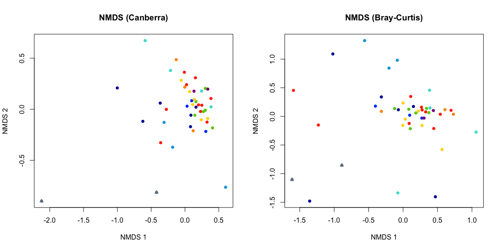
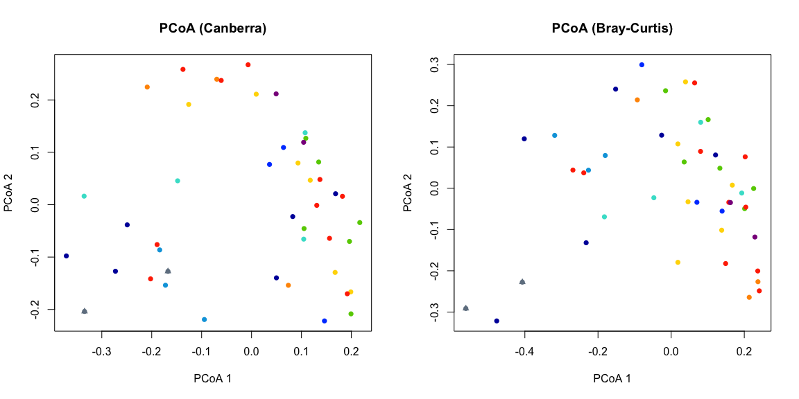
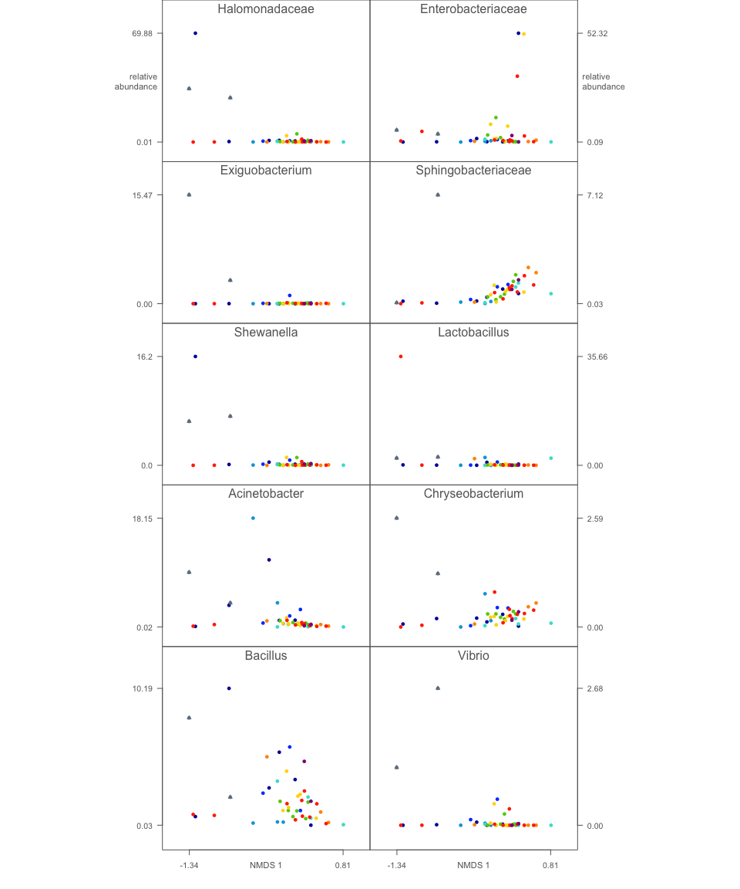
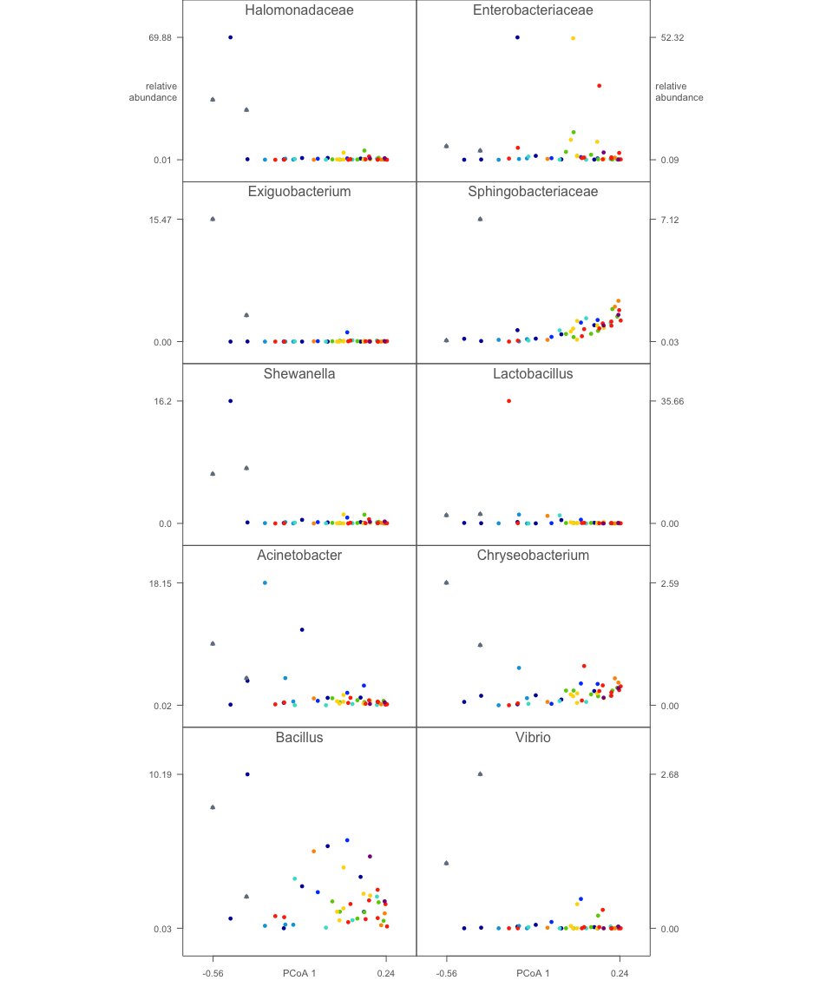
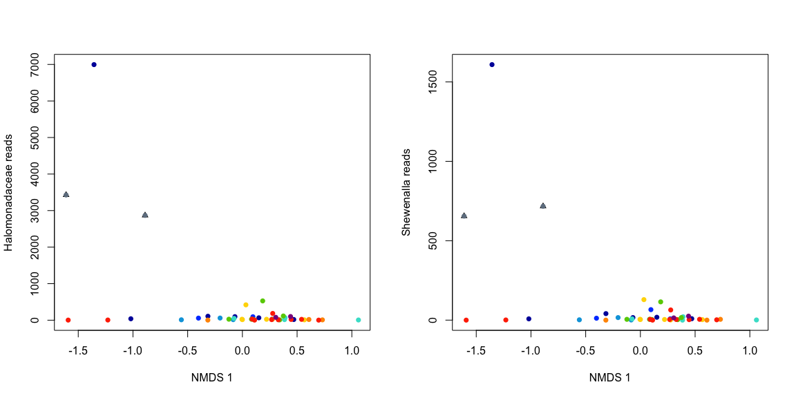
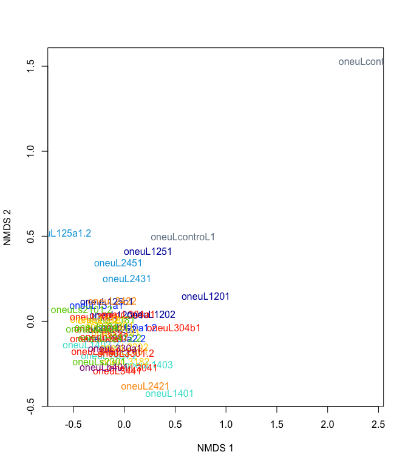
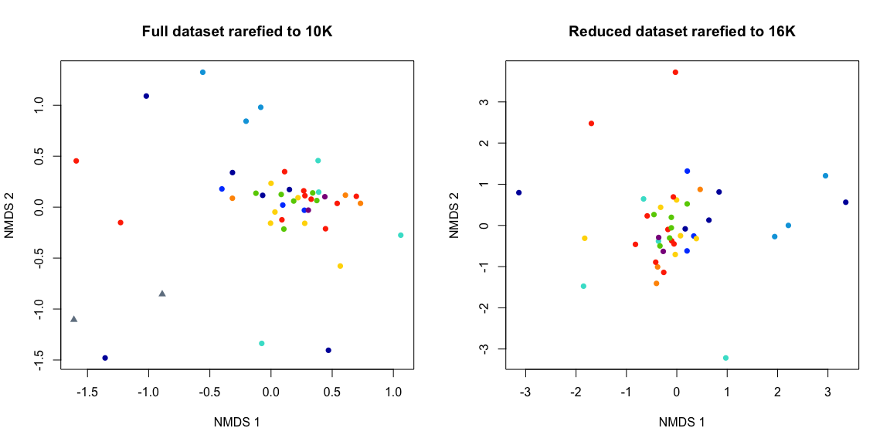
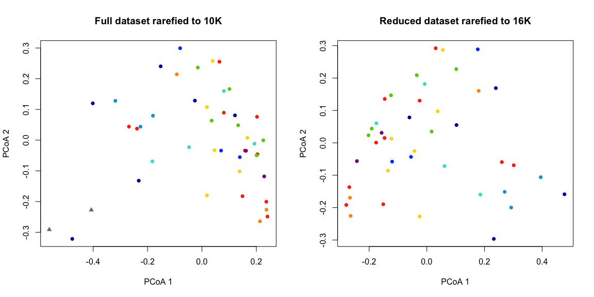

# Look for contamination in Gerlinger 16S rRNA data
Roxana Hickey  
Last updated December 9, 2015  

Adapted from analysis by James Meadow for human microbial cloud study (original script [here](https://github.com/jfmeadow/Meadow_HumanMicrobialCloud_Analysis/blob/master/manuscript_code/contamination/pb_contamination.md)).

Load data.

```r
library(vegan)
```

```
## Loading required package: permute
## Loading required package: lattice
## This is vegan 2.3-1
```

```r
library(labdsv)
```

```
## Loading required package: mgcv
## Loading required package: nlme
## This is mgcv 1.8-8. For overview type 'help("mgcv-package")'.
## Loading required package: MASS
## 
## Attaching package: 'labdsv'
## 
## The following object is masked from 'package:stats':
## 
##     density
```

```r
library(RColorBrewer)

source('~/Documents/projects/gerlinger/code/meadow_pb_functions.R')
```


```r
## read in the genus-level OTU table
ger <- read.table('~/Documents/projects/gerlinger/data/tax_16S_uparse/count_tables/gerlinger_uparse_merged_taxonomy_summaries/gerlinger_uparse_merged_L6.txt',
                    header = TRUE, sep = '\t', row.names = 1, comment.char = '', skip = 1)
ger <- t(ger)

colnames(ger) <- gsub('k__', '', colnames(ger))
colnames(ger) <- gsub('p__', '', colnames(ger))
colnames(ger) <- gsub('c__', '', colnames(ger))
colnames(ger) <- gsub('o__', '', colnames(ger))
colnames(ger) <- gsub('f__', '', colnames(ger))
colnames(ger) <- gsub('g__', '', colnames(ger))

ger.tax <- colnames(ger)

## read in mapping file with metadata
ger.map.orig <- read.table('~/Documents/projects/gerlinger/data/map_files/151125_map_edit_finalchems_crack_plus.txt',
                           header = TRUE, sep = '\t', row.names = 1, comment.char = '')
ger.map.orig$SampleID <- row.names(ger.map.orig)

## reduce mapping file to oneuL samples
ger.map <- ger.map.orig[grep('oneuL', row.names(ger.map.orig)), ]

## define samples to ignore due to duplication, low read count or from another study
sample.ignore <- c('oneuL120a1', 'oneuL120a2', 'oneuL125a1', 'oneuL1402', ## duplicates
                   'oneuL1404', 'oneuL3301', 'oneuLh2412', 'oneuLs2101',  ## duplicates
                   'oneuL3031', ## low read count
                   row.names(ger)[grep('oneuLP', row.names(ger))], ## different study
                   row.names(ger)[grep('oneuLC', row.names(ger))], ## different study
                   row.names(ger)[grep('oneuLFT', row.names(ger))]) ## different study

## total number of samples represented: 43/44 + 2 controls = 45 altogether

## make reduced OTU table
ger <- ger[!(row.names(ger) %in% sample.ignore),]

## make reduced mapping table
ger.map <- ger.map[!(row.names(ger.map) %in% sample.ignore),]

## check that all sample names match
all(row.names(ger.map) %in% row.names(ger))
```

```
## [1] TRUE
```

```r
dim(ger.map)
```

```
## [1] 45 52
```

```r
dim(ger)
```

```
## [1]  45 862
```

```r
## reorder map to match OTU table
ger.map <- ger.map[row.names(ger), ]
identical(row.names(ger), row.names(ger.map))
```

```
## [1] TRUE
```

```r
## see how many taxa there are
length(ger.tax)
```

```
## [1] 862
```

Take out plant and mitochondrial sequences

```r
plants <- grep('Chloroplast', ger.tax, ignore.case = TRUE)
mito <- grep('mitochondria', ger.tax, ignore.case = TRUE)
ger <- ger[, -c(plants, mito)]
ger.tax <- ger.tax[-c(plants, mito)] # remove from taxonomy to line up
```

Make a full rarefied dataset including control and contaminants

```r
sort(rowSums(ger))
```

```
## oneuLcontroL2 oneuLcontroL1    oneuL304b1  oneuL120a1.2     oneuL2202 
##         10014         11638         16451         19003         19232 
##     oneuL1252     oneuL3181    oneuL131a1   oneuL1402.2    oneuL120e1 
##         20143         20347         20449         20769         20810 
##     oneuL2181     oneuL2422     oneuLb401     oneuL3041     oneuL3081 
##         21491         21561         21719         21906         22029 
##   oneuL1404.2     oneuL2191    oneuLh2411   oneuL3301.2    oneuL330a1 
##         22079         22115         22504         22693         23362 
##     oneuL3461     oneuL3441  oneuLH2412.2  oneuL120a2.2     oneuL2192 
##         23362         23370         23908         24160         24234 
##     oneuL1403    oneuLs2301  oneuL125a1.2     oneuL2421     oneuL1201 
##         24362         24526         24552         24631         25116 
##    oneuL308a1     oneuL3462  oneuLs2101.2     oneuL1202    oneuL125c1 
##         25167         25264         25311         25353         25449 
##     oneuL2461     oneuL2201     oneuL3082     oneuL1401    oneuLs2401 
##         26449         26947         27267         28005         28612 
##     oneuL1251     oneuL3182     oneuL2451     oneuL2431    oneuL304a1 
##         28844         29727         33348         33716         37476
```

```r
ger.10K <- rrarefy(ger, 10000)

dim(ger.10K)
```

```
## [1]  45 855
```

```r
dim(ger.map)
```

```
## [1] 45 52
```

```r
identical(row.names(ger.10K), row.names(ger.map))
```

```
## [1] TRUE
```

Make taxonomy data frame for indexing.

```r
taxo <- makeTaxo(ger.tax, ger.10K)
head(taxo)
```

```
##                                                                                                      kingdom
## Archaea;Crenarchaeota;Thaumarchaeota;Nitrososphaerales;Nitrososphaeraceae;                           Archaea
## Archaea;Crenarchaeota;Thaumarchaeota;Nitrososphaerales;Nitrososphaeraceae;Candidatus Nitrososphaera  Archaea
## Archaea;Euryarchaeota;Halobacteria;Halobacteriales;Halobacteriaceae;                                 Archaea
## Archaea;Euryarchaeota;Halobacteria;Halobacteriales;Halobacteriaceae;Haloterrigena                    Archaea
## Archaea;Euryarchaeota;Methanobacteria;Methanobacteriales;Methanobacteriaceae;Methanobacterium        Archaea
## Bacteria;;;;;                                                                                       Bacteria
##                                                                                                            phylum
## Archaea;Crenarchaeota;Thaumarchaeota;Nitrososphaerales;Nitrososphaeraceae;                          Crenarchaeota
## Archaea;Crenarchaeota;Thaumarchaeota;Nitrososphaerales;Nitrososphaeraceae;Candidatus Nitrososphaera Crenarchaeota
## Archaea;Euryarchaeota;Halobacteria;Halobacteriales;Halobacteriaceae;                                Euryarchaeota
## Archaea;Euryarchaeota;Halobacteria;Halobacteriales;Halobacteriaceae;Haloterrigena                   Euryarchaeota
## Archaea;Euryarchaeota;Methanobacteria;Methanobacteriales;Methanobacteriaceae;Methanobacterium       Euryarchaeota
## Bacteria;;;;;                                                                                                    
##                                                                                                               class
## Archaea;Crenarchaeota;Thaumarchaeota;Nitrososphaerales;Nitrososphaeraceae;                           Thaumarchaeota
## Archaea;Crenarchaeota;Thaumarchaeota;Nitrososphaerales;Nitrososphaeraceae;Candidatus Nitrososphaera  Thaumarchaeota
## Archaea;Euryarchaeota;Halobacteria;Halobacteriales;Halobacteriaceae;                                   Halobacteria
## Archaea;Euryarchaeota;Halobacteria;Halobacteriales;Halobacteriaceae;Haloterrigena                      Halobacteria
## Archaea;Euryarchaeota;Methanobacteria;Methanobacteriales;Methanobacteriaceae;Methanobacterium       Methanobacteria
## Bacteria;;;;;                                                                                                      
##                                                                                                                  order
## Archaea;Crenarchaeota;Thaumarchaeota;Nitrososphaerales;Nitrososphaeraceae;                           Nitrososphaerales
## Archaea;Crenarchaeota;Thaumarchaeota;Nitrososphaerales;Nitrososphaeraceae;Candidatus Nitrososphaera  Nitrososphaerales
## Archaea;Euryarchaeota;Halobacteria;Halobacteriales;Halobacteriaceae;                                   Halobacteriales
## Archaea;Euryarchaeota;Halobacteria;Halobacteriales;Halobacteriaceae;Haloterrigena                      Halobacteriales
## Archaea;Euryarchaeota;Methanobacteria;Methanobacteriales;Methanobacteriaceae;Methanobacterium       Methanobacteriales
## Bacteria;;;;;                                                                                                         
##                                                                                                                  family
## Archaea;Crenarchaeota;Thaumarchaeota;Nitrososphaerales;Nitrososphaeraceae;                           Nitrososphaeraceae
## Archaea;Crenarchaeota;Thaumarchaeota;Nitrososphaerales;Nitrososphaeraceae;Candidatus Nitrososphaera  Nitrososphaeraceae
## Archaea;Euryarchaeota;Halobacteria;Halobacteriales;Halobacteriaceae;                                   Halobacteriaceae
## Archaea;Euryarchaeota;Halobacteria;Halobacteriales;Halobacteriaceae;Haloterrigena                      Halobacteriaceae
## Archaea;Euryarchaeota;Methanobacteria;Methanobacteriales;Methanobacteriaceae;Methanobacterium       Methanobacteriaceae
## Bacteria;;;;;                                                                                                          
##                                                                                                                         genus
## Archaea;Crenarchaeota;Thaumarchaeota;Nitrososphaerales;Nitrososphaeraceae;                                                   
## Archaea;Crenarchaeota;Thaumarchaeota;Nitrososphaerales;Nitrososphaeraceae;Candidatus Nitrososphaera Candidatus Nitrososphaera
## Archaea;Euryarchaeota;Halobacteria;Halobacteriales;Halobacteriaceae;                                                         
## Archaea;Euryarchaeota;Halobacteria;Halobacteriales;Halobacteriaceae;Haloterrigena                               Haloterrigena
## Archaea;Euryarchaeota;Methanobacteria;Methanobacteriales;Methanobacteriaceae;Methanobacterium                Methanobacterium
## Bacteria;;;;;                                                                                                                
##                                                                                                     abundance
## Archaea;Crenarchaeota;Thaumarchaeota;Nitrososphaerales;Nitrososphaeraceae;                                  7
## Archaea;Crenarchaeota;Thaumarchaeota;Nitrososphaerales;Nitrososphaeraceae;Candidatus Nitrososphaera        31
## Archaea;Euryarchaeota;Halobacteria;Halobacteriales;Halobacteriaceae;                                        0
## Archaea;Euryarchaeota;Halobacteria;Halobacteriales;Halobacteriaceae;Haloterrigena                           0
## Archaea;Euryarchaeota;Methanobacteria;Methanobacteriales;Methanobacteriaceae;Methanobacterium               3
## Bacteria;;;;;                                                                                               2
```

Get rid of empty OTUs to reduce computing demand.

```r
ger.10K <- ger.10K[, -which(colSums(ger.10K) == 0)]
taxo <- taxo[colnames(ger.10K), ]
head(taxo)
```

```
##                                                                                                      kingdom
## Archaea;Crenarchaeota;Thaumarchaeota;Nitrososphaerales;Nitrososphaeraceae;                           Archaea
## Archaea;Crenarchaeota;Thaumarchaeota;Nitrososphaerales;Nitrososphaeraceae;Candidatus Nitrososphaera  Archaea
## Archaea;Euryarchaeota;Methanobacteria;Methanobacteriales;Methanobacteriaceae;Methanobacterium        Archaea
## Bacteria;;;;;                                                                                       Bacteria
## Bacteria;Acidobacteria;;;;                                                                          Bacteria
## Bacteria;Acidobacteria;Acidobacteria-5;;;                                                           Bacteria
##                                                                                                            phylum
## Archaea;Crenarchaeota;Thaumarchaeota;Nitrososphaerales;Nitrososphaeraceae;                          Crenarchaeota
## Archaea;Crenarchaeota;Thaumarchaeota;Nitrososphaerales;Nitrososphaeraceae;Candidatus Nitrososphaera Crenarchaeota
## Archaea;Euryarchaeota;Methanobacteria;Methanobacteriales;Methanobacteriaceae;Methanobacterium       Euryarchaeota
## Bacteria;;;;;                                                                                                    
## Bacteria;Acidobacteria;;;;                                                                          Acidobacteria
## Bacteria;Acidobacteria;Acidobacteria-5;;;                                                           Acidobacteria
##                                                                                                               class
## Archaea;Crenarchaeota;Thaumarchaeota;Nitrososphaerales;Nitrososphaeraceae;                           Thaumarchaeota
## Archaea;Crenarchaeota;Thaumarchaeota;Nitrososphaerales;Nitrososphaeraceae;Candidatus Nitrososphaera  Thaumarchaeota
## Archaea;Euryarchaeota;Methanobacteria;Methanobacteriales;Methanobacteriaceae;Methanobacterium       Methanobacteria
## Bacteria;;;;;                                                                                                      
## Bacteria;Acidobacteria;;;;                                                                                         
## Bacteria;Acidobacteria;Acidobacteria-5;;;                                                           Acidobacteria-5
##                                                                                                                  order
## Archaea;Crenarchaeota;Thaumarchaeota;Nitrososphaerales;Nitrososphaeraceae;                           Nitrososphaerales
## Archaea;Crenarchaeota;Thaumarchaeota;Nitrososphaerales;Nitrososphaeraceae;Candidatus Nitrososphaera  Nitrososphaerales
## Archaea;Euryarchaeota;Methanobacteria;Methanobacteriales;Methanobacteriaceae;Methanobacterium       Methanobacteriales
## Bacteria;;;;;                                                                                                         
## Bacteria;Acidobacteria;;;;                                                                                            
## Bacteria;Acidobacteria;Acidobacteria-5;;;                                                                             
##                                                                                                                  family
## Archaea;Crenarchaeota;Thaumarchaeota;Nitrososphaerales;Nitrososphaeraceae;                           Nitrososphaeraceae
## Archaea;Crenarchaeota;Thaumarchaeota;Nitrososphaerales;Nitrososphaeraceae;Candidatus Nitrososphaera  Nitrososphaeraceae
## Archaea;Euryarchaeota;Methanobacteria;Methanobacteriales;Methanobacteriaceae;Methanobacterium       Methanobacteriaceae
## Bacteria;;;;;                                                                                                          
## Bacteria;Acidobacteria;;;;                                                                                             
## Bacteria;Acidobacteria;Acidobacteria-5;;;                                                                              
##                                                                                                                         genus
## Archaea;Crenarchaeota;Thaumarchaeota;Nitrososphaerales;Nitrososphaeraceae;                                                   
## Archaea;Crenarchaeota;Thaumarchaeota;Nitrososphaerales;Nitrososphaeraceae;Candidatus Nitrososphaera Candidatus Nitrososphaera
## Archaea;Euryarchaeota;Methanobacteria;Methanobacteriales;Methanobacteriaceae;Methanobacterium                Methanobacterium
## Bacteria;;;;;                                                                                                                
## Bacteria;Acidobacteria;;;;                                                                                                   
## Bacteria;Acidobacteria;Acidobacteria-5;;;                                                                                    
##                                                                                                     abundance
## Archaea;Crenarchaeota;Thaumarchaeota;Nitrososphaerales;Nitrososphaeraceae;                                  7
## Archaea;Crenarchaeota;Thaumarchaeota;Nitrososphaerales;Nitrososphaeraceae;Candidatus Nitrososphaera        31
## Archaea;Euryarchaeota;Methanobacteria;Methanobacteriales;Methanobacteriaceae;Methanobacterium               3
## Bacteria;;;;;                                                                                               2
## Bacteria;Acidobacteria;;;;                                                                                  6
## Bacteria;Acidobacteria;Acidobacteria-5;;;                                                                  14
```

```r
dim(taxo)
```

```
## [1] 781   7
```

```r
dim(ger.10K)
```

```
## [1]  45 781
```

```r
identical(row.names(taxo), colnames(ger.10K))
```

```
## [1] TRUE
```

```r
## convert to relative abundance
ger.10K.ra <- ger.10K/100
```

Quick reference vector of names for figures and whatnot. Some genus, families, etc are empty, so search for the finest taxonomic level and use that name.

```r
consensus <- apply(taxo[, 1:6], 1, cons)
consensus[1:10]
```

```
##                          Archaea;Crenarchaeota;Thaumarchaeota;Nitrososphaerales;Nitrososphaeraceae; 
##                                                                                "Nitrososphaeraceae" 
## Archaea;Crenarchaeota;Thaumarchaeota;Nitrososphaerales;Nitrososphaeraceae;Candidatus Nitrososphaera 
##                                                                         "Candidatus Nitrososphaera" 
##       Archaea;Euryarchaeota;Methanobacteria;Methanobacteriales;Methanobacteriaceae;Methanobacterium 
##                                                                                  "Methanobacterium" 
##                                                                                       Bacteria;;;;; 
##                                                                                          "Bacteria" 
##                                                                          Bacteria;Acidobacteria;;;; 
##                                                                                     "Acidobacteria" 
##                                                           Bacteria;Acidobacteria;Acidobacteria-5;;; 
##                                                                                   "Acidobacteria-5" 
##                                                           Bacteria;Acidobacteria;Acidobacteria-6;;; 
##                                                                                   "Acidobacteria-6" 
##                                                      Bacteria;Acidobacteria;Acidobacteria-6;CCU21;; 
##                                                                                             "CCU21" 
##                                                    Bacteria;Acidobacteria;Acidobacteria-6;iii1-15;; 
##                                                                                           "iii1-15" 
##                                                Bacteria;Acidobacteria;Acidobacteria-6;iii1-15;RB40; 
##                                                                                              "RB40"
```

Some indexing and metadata stuff for figures and such.

```r
ger.map$pch <- 17
table(ger.map$SpaceTypeBioBE)
```

```
## 
##                  building.support      circulation        classroom 
##                0                2                6                3 
##              gym          laundry          lockers      neg.control 
##                6                3                6                2 
##           office             pool         restroom 
##               10                4                3
```

```r
control <- which(ger.map$SpaceTypeBioBE == 'neg.control')
samples <- which(ger.map$SpaceTypeBioBE != 'neg.control')

spaces <- unique(ger.map$SpaceTypeBioBE)
spaces <- spaces[-11] ## exclude neg.control from space types

spaces.counts <- list()
for(i in 1:length(spaces)){
  spaces.counts[[i]] <- which(ger.map$SpaceTypeBioBE == spaces[i])
  # assign(paste(spaces[i]), which(ger.map$SpaceTypeBioBE == spaces[i])) 
}

ger.map$pch2 <- ger.map$pch
ger.map$pch2[ger.map$SpaceTypeBioBE == 'neg.control'] <- 16

## custom color palette
mycol.10 <- c("#0000A9", "#0049FF", "#00A4DE", "turquoise", "chartreuse3", 
              "#FFD701", "#FF9500", "#FF3300", "darkmagenta", "slategrey")
names(mycol.10) <- c('building.support', 'circulation', 'classroom', 'gym', 'laundry', 
                     'lockers', 'office', 'pool', 'restroom', 'neg.control')

ger.map$bg <- 'gray60'

for(i in 1:length(spaces)){
  ger.map$bg[spaces.counts[[i]]] <- mycol.10[i]  
}
```

Make dissimilarity matrix with both Canberra and Bray-Curtis, and then make NMDS and PCoA ordinations. The Bray-Curtis will be more useful for identifying the influence of the most abundant taxa, while Canberra has more often used for analysis in previous studies. Here, Canberra has high stress, so is not used much. Also quick plot to make sure that BC captures differences between groups.

```r
can <- vegdist(ger.10K, 'canberra')
bc <- vegdist(ger.10K)

## NMDS
nmds.can <- nmds(can)
```

```
## initial  value 30.243745 
## iter   5 value 16.378137
## iter  10 value 15.205262
## iter  15 value 14.531667
## iter  20 value 14.255624
## final  value 14.191491 
## converged
```

```r
nmds.bc <- nmds(bc)
```

```
## initial  value 31.102645 
## iter   5 value 21.026123
## iter  10 value 19.672403
## iter  15 value 18.739965
## iter  20 value 18.452951
## iter  20 value 18.441035
## iter  20 value 18.437143
## final  value 18.437143 
## converged
```

```r
par(mfrow = c(1,2))
plot(nmds.can$points, col = ger.map$SpaceTypeBioBE, type = "n",
     main = 'NMDS (Canberra)', xlab = 'NMDS 1', ylab = 'NMDS 2')
points(nmds.can$points[control, ], pch = 17, col = ger.map$bg[control])
for(i in 1:length(spaces)){
  points(nmds.can$points[spaces.counts[[i]], ], 
         pch = 16, col = ger.map$bg[spaces.counts[[i]]])
}

plot(nmds.bc$points, col = ger.map$SpaceTypeBioBE, type = "n",
     main = 'NMDS (Bray-Curtis)', xlab = 'NMDS 1', ylab = 'NMDS 2')
points(nmds.bc$points[control, ], pch = 17, col = ger.map$bg[control])
for(i in 1:length(spaces)){
  points(nmds.bc$points[spaces.counts[[i]], ], 
         pch = 16, col = ger.map$bg[spaces.counts[[i]]])
}
```

 

```r
## PCoA
pcoa.can <- cmdscale(can, eig = TRUE)
pcoa.bc <- cmdscale(bc, eig = TRUE)

par(mfrow = c(1,2))
plot(pcoa.can$points, col = ger.map$SpaceTypeBioBE, type = "n",
     main = 'PCoA (Canberra)', xlab = 'PCoA 1', ylab = 'PCoA 2')
points(pcoa.can$points[control, ], pch = 17, col = ger.map$bg[control])
for(i in 1:length(spaces)){
  points(pcoa.can$points[spaces.counts[[i]], ], 
         pch = 16, col = ger.map$bg[spaces.counts[[i]]])
}

plot(pcoa.bc$points, col = ger.map$SpaceTypeBioBE, type = "n",
     main = 'PCoA (Bray-Curtis)', xlab = 'PCoA 1', ylab = 'PCoA 2')
points(pcoa.bc$points[control, ], pch = 17, col = ger.map$bg[control])
for(i in 1:length(spaces)){
  points(pcoa.bc$points[spaces.counts[[i]], ], 
         pch = 16, col = ger.map$bg[spaces.counts[[i]]])
}
```

 

The controls appear to be fairly well separated from the samples, but at first glance no clear differences based on sample type (color) are evident. Next, find the ten most abundant taxa.

```r
## top 10 taxa
control.taxa.10 <- rev(sort(colSums(ger.10K[control, ])))[1:10]/sum(ger.10K[control, ])
sample.taxa.10 <- rev(sort(colSums(ger.10K[-control, ])))[1:10]/sum(ger.10K[-control, ])

control.taxa.10['other'] <- 1 - sum(control.taxa.10)
sample.taxa.10['other'] <- 1 - sum(sample.taxa.10)

top.10 <- cbind(rev(control.taxa.10), rev(sample.taxa.10))
# mids <- barplot(top.10, col = c('gray30', rep('gray70', 10)), border = 'gray30', space = 1)

con.cum.10 <- cumsum(rev(control.taxa.10))
sam.cum.10 <- cumsum(rev(sample.taxa.10))
```

Big panel figure showing each top contaminant in the dataset and its influence on first axis of NMDS or PCoA:

```r
## NMDS
# pdf('~/Documents/projects/gerlinger/figures/contaminationTop10_nmds_bc.pdf', height=10, width=10, useDingbats=TRUE)
layout(matrix(c(11:15, 1:10, 16:20), 5, 4), 
       heights = c(1, 1, 1, 1, 1.5), 
       widths = c(1, 2, 2, 1))
par(las = 1, mar = c(0, 4, 0, 0), fg = "gray40", col.axis = "gray40", col.lab = "gray40")
for (i in 1:10) {
    id <- names(control.taxa.10)[i]
    print(taxo[id, ])
    idCol <- ger.10K.ra[, id]
    print(sum(idCol)/sum(ger.10K.ra))
    y.lim <- round(range(idCol), 2)
    ybuff <- y.lim[2]/8
    x.lim <- round(range(nmds.bc$points[, 1]), 2)
    xbuff <- sum(abs(x.lim))/8

    if (i %in% c(1:4)) {
        par(las = 1, mar = c(0, 4, 0, 0))
    }
    if (i %in% c(5:8)) {
        par(las = 1, mar = c(0, 0, 0, 4))
    }
    if (i == 5) {
        par(las = 1, mar = c(4, 4, 0, 0))
    }
    if (i == 10) {
        par(las = 1, mar = c(4, 0, 0, 4))
    }
    plot(idCol ~ nmds.bc$points[, 1], ylim = c(y.lim + c(-ybuff, 2 * ybuff)), 
        xlim = c(x.lim + c(-xbuff, xbuff)), type = "n", xaxt = "n", yaxt = "n", 
        xlab = "", ylab = "")
    if (i %in% c(1:5)) {
        yax <- 2
    } else {
        yax <- 4
    }
    axis(side = yax, at = y.lim, labels = TRUE)
    if (i %in% c(5, 10)) {
        axis(side = 1, at = x.lim)
        mtext("NMDS 1", side = 1, line = 1, cex = 0.7)
    }
    if (i == 1) {
        mtext("relative\nabundance", side = 2, cex = 0.7, line = 0.5)
    }
    if (i == 6) {
        mtext("relative\nabundance", side = 4, cex = 0.7, line = 0.5)
    }
    points(idCol[control] ~ nmds.bc$points[control, 1], pch = 17, col = ger.map$bg[control])
    for(i in 1:length(spaces)){
      points(idCol[spaces.counts[[i]]] ~ nmds.bc$points[spaces.counts[[i]], 1], 
             pch = 16, col = ger.map$bg[spaces.counts[[i]]])
    }
    # mtext(paste(consensus[id], " (", id, ")", sep = ""), line = -1.5)
    mtext(consensus[id], line = -1.5)
}
```

```
##                                                                                kingdom
## Bacteria;Proteobacteria;Gammaproteobacteria;Oceanospirillales;Halomonadaceae; Bacteria
##                                                                                       phylum
## Bacteria;Proteobacteria;Gammaproteobacteria;Oceanospirillales;Halomonadaceae; Proteobacteria
##                                                                                             class
## Bacteria;Proteobacteria;Gammaproteobacteria;Oceanospirillales;Halomonadaceae; Gammaproteobacteria
##                                                                                           order
## Bacteria;Proteobacteria;Gammaproteobacteria;Oceanospirillales;Halomonadaceae; Oceanospirillales
##                                                                                       family
## Bacteria;Proteobacteria;Gammaproteobacteria;Oceanospirillales;Halomonadaceae; Halomonadaceae
##                                                                               genus
## Bacteria;Proteobacteria;Gammaproteobacteria;Oceanospirillales;Halomonadaceae;      
##                                                                               abundance
## Bacteria;Proteobacteria;Gammaproteobacteria;Oceanospirillales;Halomonadaceae;     15616
## [1] 0.03470222
```

```
##                                                                             kingdom
## Bacteria;Firmicutes;Bacilli;Bacillales;[Exiguobacteraceae];Exiguobacterium Bacteria
##                                                                                phylum
## Bacteria;Firmicutes;Bacilli;Bacillales;[Exiguobacteraceae];Exiguobacterium Firmicutes
##                                                                              class
## Bacteria;Firmicutes;Bacilli;Bacillales;[Exiguobacteraceae];Exiguobacterium Bacilli
##                                                                                 order
## Bacteria;Firmicutes;Bacilli;Bacillales;[Exiguobacteraceae];Exiguobacterium Bacillales
##                                                                                         family
## Bacteria;Firmicutes;Bacilli;Bacillales;[Exiguobacteraceae];Exiguobacterium [Exiguobacteraceae]
##                                                                                      genus
## Bacteria;Firmicutes;Bacilli;Bacillales;[Exiguobacteraceae];Exiguobacterium Exiguobacterium
##                                                                            abundance
## Bacteria;Firmicutes;Bacilli;Bacillales;[Exiguobacteraceae];Exiguobacterium      2131
## [1] 0.004735556
```

```
##                                                                                        kingdom
## Bacteria;Proteobacteria;Gammaproteobacteria;Alteromonadales;Shewanellaceae;Shewanella Bacteria
##                                                                                               phylum
## Bacteria;Proteobacteria;Gammaproteobacteria;Alteromonadales;Shewanellaceae;Shewanella Proteobacteria
##                                                                                                     class
## Bacteria;Proteobacteria;Gammaproteobacteria;Alteromonadales;Shewanellaceae;Shewanella Gammaproteobacteria
##                                                                                                 order
## Bacteria;Proteobacteria;Gammaproteobacteria;Alteromonadales;Shewanellaceae;Shewanella Alteromonadales
##                                                                                               family
## Bacteria;Proteobacteria;Gammaproteobacteria;Alteromonadales;Shewanellaceae;Shewanella Shewanellaceae
##                                                                                            genus
## Bacteria;Proteobacteria;Gammaproteobacteria;Alteromonadales;Shewanellaceae;Shewanella Shewanella
##                                                                                       abundance
## Bacteria;Proteobacteria;Gammaproteobacteria;Alteromonadales;Shewanellaceae;Shewanella      3636
## [1] 0.00808
```

```
##                                                                                          kingdom
## Bacteria;Proteobacteria;Gammaproteobacteria;Pseudomonadales;Moraxellaceae;Acinetobacter Bacteria
##                                                                                                 phylum
## Bacteria;Proteobacteria;Gammaproteobacteria;Pseudomonadales;Moraxellaceae;Acinetobacter Proteobacteria
##                                                                                                       class
## Bacteria;Proteobacteria;Gammaproteobacteria;Pseudomonadales;Moraxellaceae;Acinetobacter Gammaproteobacteria
##                                                                                                   order
## Bacteria;Proteobacteria;Gammaproteobacteria;Pseudomonadales;Moraxellaceae;Acinetobacter Pseudomonadales
##                                                                                                family
## Bacteria;Proteobacteria;Gammaproteobacteria;Pseudomonadales;Moraxellaceae;Acinetobacter Moraxellaceae
##                                                                                                 genus
## Bacteria;Proteobacteria;Gammaproteobacteria;Pseudomonadales;Moraxellaceae;Acinetobacter Acinetobacter
##                                                                                         abundance
## Bacteria;Proteobacteria;Gammaproteobacteria;Pseudomonadales;Moraxellaceae;Acinetobacter      7335
## [1] 0.0163
```

```
##                                                              kingdom
## Bacteria;Firmicutes;Bacilli;Bacillales;Bacillaceae;Bacillus Bacteria
##                                                                 phylum
## Bacteria;Firmicutes;Bacilli;Bacillales;Bacillaceae;Bacillus Firmicutes
##                                                               class
## Bacteria;Firmicutes;Bacilli;Bacillales;Bacillaceae;Bacillus Bacilli
##                                                                  order
## Bacteria;Firmicutes;Bacilli;Bacillales;Bacillaceae;Bacillus Bacillales
##                                                                  family
## Bacteria;Firmicutes;Bacilli;Bacillales;Bacillaceae;Bacillus Bacillaceae
##                                                                genus
## Bacteria;Firmicutes;Bacilli;Bacillales;Bacillaceae;Bacillus Bacillus
##                                                             abundance
## Bacteria;Firmicutes;Bacilli;Bacillales;Bacillaceae;Bacillus      9098
## [1] 0.02021778
```

```
##                                                                                    kingdom
## Bacteria;Proteobacteria;Gammaproteobacteria;Enterobacteriales;Enterobacteriaceae; Bacteria
##                                                                                           phylum
## Bacteria;Proteobacteria;Gammaproteobacteria;Enterobacteriales;Enterobacteriaceae; Proteobacteria
##                                                                                                 class
## Bacteria;Proteobacteria;Gammaproteobacteria;Enterobacteriales;Enterobacteriaceae; Gammaproteobacteria
##                                                                                               order
## Bacteria;Proteobacteria;Gammaproteobacteria;Enterobacteriales;Enterobacteriaceae; Enterobacteriales
##                                                                                               family
## Bacteria;Proteobacteria;Gammaproteobacteria;Enterobacteriales;Enterobacteriaceae; Enterobacteriaceae
##                                                                                   genus
## Bacteria;Proteobacteria;Gammaproteobacteria;Enterobacteriales;Enterobacteriaceae;      
##                                                                                   abundance
## Bacteria;Proteobacteria;Gammaproteobacteria;Enterobacteriales;Enterobacteriaceae;     21210
## [1] 0.04713333
```

```
##                                                                                  kingdom
## Bacteria;Bacteroidetes;Sphingobacteriia;Sphingobacteriales;Sphingobacteriaceae; Bacteria
##                                                                                        phylum
## Bacteria;Bacteroidetes;Sphingobacteriia;Sphingobacteriales;Sphingobacteriaceae; Bacteroidetes
##                                                                                            class
## Bacteria;Bacteroidetes;Sphingobacteriia;Sphingobacteriales;Sphingobacteriaceae; Sphingobacteriia
##                                                                                              order
## Bacteria;Bacteroidetes;Sphingobacteriia;Sphingobacteriales;Sphingobacteriaceae; Sphingobacteriales
##                                                                                              family
## Bacteria;Bacteroidetes;Sphingobacteriia;Sphingobacteriales;Sphingobacteriaceae; Sphingobacteriaceae
##                                                                                 genus
## Bacteria;Bacteroidetes;Sphingobacteriia;Sphingobacteriales;Sphingobacteriaceae;      
##                                                                                 abundance
## Bacteria;Bacteroidetes;Sphingobacteriia;Sphingobacteriales;Sphingobacteriaceae;      4079
## [1] 0.009064444
```

```
##                                                                             kingdom
## Bacteria;Firmicutes;Bacilli;Lactobacillales;Lactobacillaceae;Lactobacillus Bacteria
##                                                                                phylum
## Bacteria;Firmicutes;Bacilli;Lactobacillales;Lactobacillaceae;Lactobacillus Firmicutes
##                                                                              class
## Bacteria;Firmicutes;Bacilli;Lactobacillales;Lactobacillaceae;Lactobacillus Bacilli
##                                                                                      order
## Bacteria;Firmicutes;Bacilli;Lactobacillales;Lactobacillaceae;Lactobacillus Lactobacillales
##                                                                                      family
## Bacteria;Firmicutes;Bacilli;Lactobacillales;Lactobacillaceae;Lactobacillus Lactobacillaceae
##                                                                                    genus
## Bacteria;Firmicutes;Bacilli;Lactobacillales;Lactobacillaceae;Lactobacillus Lactobacillus
##                                                                            abundance
## Bacteria;Firmicutes;Bacilli;Lactobacillales;Lactobacillaceae;Lactobacillus      5288
## [1] 0.01175111
```

```
##                                                                                          kingdom
## Bacteria;Bacteroidetes;Flavobacteriia;Flavobacteriales;[Weeksellaceae];Chryseobacterium Bacteria
##                                                                                                phylum
## Bacteria;Bacteroidetes;Flavobacteriia;Flavobacteriales;[Weeksellaceae];Chryseobacterium Bacteroidetes
##                                                                                                  class
## Bacteria;Bacteroidetes;Flavobacteriia;Flavobacteriales;[Weeksellaceae];Chryseobacterium Flavobacteriia
##                                                                                                    order
## Bacteria;Bacteroidetes;Flavobacteriia;Flavobacteriales;[Weeksellaceae];Chryseobacterium Flavobacteriales
##                                                                                                  family
## Bacteria;Bacteroidetes;Flavobacteriia;Flavobacteriales;[Weeksellaceae];Chryseobacterium [Weeksellaceae]
##                                                                                                    genus
## Bacteria;Bacteroidetes;Flavobacteriia;Flavobacteriales;[Weeksellaceae];Chryseobacterium Chryseobacterium
##                                                                                         abundance
## Bacteria;Bacteroidetes;Flavobacteriia;Flavobacteriales;[Weeksellaceae];Chryseobacterium      1421
## [1] 0.003157778
```

```
##                                                                              kingdom
## Bacteria;Proteobacteria;Gammaproteobacteria;Vibrionales;Vibrionaceae;Vibrio Bacteria
##                                                                                     phylum
## Bacteria;Proteobacteria;Gammaproteobacteria;Vibrionales;Vibrionaceae;Vibrio Proteobacteria
##                                                                                           class
## Bacteria;Proteobacteria;Gammaproteobacteria;Vibrionales;Vibrionaceae;Vibrio Gammaproteobacteria
##                                                                                   order
## Bacteria;Proteobacteria;Gammaproteobacteria;Vibrionales;Vibrionaceae;Vibrio Vibrionales
##                                                                                   family
## Bacteria;Proteobacteria;Gammaproteobacteria;Vibrionales;Vibrionaceae;Vibrio Vibrionaceae
##                                                                              genus
## Bacteria;Proteobacteria;Gammaproteobacteria;Vibrionales;Vibrionaceae;Vibrio Vibrio
##                                                                             abundance
## Bacteria;Proteobacteria;Gammaproteobacteria;Vibrionales;Vibrionaceae;Vibrio       582
## [1] 0.001293333
```

```r
# dev.off()

## PCoA
# pdf('~/Documents/projects/gerlinger/figures/contaminationTop10_pcoa_bc.pdf', height=10, width=10, useDingbats=TRUE)
layout(matrix(c(11:15, 1:10, 16:20), 5, 4), 
       heights = c(1, 1, 1, 1, 1.5), 
       widths = c(1, 2, 2, 1))
```

 

```r
par(las = 1, mar = c(0, 4, 0, 0), fg = "gray40", col.axis = "gray40", col.lab = "gray40")
for (i in 1:10) {
    id <- names(control.taxa.10)[i]
    print(taxo[id, ])
    idCol <- ger.10K.ra[, id]
    print(sum(idCol)/sum(ger.10K.ra))
    y.lim <- round(range(idCol), 2)
    ybuff <- y.lim[2]/8
    x.lim <- round(range(pcoa.bc$points[, 1]), 2)
    xbuff <- sum(abs(x.lim))/8

    if (i %in% c(1:4)) {
        par(las = 1, mar = c(0, 4, 0, 0))
    }
    if (i %in% c(5:8)) {
        par(las = 1, mar = c(0, 0, 0, 4))
    }
    if (i == 5) {
        par(las = 1, mar = c(4, 4, 0, 0))
    }
    if (i == 10) {
        par(las = 1, mar = c(4, 0, 0, 4))
    }
    plot(idCol ~ pcoa.bc$points[, 1], ylim = c(y.lim + c(-ybuff, 2 * ybuff)), 
        xlim = c(x.lim + c(-xbuff, xbuff)), type = "n", xaxt = "n", yaxt = "n", 
        xlab = "", ylab = "")
    if (i %in% c(1:5)) {
        yax <- 2
    } else {
        yax <- 4
    }
    axis(side = yax, at = y.lim, labels = TRUE)
    if (i %in% c(5, 10)) {
        axis(side = 1, at = x.lim)
        mtext("PCoA 1", side = 1, line = 1, cex = 0.7)
    }
    if (i == 1) {
        mtext("relative\nabundance", side = 2, cex = 0.7, line = 0.5)
    }
    if (i == 6) {
        mtext("relative\nabundance", side = 4, cex = 0.7, line = 0.5)
    }
    points(idCol[control] ~ pcoa.bc$points[control, 1], pch = 17, col = ger.map$bg[control])
    for(i in 1:length(spaces)){
      points(idCol[spaces.counts[[i]]] ~ pcoa.bc$points[spaces.counts[[i]], 1], 
             pch = 16, col = ger.map$bg[spaces.counts[[i]]])
    }
    # mtext(paste(consensus[id], " (", id, ")", sep = ""), line = -1.5)
    mtext(consensus[id], line = -1.5)
}
```

```
##                                                                                kingdom
## Bacteria;Proteobacteria;Gammaproteobacteria;Oceanospirillales;Halomonadaceae; Bacteria
##                                                                                       phylum
## Bacteria;Proteobacteria;Gammaproteobacteria;Oceanospirillales;Halomonadaceae; Proteobacteria
##                                                                                             class
## Bacteria;Proteobacteria;Gammaproteobacteria;Oceanospirillales;Halomonadaceae; Gammaproteobacteria
##                                                                                           order
## Bacteria;Proteobacteria;Gammaproteobacteria;Oceanospirillales;Halomonadaceae; Oceanospirillales
##                                                                                       family
## Bacteria;Proteobacteria;Gammaproteobacteria;Oceanospirillales;Halomonadaceae; Halomonadaceae
##                                                                               genus
## Bacteria;Proteobacteria;Gammaproteobacteria;Oceanospirillales;Halomonadaceae;      
##                                                                               abundance
## Bacteria;Proteobacteria;Gammaproteobacteria;Oceanospirillales;Halomonadaceae;     15616
## [1] 0.03470222
```

```
##                                                                             kingdom
## Bacteria;Firmicutes;Bacilli;Bacillales;[Exiguobacteraceae];Exiguobacterium Bacteria
##                                                                                phylum
## Bacteria;Firmicutes;Bacilli;Bacillales;[Exiguobacteraceae];Exiguobacterium Firmicutes
##                                                                              class
## Bacteria;Firmicutes;Bacilli;Bacillales;[Exiguobacteraceae];Exiguobacterium Bacilli
##                                                                                 order
## Bacteria;Firmicutes;Bacilli;Bacillales;[Exiguobacteraceae];Exiguobacterium Bacillales
##                                                                                         family
## Bacteria;Firmicutes;Bacilli;Bacillales;[Exiguobacteraceae];Exiguobacterium [Exiguobacteraceae]
##                                                                                      genus
## Bacteria;Firmicutes;Bacilli;Bacillales;[Exiguobacteraceae];Exiguobacterium Exiguobacterium
##                                                                            abundance
## Bacteria;Firmicutes;Bacilli;Bacillales;[Exiguobacteraceae];Exiguobacterium      2131
## [1] 0.004735556
```

```
##                                                                                        kingdom
## Bacteria;Proteobacteria;Gammaproteobacteria;Alteromonadales;Shewanellaceae;Shewanella Bacteria
##                                                                                               phylum
## Bacteria;Proteobacteria;Gammaproteobacteria;Alteromonadales;Shewanellaceae;Shewanella Proteobacteria
##                                                                                                     class
## Bacteria;Proteobacteria;Gammaproteobacteria;Alteromonadales;Shewanellaceae;Shewanella Gammaproteobacteria
##                                                                                                 order
## Bacteria;Proteobacteria;Gammaproteobacteria;Alteromonadales;Shewanellaceae;Shewanella Alteromonadales
##                                                                                               family
## Bacteria;Proteobacteria;Gammaproteobacteria;Alteromonadales;Shewanellaceae;Shewanella Shewanellaceae
##                                                                                            genus
## Bacteria;Proteobacteria;Gammaproteobacteria;Alteromonadales;Shewanellaceae;Shewanella Shewanella
##                                                                                       abundance
## Bacteria;Proteobacteria;Gammaproteobacteria;Alteromonadales;Shewanellaceae;Shewanella      3636
## [1] 0.00808
```

```
##                                                                                          kingdom
## Bacteria;Proteobacteria;Gammaproteobacteria;Pseudomonadales;Moraxellaceae;Acinetobacter Bacteria
##                                                                                                 phylum
## Bacteria;Proteobacteria;Gammaproteobacteria;Pseudomonadales;Moraxellaceae;Acinetobacter Proteobacteria
##                                                                                                       class
## Bacteria;Proteobacteria;Gammaproteobacteria;Pseudomonadales;Moraxellaceae;Acinetobacter Gammaproteobacteria
##                                                                                                   order
## Bacteria;Proteobacteria;Gammaproteobacteria;Pseudomonadales;Moraxellaceae;Acinetobacter Pseudomonadales
##                                                                                                family
## Bacteria;Proteobacteria;Gammaproteobacteria;Pseudomonadales;Moraxellaceae;Acinetobacter Moraxellaceae
##                                                                                                 genus
## Bacteria;Proteobacteria;Gammaproteobacteria;Pseudomonadales;Moraxellaceae;Acinetobacter Acinetobacter
##                                                                                         abundance
## Bacteria;Proteobacteria;Gammaproteobacteria;Pseudomonadales;Moraxellaceae;Acinetobacter      7335
## [1] 0.0163
```

```
##                                                              kingdom
## Bacteria;Firmicutes;Bacilli;Bacillales;Bacillaceae;Bacillus Bacteria
##                                                                 phylum
## Bacteria;Firmicutes;Bacilli;Bacillales;Bacillaceae;Bacillus Firmicutes
##                                                               class
## Bacteria;Firmicutes;Bacilli;Bacillales;Bacillaceae;Bacillus Bacilli
##                                                                  order
## Bacteria;Firmicutes;Bacilli;Bacillales;Bacillaceae;Bacillus Bacillales
##                                                                  family
## Bacteria;Firmicutes;Bacilli;Bacillales;Bacillaceae;Bacillus Bacillaceae
##                                                                genus
## Bacteria;Firmicutes;Bacilli;Bacillales;Bacillaceae;Bacillus Bacillus
##                                                             abundance
## Bacteria;Firmicutes;Bacilli;Bacillales;Bacillaceae;Bacillus      9098
## [1] 0.02021778
```

```
##                                                                                    kingdom
## Bacteria;Proteobacteria;Gammaproteobacteria;Enterobacteriales;Enterobacteriaceae; Bacteria
##                                                                                           phylum
## Bacteria;Proteobacteria;Gammaproteobacteria;Enterobacteriales;Enterobacteriaceae; Proteobacteria
##                                                                                                 class
## Bacteria;Proteobacteria;Gammaproteobacteria;Enterobacteriales;Enterobacteriaceae; Gammaproteobacteria
##                                                                                               order
## Bacteria;Proteobacteria;Gammaproteobacteria;Enterobacteriales;Enterobacteriaceae; Enterobacteriales
##                                                                                               family
## Bacteria;Proteobacteria;Gammaproteobacteria;Enterobacteriales;Enterobacteriaceae; Enterobacteriaceae
##                                                                                   genus
## Bacteria;Proteobacteria;Gammaproteobacteria;Enterobacteriales;Enterobacteriaceae;      
##                                                                                   abundance
## Bacteria;Proteobacteria;Gammaproteobacteria;Enterobacteriales;Enterobacteriaceae;     21210
## [1] 0.04713333
```

```
##                                                                                  kingdom
## Bacteria;Bacteroidetes;Sphingobacteriia;Sphingobacteriales;Sphingobacteriaceae; Bacteria
##                                                                                        phylum
## Bacteria;Bacteroidetes;Sphingobacteriia;Sphingobacteriales;Sphingobacteriaceae; Bacteroidetes
##                                                                                            class
## Bacteria;Bacteroidetes;Sphingobacteriia;Sphingobacteriales;Sphingobacteriaceae; Sphingobacteriia
##                                                                                              order
## Bacteria;Bacteroidetes;Sphingobacteriia;Sphingobacteriales;Sphingobacteriaceae; Sphingobacteriales
##                                                                                              family
## Bacteria;Bacteroidetes;Sphingobacteriia;Sphingobacteriales;Sphingobacteriaceae; Sphingobacteriaceae
##                                                                                 genus
## Bacteria;Bacteroidetes;Sphingobacteriia;Sphingobacteriales;Sphingobacteriaceae;      
##                                                                                 abundance
## Bacteria;Bacteroidetes;Sphingobacteriia;Sphingobacteriales;Sphingobacteriaceae;      4079
## [1] 0.009064444
```

```
##                                                                             kingdom
## Bacteria;Firmicutes;Bacilli;Lactobacillales;Lactobacillaceae;Lactobacillus Bacteria
##                                                                                phylum
## Bacteria;Firmicutes;Bacilli;Lactobacillales;Lactobacillaceae;Lactobacillus Firmicutes
##                                                                              class
## Bacteria;Firmicutes;Bacilli;Lactobacillales;Lactobacillaceae;Lactobacillus Bacilli
##                                                                                      order
## Bacteria;Firmicutes;Bacilli;Lactobacillales;Lactobacillaceae;Lactobacillus Lactobacillales
##                                                                                      family
## Bacteria;Firmicutes;Bacilli;Lactobacillales;Lactobacillaceae;Lactobacillus Lactobacillaceae
##                                                                                    genus
## Bacteria;Firmicutes;Bacilli;Lactobacillales;Lactobacillaceae;Lactobacillus Lactobacillus
##                                                                            abundance
## Bacteria;Firmicutes;Bacilli;Lactobacillales;Lactobacillaceae;Lactobacillus      5288
## [1] 0.01175111
```

```
##                                                                                          kingdom
## Bacteria;Bacteroidetes;Flavobacteriia;Flavobacteriales;[Weeksellaceae];Chryseobacterium Bacteria
##                                                                                                phylum
## Bacteria;Bacteroidetes;Flavobacteriia;Flavobacteriales;[Weeksellaceae];Chryseobacterium Bacteroidetes
##                                                                                                  class
## Bacteria;Bacteroidetes;Flavobacteriia;Flavobacteriales;[Weeksellaceae];Chryseobacterium Flavobacteriia
##                                                                                                    order
## Bacteria;Bacteroidetes;Flavobacteriia;Flavobacteriales;[Weeksellaceae];Chryseobacterium Flavobacteriales
##                                                                                                  family
## Bacteria;Bacteroidetes;Flavobacteriia;Flavobacteriales;[Weeksellaceae];Chryseobacterium [Weeksellaceae]
##                                                                                                    genus
## Bacteria;Bacteroidetes;Flavobacteriia;Flavobacteriales;[Weeksellaceae];Chryseobacterium Chryseobacterium
##                                                                                         abundance
## Bacteria;Bacteroidetes;Flavobacteriia;Flavobacteriales;[Weeksellaceae];Chryseobacterium      1421
## [1] 0.003157778
```

```
##                                                                              kingdom
## Bacteria;Proteobacteria;Gammaproteobacteria;Vibrionales;Vibrionaceae;Vibrio Bacteria
##                                                                                     phylum
## Bacteria;Proteobacteria;Gammaproteobacteria;Vibrionales;Vibrionaceae;Vibrio Proteobacteria
##                                                                                           class
## Bacteria;Proteobacteria;Gammaproteobacteria;Vibrionales;Vibrionaceae;Vibrio Gammaproteobacteria
##                                                                                   order
## Bacteria;Proteobacteria;Gammaproteobacteria;Vibrionales;Vibrionaceae;Vibrio Vibrionales
##                                                                                   family
## Bacteria;Proteobacteria;Gammaproteobacteria;Vibrionales;Vibrionaceae;Vibrio Vibrionaceae
##                                                                              genus
## Bacteria;Proteobacteria;Gammaproteobacteria;Vibrionales;Vibrionaceae;Vibrio Vibrio
##                                                                             abundance
## Bacteria;Proteobacteria;Gammaproteobacteria;Vibrionales;Vibrionaceae;Vibrio       582
## [1] 0.001293333
```

```r
# dev.off()
```

 

Halomonas and Shewanella are both abundant in the controls and also in one sample. This could be skewing the first PCoA/NMDS axis, so we'll remove those as probably contaminants. Exigubacterium is somewhat abundant in the controls but not in any samples, so we can safely ignore it. Other taxa are present in low abundance in controls and higher abundance in samples (e.g. Enterobacteriaceae), so those are likely not contaminants. Therefore, we will remove Halomonadaceae and Shewanella as likely contaminants but leave all other taxa intact.

```r
rev(sort(colSums(ger.10K)))[1:10]
```

```
##   Bacteria;Proteobacteria;Alphaproteobacteria;Sphingomonadales;Sphingomonadaceae;Sphingomonas 
##                                                                                         31323 
##             Bacteria;Proteobacteria;Gammaproteobacteria;Enterobacteriales;Enterobacteriaceae; 
##                                                                                         21210 
##                     Bacteria;Bacteroidetes;Cytophagia;Cytophagales;Cytophagaceae;Hymenobacter 
##                                                                                         19292 
##        Bacteria;Actinobacteria;Actinobacteria;Actinomycetales;Microbacteriaceae;Rathayibacter 
##                                                                                         16865 
##                 Bacteria;Proteobacteria;Gammaproteobacteria;Oceanospirillales;Halomonadaceae; 
##                                                                                         15616 
##      Bacteria;Proteobacteria;Gammaproteobacteria;Pseudomonadales;Pseudomonadaceae;Pseudomonas 
##                                                                                         14837 
##                  Bacteria;Proteobacteria;Betaproteobacteria;Burkholderiales;Oxalobacteraceae; 
##                                                                                         13907 
## Bacteria;Proteobacteria;Alphaproteobacteria;Rhodobacterales;Rhodobacteraceae;Rubellimicrobium 
##                                                                                         12952 
##                     Bacteria;Actinobacteria;Actinobacteria;Actinomycetales;Microbacteriaceae; 
##                                                                                         12704 
##     Bacteria;Actinobacteria;Actinobacteria;Actinomycetales;Corynebacteriaceae;Corynebacterium 
##                                                                                         12052
```

```r
halo <- grep('Halomonadaceae', row.names(taxo), ignore.case = TRUE) # top Halomonas is #1 in list
taxo[halo, ]
```

```
##                                                                                                   kingdom
## Bacteria;Proteobacteria;Gammaproteobacteria;Oceanospirillales;Halomonadaceae;                    Bacteria
## Bacteria;Proteobacteria;Gammaproteobacteria;Oceanospirillales;Halomonadaceae;Candidatus Portiera Bacteria
## Bacteria;Proteobacteria;Gammaproteobacteria;Oceanospirillales;Halomonadaceae;Haererehalobacter   Bacteria
## Bacteria;Proteobacteria;Gammaproteobacteria;Oceanospirillales;Halomonadaceae;Halomonas           Bacteria
## Bacteria;Proteobacteria;Gammaproteobacteria;Oceanospirillales;Halomonadaceae;Kushneria           Bacteria
##                                                                                                          phylum
## Bacteria;Proteobacteria;Gammaproteobacteria;Oceanospirillales;Halomonadaceae;                    Proteobacteria
## Bacteria;Proteobacteria;Gammaproteobacteria;Oceanospirillales;Halomonadaceae;Candidatus Portiera Proteobacteria
## Bacteria;Proteobacteria;Gammaproteobacteria;Oceanospirillales;Halomonadaceae;Haererehalobacter   Proteobacteria
## Bacteria;Proteobacteria;Gammaproteobacteria;Oceanospirillales;Halomonadaceae;Halomonas           Proteobacteria
## Bacteria;Proteobacteria;Gammaproteobacteria;Oceanospirillales;Halomonadaceae;Kushneria           Proteobacteria
##                                                                                                                class
## Bacteria;Proteobacteria;Gammaproteobacteria;Oceanospirillales;Halomonadaceae;                    Gammaproteobacteria
## Bacteria;Proteobacteria;Gammaproteobacteria;Oceanospirillales;Halomonadaceae;Candidatus Portiera Gammaproteobacteria
## Bacteria;Proteobacteria;Gammaproteobacteria;Oceanospirillales;Halomonadaceae;Haererehalobacter   Gammaproteobacteria
## Bacteria;Proteobacteria;Gammaproteobacteria;Oceanospirillales;Halomonadaceae;Halomonas           Gammaproteobacteria
## Bacteria;Proteobacteria;Gammaproteobacteria;Oceanospirillales;Halomonadaceae;Kushneria           Gammaproteobacteria
##                                                                                                              order
## Bacteria;Proteobacteria;Gammaproteobacteria;Oceanospirillales;Halomonadaceae;                    Oceanospirillales
## Bacteria;Proteobacteria;Gammaproteobacteria;Oceanospirillales;Halomonadaceae;Candidatus Portiera Oceanospirillales
## Bacteria;Proteobacteria;Gammaproteobacteria;Oceanospirillales;Halomonadaceae;Haererehalobacter   Oceanospirillales
## Bacteria;Proteobacteria;Gammaproteobacteria;Oceanospirillales;Halomonadaceae;Halomonas           Oceanospirillales
## Bacteria;Proteobacteria;Gammaproteobacteria;Oceanospirillales;Halomonadaceae;Kushneria           Oceanospirillales
##                                                                                                          family
## Bacteria;Proteobacteria;Gammaproteobacteria;Oceanospirillales;Halomonadaceae;                    Halomonadaceae
## Bacteria;Proteobacteria;Gammaproteobacteria;Oceanospirillales;Halomonadaceae;Candidatus Portiera Halomonadaceae
## Bacteria;Proteobacteria;Gammaproteobacteria;Oceanospirillales;Halomonadaceae;Haererehalobacter   Halomonadaceae
## Bacteria;Proteobacteria;Gammaproteobacteria;Oceanospirillales;Halomonadaceae;Halomonas           Halomonadaceae
## Bacteria;Proteobacteria;Gammaproteobacteria;Oceanospirillales;Halomonadaceae;Kushneria           Halomonadaceae
##                                                                                                                genus
## Bacteria;Proteobacteria;Gammaproteobacteria;Oceanospirillales;Halomonadaceae;                                       
## Bacteria;Proteobacteria;Gammaproteobacteria;Oceanospirillales;Halomonadaceae;Candidatus Portiera Candidatus Portiera
## Bacteria;Proteobacteria;Gammaproteobacteria;Oceanospirillales;Halomonadaceae;Haererehalobacter     Haererehalobacter
## Bacteria;Proteobacteria;Gammaproteobacteria;Oceanospirillales;Halomonadaceae;Halomonas                     Halomonas
## Bacteria;Proteobacteria;Gammaproteobacteria;Oceanospirillales;Halomonadaceae;Kushneria                     Kushneria
##                                                                                                  abundance
## Bacteria;Proteobacteria;Gammaproteobacteria;Oceanospirillales;Halomonadaceae;                        15616
## Bacteria;Proteobacteria;Gammaproteobacteria;Oceanospirillales;Halomonadaceae;Candidatus Portiera        35
## Bacteria;Proteobacteria;Gammaproteobacteria;Oceanospirillales;Halomonadaceae;Haererehalobacter           2
## Bacteria;Proteobacteria;Gammaproteobacteria;Oceanospirillales;Halomonadaceae;Halomonas                  67
## Bacteria;Proteobacteria;Gammaproteobacteria;Oceanospirillales;Halomonadaceae;Kushneria                   1
```

```r
ger.10K[, halo[1]] # only #1 and #4 are prevalent in controls
```

```
##     oneuL1201     oneuL1202  oneuL120a1.2  oneuL120a2.2    oneuL120e1 
##          6983            25            84            31            98 
##     oneuL1251     oneuL1252  oneuL125a1.2    oneuL125c1    oneuL131a1 
##            36            65             8           106            58 
##     oneuL1401   oneuL1402.2     oneuL1403   oneuL1404.2     oneuL2181 
##            39            16             6            74             8 
##     oneuL2191     oneuL2192     oneuL2201     oneuL2202     oneuL2421 
##           383            11            18            18            10 
##     oneuL2422     oneuL2431     oneuL2451     oneuL2461     oneuL3041 
##             2            60            12            15             3 
##    oneuL304a1    oneuL304b1     oneuL3081     oneuL3082    oneuL308a1 
##             7             2             2            33            15 
##     oneuL3181     oneuL3182   oneuL3301.2    oneuL330a1     oneuL3441 
##            28            11            24            93            24 
##     oneuL3461     oneuL3462     oneuLb401 oneuLcontroL1 oneuLcontroL2 
##           181            11            74          2865          3430 
##    oneuLh2411  oneuLH2412.2  oneuLs2101.2    oneuLs2301    oneuLs2401 
##            29             7            21           100           490
```

```r
haloCol <- ger.10K[, halo[1]]

par(mfrow = c(1,2))
plot(haloCol ~ nmds.bc$points[, 1], type = "n", xlab = 'NMDS 1', ylab = 'Halomonadaceae reads')
points(haloCol[control] ~ nmds.bc$points[control, 1], pch = 17, bg = ger.map$bg[control])
for(i in 1:length(spaces)){
  points(haloCol[spaces.counts[[i]]] ~ nmds.bc$points[spaces.counts[[i]], 1], 
         pch = 16, col = ger.map$bg[spaces.counts[[i]]])
}

shew <- grep('Shewanella', row.names(taxo), ignore.case = TRUE)
taxo[shew, ]
```

```
##                                                                                        kingdom
## Bacteria;Proteobacteria;Gammaproteobacteria;Alteromonadales;Shewanellaceae;Shewanella Bacteria
##                                                                                               phylum
## Bacteria;Proteobacteria;Gammaproteobacteria;Alteromonadales;Shewanellaceae;Shewanella Proteobacteria
##                                                                                                     class
## Bacteria;Proteobacteria;Gammaproteobacteria;Alteromonadales;Shewanellaceae;Shewanella Gammaproteobacteria
##                                                                                                 order
## Bacteria;Proteobacteria;Gammaproteobacteria;Alteromonadales;Shewanellaceae;Shewanella Alteromonadales
##                                                                                               family
## Bacteria;Proteobacteria;Gammaproteobacteria;Alteromonadales;Shewanellaceae;Shewanella Shewanellaceae
##                                                                                            genus
## Bacteria;Proteobacteria;Gammaproteobacteria;Alteromonadales;Shewanellaceae;Shewanella Shewanella
##                                                                                       abundance
## Bacteria;Proteobacteria;Gammaproteobacteria;Alteromonadales;Shewanellaceae;Shewanella      3636
```

```r
ger.10K[, shew] # only #1 and #4 are prevalent in controls
```

```
##     oneuL1201     oneuL1202  oneuL120a1.2  oneuL120a2.2    oneuL120e1 
##          1616            11            51             2            18 
##     oneuL1251     oneuL1252  oneuL125a1.2    oneuL125c1    oneuL131a1 
##            14            17             4            49            16 
##     oneuL1401   oneuL1402.2     oneuL1403   oneuL1404.2     oneuL2181 
##            10             2             3            18             3 
##     oneuL2191     oneuL2192     oneuL2201     oneuL2202     oneuL2421 
##           118             2             7             3             3 
##     oneuL2422     oneuL2431     oneuL2451     oneuL2461     oneuL3041 
##             0            15             3             0             4 
##    oneuL304a1    oneuL304b1     oneuL3081     oneuL3082    oneuL308a1 
##             0             0             0            12             6 
##     oneuL3181     oneuL3182   oneuL3301.2    oneuL330a1     oneuL3441 
##             3             2             4            25             4 
##     oneuL3461     oneuL3462     oneuLb401 oneuLcontroL1 oneuLcontroL2 
##            48             2            15           728           654 
##    oneuLh2411  oneuLH2412.2  oneuLs2101.2    oneuLs2301    oneuLs2401 
##             4             2             8            19           111
```

```r
shewCol <- ger.10K[, shew]

plot(shewCol ~ nmds.bc$points[, 1], type = "n", xlab = 'NMDS 1', ylab = 'Shewenalla reads')
points(shewCol[control] ~ nmds.bc$points[control, 1], pch = 17, bg = ger.map$bg[control])
for(i in 1:length(spaces)){
  points(shewCol[spaces.counts[[i]]] ~ nmds.bc$points[spaces.counts[[i]], 1], 
         pch = 16, col = ger.map$bg[spaces.counts[[i]]])
}
```

 

Check out the NMDS and PCoA after taking out contaminants.

```r
dim(ger)
```

```
## [1]  45 855
```

```r
ger.nc <- ger[, -which(colnames(ger) %in% names(control.taxa.10[c(1,3)]))]

bc.nc <- vegdist(ger.nc)
can.nc <- vegdist(ger.nc, method = 'canberra')

nmds.bc.nc <- nmds(bc.nc)
```

```
## initial  value 31.659204 
## iter   5 value 20.992037
## iter  10 value 20.122231
## iter  15 value 19.611900
## iter  20 value 19.232755
## iter  25 value 18.988017
## iter  30 value 18.836726
## final  value 18.774813 
## converged
```

```r
plot(nmds.bc.nc$points, type = 'n', xlab = 'NMDS 1', ylab = 'NMDS 2')
text(nmds.bc.nc$points[control, 2] ~ nmds.bc.nc$points[control, 1],
     labels = rownames(nmds.bc.nc$points[control, ]), col = ger.map$bg[control])
text(nmds.bc.nc$points[samples, 2] ~ nmds.bc.nc$points[samples, 1],
     labels = rownames(nmds.bc.nc$points[samples, ]), col = ger.map$bg[samples])
```

 

```r
pcoa.bc.nc <- cmdscale(bc.nc, eig = TRUE)

plot(pcoa.bc.nc$points, type = 'n', xlab = 'PCoA 1', ylab = 'PCoA 2')
text(pcoa.bc.nc$points[control, 2] ~ pcoa.bc.nc$points[control, 1],
     labels = rownames(pcoa.bc.nc$points[control, ]), col = ger.map$bg[control])
text(pcoa.bc.nc$points[samples, 2] ~ pcoa.bc.nc$points[samples, 1],
     labels = rownames(pcoa.bc.nc$points[samples, ]), col = ger.map$bg[samples])
```

 

```r
sort(rowSums(ger.nc))
```

```
##     oneuL1201 oneuLcontroL2 oneuLcontroL1    oneuL304b1  oneuL120a1.2 
##          3486          5926          7475         16447         18735 
##     oneuL2202     oneuL1252     oneuL3181    oneuL131a1    oneuL120e1 
##         19194         19966         20294         20301         20562 
##   oneuL1402.2     oneuL2191     oneuL2181     oneuLb401     oneuL2422 
##         20735         20945         21459         21506         21554 
##     oneuL3041   oneuL1404.2     oneuL3081    oneuLh2411   oneuL3301.2 
##         21896         21905         22025         22445         22634 
##     oneuL3461    oneuL330a1     oneuL3441  oneuLH2412.2  oneuL120a2.2 
##         22815         23086         23304         23873         24080 
##     oneuL2192    oneuLs2301     oneuL1403  oneuL125a1.2     oneuL2421 
##         24191         24220         24346         24521         24589 
##    oneuL125c1    oneuL308a1     oneuL3462  oneuLs2101.2     oneuL1202 
##         25061         25123         25224         25242         25264 
##     oneuL2461    oneuLs2401     oneuL2201     oneuL3082     oneuL1401 
##         26402         26810         26883         27155         27856 
##     oneuL1251     oneuL3182     oneuL2451     oneuL2431    oneuL304a1 
##         28724         29669         33307         33447         37455
```

Based on the NMDS and read counts, sample 'oneuL1201' is similar to the controls and has far fewer read counts than the rest of the samples. The controls are also well separated from the rest of the samples (i.e. their composition is different). Therefore, we will exclude the two controls and 

```r
## save OTU table and map table with all samples
ger.nc.all <- ger.nc
ger.map.all <- ger.map

## write new OTU table and map table excluding controls and oneuL1201
ger.nc <- ger.nc.all[-which(rownames(ger.nc.all) %in% c('oneuL1201', 'oneuLcontroL1', 'oneuLcontroL2')), ]

ger.map <- ger.map.all[-which(rownames(ger.map.all) %in% c('oneuL1201', 'oneuLcontroL1', 'oneuLcontroL2')), ]

## rarefy
sort(rowSums(ger.nc)) ## minimum is 16,447
```

```
##   oneuL304b1 oneuL120a1.2    oneuL2202    oneuL1252    oneuL3181 
##        16447        18735        19194        19966        20294 
##   oneuL131a1   oneuL120e1  oneuL1402.2    oneuL2191    oneuL2181 
##        20301        20562        20735        20945        21459 
##    oneuLb401    oneuL2422    oneuL3041  oneuL1404.2    oneuL3081 
##        21506        21554        21896        21905        22025 
##   oneuLh2411  oneuL3301.2    oneuL3461   oneuL330a1    oneuL3441 
##        22445        22634        22815        23086        23304 
## oneuLH2412.2 oneuL120a2.2    oneuL2192   oneuLs2301    oneuL1403 
##        23873        24080        24191        24220        24346 
## oneuL125a1.2    oneuL2421   oneuL125c1   oneuL308a1    oneuL3462 
##        24521        24589        25061        25123        25224 
## oneuLs2101.2    oneuL1202    oneuL2461   oneuLs2401    oneuL2201 
##        25242        25264        26402        26810        26883 
##    oneuL3082    oneuL1401    oneuL1251    oneuL3182    oneuL2451 
##        27155        27856        28724        29669        33307 
##    oneuL2431   oneuL304a1 
##        33447        37455
```

```r
ger.nc.rare <- rrarefy(ger.nc, 16000)
ger.nc.rare <- ger.nc.rare[, -which(colSums(ger.nc.rare) == 0)]
# ger.rare <- rrarefy(ger, 16000)
# ger.rare <- ger.rare[, -which(colSums(ger.rare) == 0)]

taxo.nc <- makeTaxo(ger.tax[ger.tax %in% colnames(ger.nc.rare)], ger.nc.rare)
consensus.nc <- apply(taxo.nc[, 1:6], 1, cons)
```

Make same NMDS objects to compare.

```r
bc.nc <- vegdist(ger.nc.rare)
can.nc <- vegdist(ger.nc.rare, method = 'canberra')
# bc <- vegdist(ger.rare)

nmds.bc.nc <- nmds(bc.nc)
```

```
## initial  value 31.339182 
## iter   5 value 22.258759
## iter  10 value 20.181488
## iter  15 value 19.311349
## iter  20 value 18.890965
## iter  25 value 18.658794
## iter  30 value 18.433475
## iter  35 value 18.019468
## iter  40 value 17.375754
## final  value 17.245448 
## converged
```

```r
# nmds.bc <- nmds(bc)

par(mfrow = c(1,2))
plot(nmds.bc$points, type = 'n', main = 'Full dataset rarefied to 10K', 
     xlab = 'NMDS 1', ylab = 'NMDS 2')
points(nmds.bc$points[control, ], pch = 17, col = ger.map.all$bg[control])
points(nmds.bc$points[samples, ], pch = 16, col = ger.map.all$bg[samples])

plot(nmds.bc.nc$points, type = 'n', main = 'Reduced dataset rarefied to 16K', 
     xlab = 'NMDS 1', ylab = 'NMDS 2')
points(nmds.bc.nc$points, pch = 16, col = ger.map$bg)
```

 

Compare PCoA plots

```r
pcoa.bc.nc <- cmdscale(bc.nc, eig = TRUE)

par(mfrow = c(1,2))
plot(pcoa.bc$points, type = 'n', main = 'Full dataset rarefied to 10K', 
     xlab = 'PCoA 1', ylab = 'PCoA 2')
points(pcoa.bc$points[control, ], pch = 17, col = ger.map.all$bg[control])
points(pcoa.bc$points[samples, ], pch = 16, col = ger.map.all$bg[samples])

plot(pcoa.bc.nc$points, type = 'n', main = 'Reduced dataset rarefied to 16K', 
     xlab = 'PCoA 1', ylab = 'PCoA 2')
points(pcoa.bc.nc$points, pch = 16, col = ger.map$bg)
```

 

Run some stats to see if space type explains dissimilarity

```r
adonis(bc.nc ~ ger.map$SpaceTypeBioBE) ## R2 = 0.28471, p = 0.004 **
```

```
## 
## Call:
## adonis(formula = bc.nc ~ ger.map$SpaceTypeBioBE) 
## 
## Permutation: free
## Number of permutations: 999
## 
## Terms added sequentially (first to last)
## 
##                        Df SumsOfSqs MeanSqs F.Model      R2 Pr(>F)   
## ger.map$SpaceTypeBioBE  8    2.0817 0.26021  1.6362 0.28401  0.004 **
## Residuals              33    5.2481 0.15903         0.71599          
## Total                  41    7.3298                 1.00000          
## ---
## Signif. codes:  0 '***' 0.001 '**' 0.01 '*' 0.05 '.' 0.1 ' ' 1
```

```r
adonis(can.nc ~ ger.map$SpaceTypeBioBE) ## R2 = 0.22885,  p = 0.006 **
```

```
## 
## Call:
## adonis(formula = can.nc ~ ger.map$SpaceTypeBioBE) 
## 
## Permutation: free
## Number of permutations: 999
## 
## Terms added sequentially (first to last)
## 
##                        Df SumsOfSqs MeanSqs F.Model      R2 Pr(>F)   
## ger.map$SpaceTypeBioBE  8    2.4653 0.30816  1.2188 0.22807  0.008 **
## Residuals              33    8.3438 0.25284         0.77193          
## Total                  41   10.8090                 1.00000          
## ---
## Signif. codes:  0 '***' 0.001 '**' 0.01 '*' 0.05 '.' 0.1 ' ' 1
```

Loose ends: calculate PCoA 'variance explained', reduce color palette

```r
## Use ape::pcoa to obtain R^2-like ratios
pcoa.rval <- ape::pcoa(vegdist(ger.nc.rare))

## R^2-like ratio for first two axes
pcoa.rval$values$Rel_corr_eig[1:2]
```

```
## [1] 0.1844473 0.1146724
```

```r
## reduce mycol.10 to mycol.9 (neg control no longer needed)
mycol.9 <- mycol.10[-10]
```

Clean up, save data

```r
rm(ger.10K.ra, ger.10K, top.10, can, con.cum.10, control.taxa.10, halo, haloCol, shew, shewCol, i, mito, nmds.can, 
  plants, sam.cum.10, sample.ignore, sample.taxa.10, spaces.counts)
save.image('~/Documents/projects/gerlinger/results/otu_setup/ger_rm_contaminants.RData')
```
