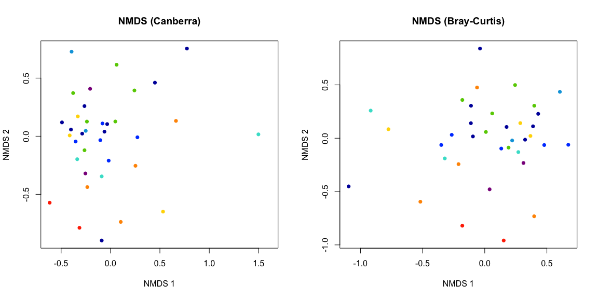
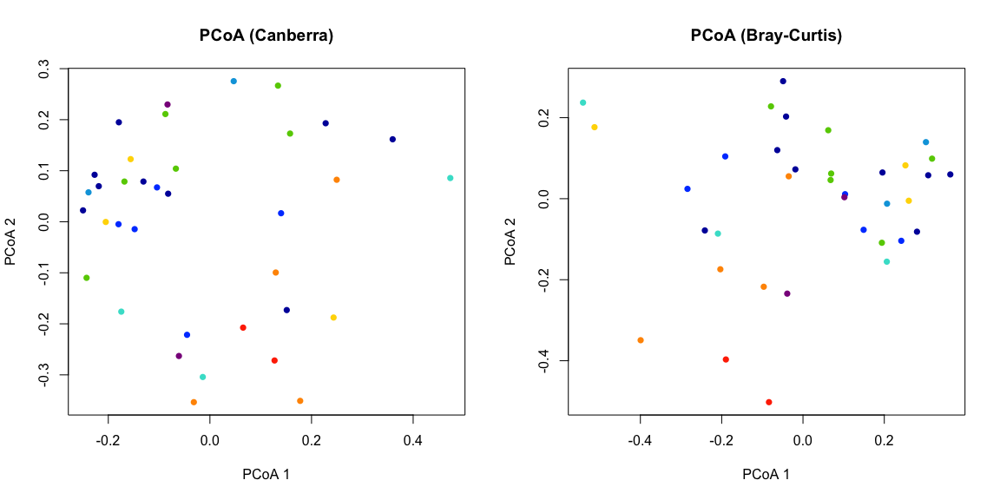
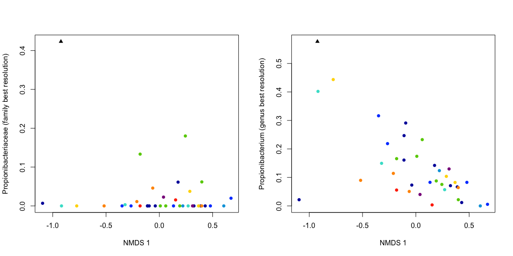
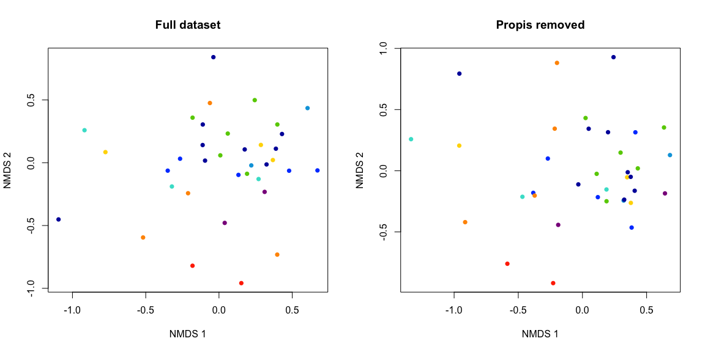
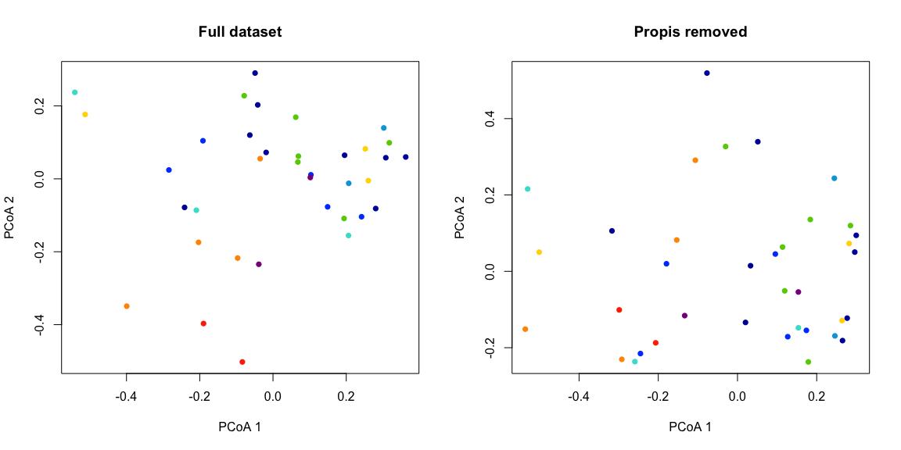
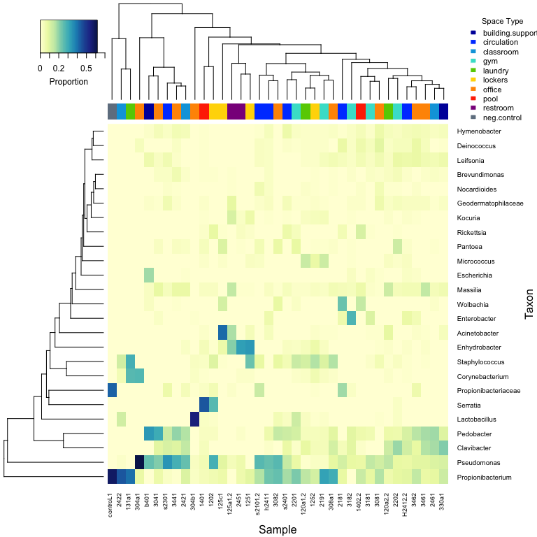
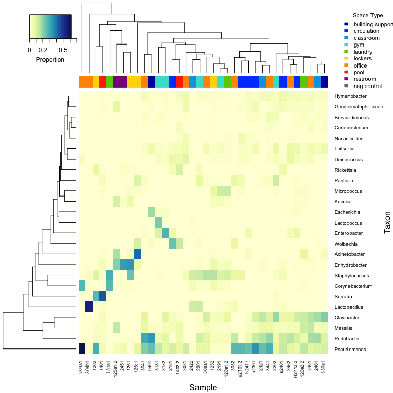

# Look for contamination in Gerlinger metagenomics MetaPhlAn data
Roxana Hickey  
Last updated December 9, 2015  

Adapted from analysis by James Meadow for human microbial cloud study (original script [here](https://github.com/jfmeadow/Meadow_HumanMicrobialCloud_Analysis/blob/master/manuscript_code/contamination/pb_contamination.md)).

Load data.

```r
library(vegan)
```

```
## Loading required package: permute
## Loading required package: lattice
## This is vegan 2.3-1
```

```r
library(labdsv)
```

```
## Loading required package: mgcv
## Loading required package: nlme
## This is mgcv 1.8-8. For overview type 'help("mgcv-package")'.
## Loading required package: MASS
## 
## Attaching package: 'labdsv'
## 
## The following object is masked from 'package:stats':
## 
##     density
```

```r
library(RColorBrewer)
library(gplots)
```

```
## 
## Attaching package: 'gplots'
## 
## The following object is masked from 'package:stats':
## 
##     lowess
```

```r
source('~/Documents/projects/gerlinger/code/meadow_pb_functions.R')
```

Read in the OTU table (relative abundance)

```r
## read in the genus-level OTU table
ger.meta <- read.table('~/Documents/projects/gerlinger/data/tax_shotgun_metaphlan/AAGAGGCA-AGAGGATA_S4cat_R1_001.fastq.metaphlan2_merged_meta_L6.txt', header = T, sep = '\t', row.names = 1)
ger.meta <- t(ger.meta)

colnames(ger.meta) <- gsub('k__', '', colnames(ger.meta))
colnames(ger.meta) <- gsub('p__', '', colnames(ger.meta))
colnames(ger.meta) <- gsub('c__', '', colnames(ger.meta))
colnames(ger.meta) <- gsub('o__', '', colnames(ger.meta))
colnames(ger.meta) <- gsub('f__', '', colnames(ger.meta))
colnames(ger.meta) <- gsub('g__', '', colnames(ger.meta))
colnames(ger.meta) <- gsub('Other', '', colnames(ger.meta))

ger.meta.tax <- colnames(ger.meta)

## read in master sample ID key
sid.key <- read.table('~/Documents/projects/gerlinger/data/sampleid_master_key.txt',
                      sep = '\t', header = T, row.names = NULL)
rownames(ger.meta) %in% sid.key$metaphlan_barcode
```

```
##  [1] TRUE TRUE TRUE TRUE TRUE TRUE TRUE TRUE TRUE TRUE TRUE TRUE TRUE TRUE
## [15] TRUE TRUE TRUE TRUE TRUE TRUE TRUE TRUE TRUE TRUE TRUE TRUE TRUE TRUE
## [29] TRUE TRUE TRUE TRUE TRUE TRUE TRUE TRUE TRUE TRUE TRUE TRUE TRUE TRUE
```

```r
## replace sample IDs to match 16S data
ger.meta.orig <- ger.meta
rownames(ger.meta) <- sid.key$uparse_sampleid[match(rownames(ger.meta.orig), sid.key$metaphlan_barcode)]

## read in mapping file with metadata
ger.map.orig <- read.table('~/Documents/projects/gerlinger/data/map_files/151125_map_edit_finalchems_crack_plus.txt',
                           header = TRUE, sep = '\t', row.names = 1, comment.char = '')
ger.map.orig$SampleID <- row.names(ger.map.orig)

## define samples to ignore due to duplication
sample.ignore <- c('oneuL120a1', 'oneuL120a2', 'oneuL125a1', 'oneuL1402', 'oneuLh2412', 'oneuLs2101')

## make reduced OTU table
ger.meta <- ger.meta[!(row.names(ger.meta) %in% sample.ignore),]

## reduce mapping file to samples in MetaPhlAn dataset
ger.meta.map <- ger.map.orig[ger.map.orig$SampleID %in% rownames(ger.meta),]

## check that all sample names match
all(row.names(ger.meta.map) %in% row.names(ger.meta))
```

```
## [1] TRUE
```

```r
dim(ger.meta.map)
```

```
## [1] 37 52
```

```r
dim(ger.meta)
```

```
## [1]  37 155
```

```r
## reorder map to match OTU table
ger.meta.map <- ger.meta.map[row.names(ger.meta), ]
identical(row.names(ger.meta), row.names(ger.meta.map))
```

```
## [1] TRUE
```

```r
## see how many taxa there are
length(ger.meta.tax)
```

```
## [1] 155
```

Plant and mitochondrial sequences are not present in the MetaPhlAn data, so we do not need to remove them manually as we did with the 16S rRNA data. Next, we'll make a taxonomy data frame for indexing.

```r
taxo <- makeTaxo(ger.meta.tax, ger.meta)
head(taxo)
```

```
##                                                                                          kingdom
## Bacteria;Acidobacteria;Acidobacteriia;Acidobacteriales;Acidobacteriaceae;               Bacteria
## Bacteria;Acidobacteria;Acidobacteriia;Acidobacteriales;Acidobacteriaceae;Granulicella   Bacteria
## Bacteria;Acidobacteria;Acidobacteriia;Acidobacteriales;Acidobacteriaceae;Terriglobus    Bacteria
## Bacteria;Actinobacteria;Actinobacteria;Actinomycetales;Actinomycetaceae;Actinomyces     Bacteria
## Bacteria;Actinobacteria;Actinobacteria;Actinomycetales;Actinomycetaceae;Varibaculum     Bacteria
## Bacteria;Actinobacteria;Actinobacteria;Actinomycetales;Brevibacteriaceae;Brevibacterium Bacteria
##                                                                                                 phylum
## Bacteria;Acidobacteria;Acidobacteriia;Acidobacteriales;Acidobacteriaceae;                Acidobacteria
## Bacteria;Acidobacteria;Acidobacteriia;Acidobacteriales;Acidobacteriaceae;Granulicella    Acidobacteria
## Bacteria;Acidobacteria;Acidobacteriia;Acidobacteriales;Acidobacteriaceae;Terriglobus     Acidobacteria
## Bacteria;Actinobacteria;Actinobacteria;Actinomycetales;Actinomycetaceae;Actinomyces     Actinobacteria
## Bacteria;Actinobacteria;Actinobacteria;Actinomycetales;Actinomycetaceae;Varibaculum     Actinobacteria
## Bacteria;Actinobacteria;Actinobacteria;Actinomycetales;Brevibacteriaceae;Brevibacterium Actinobacteria
##                                                                                                  class
## Bacteria;Acidobacteria;Acidobacteriia;Acidobacteriales;Acidobacteriaceae;               Acidobacteriia
## Bacteria;Acidobacteria;Acidobacteriia;Acidobacteriales;Acidobacteriaceae;Granulicella   Acidobacteriia
## Bacteria;Acidobacteria;Acidobacteriia;Acidobacteriales;Acidobacteriaceae;Terriglobus    Acidobacteriia
## Bacteria;Actinobacteria;Actinobacteria;Actinomycetales;Actinomycetaceae;Actinomyces     Actinobacteria
## Bacteria;Actinobacteria;Actinobacteria;Actinomycetales;Actinomycetaceae;Varibaculum     Actinobacteria
## Bacteria;Actinobacteria;Actinobacteria;Actinomycetales;Brevibacteriaceae;Brevibacterium Actinobacteria
##                                                                                                    order
## Bacteria;Acidobacteria;Acidobacteriia;Acidobacteriales;Acidobacteriaceae;               Acidobacteriales
## Bacteria;Acidobacteria;Acidobacteriia;Acidobacteriales;Acidobacteriaceae;Granulicella   Acidobacteriales
## Bacteria;Acidobacteria;Acidobacteriia;Acidobacteriales;Acidobacteriaceae;Terriglobus    Acidobacteriales
## Bacteria;Actinobacteria;Actinobacteria;Actinomycetales;Actinomycetaceae;Actinomyces      Actinomycetales
## Bacteria;Actinobacteria;Actinobacteria;Actinomycetales;Actinomycetaceae;Varibaculum      Actinomycetales
## Bacteria;Actinobacteria;Actinobacteria;Actinomycetales;Brevibacteriaceae;Brevibacterium  Actinomycetales
##                                                                                                    family
## Bacteria;Acidobacteria;Acidobacteriia;Acidobacteriales;Acidobacteriaceae;               Acidobacteriaceae
## Bacteria;Acidobacteria;Acidobacteriia;Acidobacteriales;Acidobacteriaceae;Granulicella   Acidobacteriaceae
## Bacteria;Acidobacteria;Acidobacteriia;Acidobacteriales;Acidobacteriaceae;Terriglobus    Acidobacteriaceae
## Bacteria;Actinobacteria;Actinobacteria;Actinomycetales;Actinomycetaceae;Actinomyces      Actinomycetaceae
## Bacteria;Actinobacteria;Actinobacteria;Actinomycetales;Actinomycetaceae;Varibaculum      Actinomycetaceae
## Bacteria;Actinobacteria;Actinobacteria;Actinomycetales;Brevibacteriaceae;Brevibacterium Brevibacteriaceae
##                                                                                                  genus
## Bacteria;Acidobacteria;Acidobacteriia;Acidobacteriales;Acidobacteriaceae;                             
## Bacteria;Acidobacteria;Acidobacteriia;Acidobacteriales;Acidobacteriaceae;Granulicella     Granulicella
## Bacteria;Acidobacteria;Acidobacteriia;Acidobacteriales;Acidobacteriaceae;Terriglobus       Terriglobus
## Bacteria;Actinobacteria;Actinobacteria;Actinomycetales;Actinomycetaceae;Actinomyces        Actinomyces
## Bacteria;Actinobacteria;Actinobacteria;Actinomycetales;Actinomycetaceae;Varibaculum        Varibaculum
## Bacteria;Actinobacteria;Actinobacteria;Actinomycetales;Brevibacteriaceae;Brevibacterium Brevibacterium
##                                                                                           abundance
## Bacteria;Acidobacteria;Acidobacteriia;Acidobacteriales;Acidobacteriaceae;               0.149589294
## Bacteria;Acidobacteria;Acidobacteriia;Acidobacteriales;Acidobacteriaceae;Granulicella   0.178955933
## Bacteria;Acidobacteria;Acidobacteriia;Acidobacteriales;Acidobacteriaceae;Terriglobus    0.027168602
## Bacteria;Actinobacteria;Actinobacteria;Actinomycetales;Actinomycetaceae;Actinomyces     0.005831398
## Bacteria;Actinobacteria;Actinobacteria;Actinomycetales;Actinomycetaceae;Varibaculum     0.015270902
## Bacteria;Actinobacteria;Actinobacteria;Actinomycetales;Brevibacteriaceae;Brevibacterium 0.156803528
```

Get rid of empty OTUs to reduce computing demand.

```r
taxo <- taxo[colnames(ger.meta), ]
head(taxo)
```

```
##                                                                                          kingdom
## Bacteria;Acidobacteria;Acidobacteriia;Acidobacteriales;Acidobacteriaceae;               Bacteria
## Bacteria;Acidobacteria;Acidobacteriia;Acidobacteriales;Acidobacteriaceae;Granulicella   Bacteria
## Bacteria;Acidobacteria;Acidobacteriia;Acidobacteriales;Acidobacteriaceae;Terriglobus    Bacteria
## Bacteria;Actinobacteria;Actinobacteria;Actinomycetales;Actinomycetaceae;Actinomyces     Bacteria
## Bacteria;Actinobacteria;Actinobacteria;Actinomycetales;Actinomycetaceae;Varibaculum     Bacteria
## Bacteria;Actinobacteria;Actinobacteria;Actinomycetales;Brevibacteriaceae;Brevibacterium Bacteria
##                                                                                                 phylum
## Bacteria;Acidobacteria;Acidobacteriia;Acidobacteriales;Acidobacteriaceae;                Acidobacteria
## Bacteria;Acidobacteria;Acidobacteriia;Acidobacteriales;Acidobacteriaceae;Granulicella    Acidobacteria
## Bacteria;Acidobacteria;Acidobacteriia;Acidobacteriales;Acidobacteriaceae;Terriglobus     Acidobacteria
## Bacteria;Actinobacteria;Actinobacteria;Actinomycetales;Actinomycetaceae;Actinomyces     Actinobacteria
## Bacteria;Actinobacteria;Actinobacteria;Actinomycetales;Actinomycetaceae;Varibaculum     Actinobacteria
## Bacteria;Actinobacteria;Actinobacteria;Actinomycetales;Brevibacteriaceae;Brevibacterium Actinobacteria
##                                                                                                  class
## Bacteria;Acidobacteria;Acidobacteriia;Acidobacteriales;Acidobacteriaceae;               Acidobacteriia
## Bacteria;Acidobacteria;Acidobacteriia;Acidobacteriales;Acidobacteriaceae;Granulicella   Acidobacteriia
## Bacteria;Acidobacteria;Acidobacteriia;Acidobacteriales;Acidobacteriaceae;Terriglobus    Acidobacteriia
## Bacteria;Actinobacteria;Actinobacteria;Actinomycetales;Actinomycetaceae;Actinomyces     Actinobacteria
## Bacteria;Actinobacteria;Actinobacteria;Actinomycetales;Actinomycetaceae;Varibaculum     Actinobacteria
## Bacteria;Actinobacteria;Actinobacteria;Actinomycetales;Brevibacteriaceae;Brevibacterium Actinobacteria
##                                                                                                    order
## Bacteria;Acidobacteria;Acidobacteriia;Acidobacteriales;Acidobacteriaceae;               Acidobacteriales
## Bacteria;Acidobacteria;Acidobacteriia;Acidobacteriales;Acidobacteriaceae;Granulicella   Acidobacteriales
## Bacteria;Acidobacteria;Acidobacteriia;Acidobacteriales;Acidobacteriaceae;Terriglobus    Acidobacteriales
## Bacteria;Actinobacteria;Actinobacteria;Actinomycetales;Actinomycetaceae;Actinomyces      Actinomycetales
## Bacteria;Actinobacteria;Actinobacteria;Actinomycetales;Actinomycetaceae;Varibaculum      Actinomycetales
## Bacteria;Actinobacteria;Actinobacteria;Actinomycetales;Brevibacteriaceae;Brevibacterium  Actinomycetales
##                                                                                                    family
## Bacteria;Acidobacteria;Acidobacteriia;Acidobacteriales;Acidobacteriaceae;               Acidobacteriaceae
## Bacteria;Acidobacteria;Acidobacteriia;Acidobacteriales;Acidobacteriaceae;Granulicella   Acidobacteriaceae
## Bacteria;Acidobacteria;Acidobacteriia;Acidobacteriales;Acidobacteriaceae;Terriglobus    Acidobacteriaceae
## Bacteria;Actinobacteria;Actinobacteria;Actinomycetales;Actinomycetaceae;Actinomyces      Actinomycetaceae
## Bacteria;Actinobacteria;Actinobacteria;Actinomycetales;Actinomycetaceae;Varibaculum      Actinomycetaceae
## Bacteria;Actinobacteria;Actinobacteria;Actinomycetales;Brevibacteriaceae;Brevibacterium Brevibacteriaceae
##                                                                                                  genus
## Bacteria;Acidobacteria;Acidobacteriia;Acidobacteriales;Acidobacteriaceae;                             
## Bacteria;Acidobacteria;Acidobacteriia;Acidobacteriales;Acidobacteriaceae;Granulicella     Granulicella
## Bacteria;Acidobacteria;Acidobacteriia;Acidobacteriales;Acidobacteriaceae;Terriglobus       Terriglobus
## Bacteria;Actinobacteria;Actinobacteria;Actinomycetales;Actinomycetaceae;Actinomyces        Actinomyces
## Bacteria;Actinobacteria;Actinobacteria;Actinomycetales;Actinomycetaceae;Varibaculum        Varibaculum
## Bacteria;Actinobacteria;Actinobacteria;Actinomycetales;Brevibacteriaceae;Brevibacterium Brevibacterium
##                                                                                           abundance
## Bacteria;Acidobacteria;Acidobacteriia;Acidobacteriales;Acidobacteriaceae;               0.149589294
## Bacteria;Acidobacteria;Acidobacteriia;Acidobacteriales;Acidobacteriaceae;Granulicella   0.178955933
## Bacteria;Acidobacteria;Acidobacteriia;Acidobacteriales;Acidobacteriaceae;Terriglobus    0.027168602
## Bacteria;Actinobacteria;Actinobacteria;Actinomycetales;Actinomycetaceae;Actinomyces     0.005831398
## Bacteria;Actinobacteria;Actinobacteria;Actinomycetales;Actinomycetaceae;Varibaculum     0.015270902
## Bacteria;Actinobacteria;Actinobacteria;Actinomycetales;Brevibacteriaceae;Brevibacterium 0.156803528
```

```r
dim(taxo)
```

```
## [1] 155   7
```

```r
dim(ger.meta)
```

```
## [1]  37 155
```

```r
identical(row.names(taxo), colnames(ger.meta))
```

```
## [1] TRUE
```

Quick reference vector of names for figures and whatnot. Some genus, families, etc are empty, so search for the finest taxonomic level and use that name.

```r
consensus <- apply(taxo[, 1:6], 1, cons)
consensus[1:10]
```

```
##                 Bacteria;Acidobacteria;Acidobacteriia;Acidobacteriales;Acidobacteriaceae; 
##                                                                       "Acidobacteriaceae" 
##     Bacteria;Acidobacteria;Acidobacteriia;Acidobacteriales;Acidobacteriaceae;Granulicella 
##                                                                            "Granulicella" 
##      Bacteria;Acidobacteria;Acidobacteriia;Acidobacteriales;Acidobacteriaceae;Terriglobus 
##                                                                             "Terriglobus" 
##       Bacteria;Actinobacteria;Actinobacteria;Actinomycetales;Actinomycetaceae;Actinomyces 
##                                                                             "Actinomyces" 
##       Bacteria;Actinobacteria;Actinobacteria;Actinomycetales;Actinomycetaceae;Varibaculum 
##                                                                             "Varibaculum" 
##   Bacteria;Actinobacteria;Actinobacteria;Actinomycetales;Brevibacteriaceae;Brevibacterium 
##                                                                          "Brevibacterium" 
##     Bacteria;Actinobacteria;Actinobacteria;Actinomycetales;Cellulomonadaceae;Cellulomonas 
##                                                                            "Cellulomonas" 
## Bacteria;Actinobacteria;Actinobacteria;Actinomycetales;Corynebacteriaceae;Corynebacterium 
##                                                                         "Corynebacterium" 
##                  Bacteria;Actinobacteria;Actinobacteria;Actinomycetales;Dermabacteraceae; 
##                                                                        "Dermabacteraceae" 
##   Bacteria;Actinobacteria;Actinobacteria;Actinomycetales;Dermabacteraceae;Brachybacterium 
##                                                                         "Brachybacterium"
```

Some indexing and metadata stuff for figures and such.

```r
ger.meta.map$pch <- 16
table(ger.meta.map$SpaceTypeBioBE)
```

```
## 
##                  building.support      circulation        classroom 
##                0                2                6                3 
##              gym          laundry          lockers      neg.control 
##                5                3                4                1 
##           office             pool         restroom 
##                9                2                2
```

```r
control <- which(ger.meta.map$SpaceTypeBioBE == 'neg.control')
samples <- which(ger.meta.map$SpaceTypeBioBE != 'neg.control')

spaces <- unique(ger.meta.map$SpaceTypeBioBE)
spaces <- spaces[-10]

spaces.counts <- list()
for(i in 1:length(spaces)){
  spaces.counts[[i]] <- which(ger.meta.map$SpaceTypeBioBE == spaces[i])
}

ger.meta.map$pch2 <- ger.meta.map$pch
ger.meta.map$pch2[ger.meta.map$SpaceTypeBioBE == 'neg.control'] <- 17

## custom color palette
mycol.10 <- c("#0000A9", "#0049FF", "#00A4DE", "turquoise", "chartreuse3", 
              "#FFD701", "#FF9500", "#FF3300", "darkmagenta", "slategrey")
names(mycol.10) <- c('building.support', 'circulation', 'classroom', 'gym', 'laundry', 
                     'lockers', 'office', 'pool', 'restroom', 'neg.control')

ger.meta.map$bg <- 'gray60'

for(i in 1:length(spaces)){
  ger.meta.map$bg[spaces.counts[[i]]] <- mycol.10[i]  
}
```

Make dissimilarity matrix with both Canberra and Bray-Curtis, and then make NMDS and PCoA ordinations. The Bray-Curtis will be more useful for identifying the influence of the most abundant taxa, while Canberra has most often been used for analysis in our previous studies. Here, Canberra has high stress, so is not used much. Also quick plot to make sure that BC captures differences between groups.

```r
can.meta <- vegdist(ger.meta, 'canberra')
bc.meta <- vegdist(ger.meta)

## NMDS
nmds.can.meta <- nmds(can.meta)
```

```
## initial  value 28.560507 
## iter   5 value 18.769567
## iter  10 value 17.122285
## iter  15 value 16.535713
## iter  20 value 16.201906
## iter  20 value 16.186225
## iter  20 value 16.183853
## final  value 16.183853 
## converged
```

```r
nmds.bc.meta <- nmds(bc.meta)
```

```
## initial  value 32.021855 
## iter   5 value 21.051014
## iter  10 value 19.894244
## iter  15 value 19.345532
## final  value 19.302670 
## converged
```

```r
par(mfrow = c(1,2))
plot(nmds.can.meta$points, col = ger.meta.map$SpaceTypeBioBE, type = "n",
     main = 'NMDS (Canberra)', xlab = 'NMDS 1', ylab = 'NMDS 2')
points(nmds.can.meta$points[control, ], pch = 17, col = ger.meta.map$bg[control])
for(i in 1:length(spaces)){
  points(nmds.can.meta$points[spaces.counts[[i]], ], 
         pch = 16, col = ger.meta.map$bg[spaces.counts[[i]]])
}

plot(nmds.bc.meta$points, col = ger.meta.map$SpaceTypeBioBE, type = "n",
     main = 'NMDS (Bray-Curtis)', xlab = 'NMDS 1', ylab = 'NMDS 2')
points(nmds.bc.meta$points[control, ], pch = 17, col = ger.meta.map$bg[control])
for(i in 1:length(spaces)){
  points(nmds.bc.meta$points[spaces.counts[[i]], ], 
         pch = 16, col = ger.meta.map$bg[spaces.counts[[i]]])
}
```

 

```r
## PCoA
pcoa.can.meta <- cmdscale(can.meta, eig = TRUE)
pcoa.bc.meta <- cmdscale(bc.meta, eig = TRUE)

par(mfrow = c(1,2))
plot(pcoa.can.meta$points, col = ger.meta.map$SpaceTypeBioBE, type = "n",
     main = 'PCoA (Canberra)', xlab = 'PCoA 1', ylab = 'PCoA 2')
points(pcoa.can.meta$points[control, ], pch = 17, col = ger.meta.map$bg[control])
for(i in 1:length(spaces)){
  points(pcoa.can.meta$points[spaces.counts[[i]], ], 
         pch = 16, col = ger.meta.map$bg[spaces.counts[[i]]])
}

plot(pcoa.bc.meta$points, col = ger.meta.map$SpaceTypeBioBE, type = "n",
     main = 'PCoA (Bray-Curtis)', xlab = 'PCoA 1', ylab = 'PCoA 2')
points(pcoa.bc.meta$points[control, ], pch = 17, col = ger.meta.map$bg[control])
for(i in 1:length(spaces)){
  points(pcoa.bc.meta$points[spaces.counts[[i]], ], 
         pch = 16, col = ger.meta.map$bg[spaces.counts[[i]]])
}
```

 

Find the 10 most abundant taxa. Use 10 for plotting, and take out those contaminants. Notably in this case, the only bacterial taxa found in the negative control are Propionibacterium (genus) and Propionibacteriaceae (family)

```r
## top 10 taxa
control.taxa.10 <- rev(sort(ger.meta[control, ]))[1:10]/sum(ger.meta[control, ])
sample.taxa.10 <- rev(sort(colSums(ger.meta[-control, ])))[1:10]/sum(ger.meta[-control, ])

control.taxa.10['other'] <- 1 - sum(control.taxa.10)
sample.taxa.10['other'] <- 1 - sum(sample.taxa.10)

top.10 <- cbind(rev(control.taxa.10), rev(sample.taxa.10))
# mids <- barplot(top.10, col = c('gray30', rep('gray70', 10)), border = 'gray30', space = 1)

con.cum.10 <- cumsum(rev(control.taxa.10))
sam.cum.10 <- cumsum(rev(sample.taxa.10))
```

Only Propionibacterium/Propionibacteriaceae are present in the negative control. In the samples, it accounts for just under 12% of the data.

```r
rev(sort(colSums(ger.meta)))[1:10]
```

```
## Bacteria;Actinobacteria;Actinobacteria;Actinomycetales;Propionibacteriaceae;Propionibacterium 
##                                                                                      5.035205 
##      Bacteria;Proteobacteria;Gammaproteobacteria;Pseudomonadales;Pseudomonadaceae;Pseudomonas 
##                                                                                      4.838863 
##     Bacteria;Bacteroidetes;Sphingobacteriia;Sphingobacteriales;Sphingobacteriaceae;Pedobacter 
##                                                                                      2.864599 
##          Bacteria;Actinobacteria;Actinobacteria;Actinomycetales;Microbacteriaceae;Clavibacter 
##                                                                                      2.079112 
##                       Bacteria;Firmicutes;Bacilli;Bacillales;Staphylococcaceae;Staphylococcus 
##                                                                                      1.814531 
##          Bacteria;Proteobacteria;Betaproteobacteria;Burkholderiales;Oxalobacteraceae;Massilia 
##                                                                                      1.371540 
##       Bacteria;Proteobacteria;Gammaproteobacteria;Pseudomonadales;Moraxellaceae;Enhydrobacter 
##                                                                                      1.246298 
##                  Bacteria;Actinobacteria;Actinobacteria;Actinomycetales;Propionibacteriaceae; 
##                                                                                      1.021875 
##                    Bacteria;Firmicutes;Bacilli;Lactobacillales;Lactobacillaceae;Lactobacillus 
##                                                                                      1.010316 
##            Bacteria;Actinobacteria;Actinobacteria;Actinomycetales;Microbacteriaceae;Leifsonia 
##                                                                                      0.900631
```

```r
c1 <- ger.meta[, 'Bacteria;Actinobacteria;Actinobacteria;Actinomycetales;Propionibacteriaceae;']
c2 <- ger.meta[, 'Bacteria;Actinobacteria;Actinobacteria;Actinomycetales;Propionibacteriaceae;Propionibacterium']

par(mfrow = c(1,2))
plot(c1 ~ nmds.bc.meta$points[, 1], type = "n", xlab = 'NMDS 1', ylab = 'Propionibacteriaceae (family best resolution)')
points(c1[control] ~ nmds.bc.meta$points[control, 1], pch = 17, bg = ger.meta.map$bg[control])
for(i in 1:length(spaces)){
  points(c1[spaces.counts[[i]]] ~ nmds.bc.meta$points[spaces.counts[[i]], 1], 
         pch = 16, col = ger.meta.map$bg[spaces.counts[[i]]])
}

plot(c2 ~ nmds.bc.meta$points[, 1], type = "n", xlab = 'NMDS 1', ylab = 'Propionibacterium (genus best resolution)')
points(c2[control] ~ nmds.bc.meta$points[control, 1], pch = 17, bg = ger.meta.map$bg[control])
for(i in 1:length(spaces)){
  points(c2[spaces.counts[[i]]] ~ nmds.bc.meta$points[spaces.counts[[i]], 1], 
         pch = 16, col = ger.meta.map$bg[spaces.counts[[i]]])
}
```

 

Now take out those most abundant in pcr controls.

```r
dim(ger.meta)
```

```
## [1]  37 155
```

```r
## reduce taxonomy table
ger.meta.nc <- ger.meta[, -which(colnames(ger.meta) %in% names(control.taxa.10[1:2]))]
ger.meta.nc <- ger.meta.nc[rowSums(ger.meta.nc) > 0, ]

sort(rowSums(ger.meta.nc))
```

```
##    oneuL2422   oneuL131a1    oneuL2191 oneuLs2101.2   oneuL308a1 
##    0.5564934    0.5980369    0.6836755    0.7008867    0.7090219 
##    oneuL2181    oneuL3082   oneuLh2411    oneuL2201    oneuL3462 
##    0.7445690    0.7532283    0.7673348    0.7813655    0.7966049 
##   oneuLs2401    oneuL3081 oneuL120a1.2    oneuL2421  oneuL1402.2 
##    0.8258559    0.8391073    0.8474248    0.8587563    0.8702367 
##    oneuL1252   oneuL330a1    oneuL1202    oneuL1251 oneuLH2412.2 
##    0.8746896    0.8761723    0.9033639    0.9102364    0.9122837 
##   oneuLs2301    oneuL2202    oneuL3181    oneuL2461   oneuL304a1 
##    0.9164682    0.9172707    0.9173616    0.9176720    0.9268611 
##    oneuL3461    oneuL3041   oneuL125c1    oneuL1401 oneuL120a2.2 
##    0.9289921    0.9332362    0.9357471    0.9372052    0.9430315 
##    oneuL2451   oneuL304b1    oneuL3182 oneuL125a1.2    oneuL3441 
##    0.9443315    0.9714793    0.9746497    0.9810906    0.9881796 
##    oneuLb401 
##    1.0000000
```

```r
taxo.nc <- makeTaxo(ger.meta.tax[ger.meta.tax %in% colnames(ger.meta.nc)], ger.meta.nc)
consensus.nc <- apply(taxo.nc[, 1:6], 1, cons)

## reduce map table
ger.meta.map.nc <- ger.meta.map[rownames(ger.meta.map) %in% rownames(ger.meta.nc),]
```

Make same NMDS objects to compare.

```r
bc.meta.nc <- vegdist(ger.meta.nc)
bc.meta <- vegdist(ger.meta)

## NMDS
nmds.bc.meta.nc <- nmds(bc.meta.nc)
```

```
## initial  value 30.742085 
## iter   5 value 22.026368
## iter  10 value 20.582357
## iter  15 value 20.072790
## final  value 19.918743 
## converged
```

```r
nmds.bc.meta <- nmds(bc.meta)
```

```
## initial  value 32.021855 
## iter   5 value 21.051014
## iter  10 value 19.894244
## iter  15 value 19.345532
## final  value 19.302670 
## converged
```

```r
par(mfrow = c(1,2))
plot(nmds.bc.meta$points, type = 'n', main = 'Full dataset', xlab = 'NMDS 1', ylab = 'NMDS 2')
points(nmds.bc.meta$points[control, ], pch = 17, col = ger.meta.map$bg[control])
points(nmds.bc.meta$points[samples, ], pch = 16, col = ger.meta.map$bg[samples])

plot(nmds.bc.meta.nc$points, type = 'n', main = 'Propis removed', xlab = 'NMDS 1', ylab = 'NMDS 2')
points(nmds.bc.meta.nc$points, pch = 16, col = ger.meta.map.nc$bg)
```

 

```r
## PCoA
pcoa.bc.meta.nc <- cmdscale(bc.meta.nc, eig = TRUE)
pcoa.bc.meta <- cmdscale(bc.meta, eig = TRUE)

par(mfrow = c(1,2))
plot(pcoa.bc.meta$points, type = 'n', main = 'Full dataset', xlab = 'PCoA 1', ylab = 'PCoA 2')
points(pcoa.bc.meta$points[control, ], pch = 17, col = ger.meta.map$bg[control])
points(pcoa.bc.meta$points[samples, ], pch = 16, col = ger.meta.map$bg[samples])

plot(pcoa.bc.meta.nc$points, type = 'n', main = 'Propis removed', xlab = 'PCoA 1', ylab = 'PCoA 2')
points(pcoa.bc.meta.nc$points, pch = 16, col = ger.meta.map.nc$bg)
```

 

Run some stats to see if space type explains dissimilarity

```r
adonis(bc.meta.nc ~ ger.meta.map.nc$SpaceTypeBioBE)
```

```
## 
## Call:
## adonis(formula = bc.meta.nc ~ ger.meta.map.nc$SpaceTypeBioBE) 
## 
## Permutation: free
## Number of permutations: 999
## 
## Terms added sequentially (first to last)
## 
##                                Df SumsOfSqs MeanSqs F.Model      R2 Pr(>F)
## ger.meta.map.nc$SpaceTypeBioBE  8    2.7169 0.33962  1.3915 0.29193  0.024
## Residuals                      27    6.5900 0.24407         0.70807       
## Total                          35    9.3069                 1.00000       
##                                 
## ger.meta.map.nc$SpaceTypeBioBE *
## Residuals                       
## Total                           
## ---
## Signif. codes:  0 '***' 0.001 '**' 0.01 '*' 0.05 '.' 0.1 ' ' 1
```

```r
adonis(bc.meta ~ ger.meta.map$SpaceTypeBioBE)
```

```
## 
## Call:
## adonis(formula = bc.meta ~ ger.meta.map$SpaceTypeBioBE) 
## 
## Permutation: free
## Number of permutations: 999
## 
## Terms added sequentially (first to last)
## 
##                             Df SumsOfSqs MeanSqs F.Model     R2 Pr(>F)  
## ger.meta.map$SpaceTypeBioBE  9    2.9471 0.32745  1.4491 0.3257  0.011 *
## Residuals                   27    6.1013 0.22597         0.6743         
## Total                       36    9.0484                 1.0000         
## ---
## Signif. codes:  0 '***' 0.001 '**' 0.01 '*' 0.05 '.' 0.1 ' ' 1
```

Make heatmaps with and without Propi removed

```r
## with Propi
## subset to top 25 taxa
pick <- order(colSums(ger.meta), decreasing=TRUE)[1:25]

identical(row.names(ger.meta), row.names(ger.meta.map))
```

```
## [1] TRUE
```

```r
mycol <- mycol.10[match(ger.meta.map$SpaceTypeBioBE, names(mycol.10))]

# png('~/Documents/projects/gerlinger/figures/ger_meta_heatmap_top25_genus_withPropi.png', width = 7, height = 6, res = 300, units = 'in', pointsize = 8)
par(xpd = TRUE)
heatmap.2(t(ger.meta[,pick]), trace = 'none',
          col = colorRampPalette(brewer.pal(9, 'YlGnBu'))(100), margin = c(6,10),
          ColSideColors = mycol,
          density.info = 'none', 
          keysize = 1, key.title = '', key.xlab = 'Proportion',
          labCol = ger.meta.map[row.names(ger.meta), 'Description'],
          labRow = consensus[colnames(ger.meta[,pick])],
          xlab = 'Sample', ylab = 'Taxon')
legend(0.9, 1.1, bty = 'n', cex = 0.7, title = 'Space Type',
       legend = c('building.support', 'circulation', 'classroom', 'gym', 'laundry', 
                  'lockers', 'office', 'pool', 'restroom', 'neg.control'),
       fill = mycol.10, border = 'white')
```

 

```r
# dev.off()

## no Propi
## subset to top 25 taxa
pick <- order(colSums(ger.meta.nc), decreasing=TRUE)[1:25]

identical(row.names(ger.meta.nc), row.names(ger.meta.map.nc))
```

```
## [1] TRUE
```

```r
mycol <- mycol.10[match(ger.meta.map.nc$SpaceTypeBioBE, names(mycol.10))]

# png('~/Documents/projects/gerlinger/figures/ger_meta_heatmap_top25_genus_noPropi.png', width = 7, height = 6, res = 300, units = 'in', pointsize = 8)
par(xpd = TRUE)
heatmap.2(t(ger.meta.nc[,pick]), trace = 'none',
          col = colorRampPalette(brewer.pal(9, 'YlGnBu'))(100), margin = c(6,10),
          ColSideColors = mycol,
          density.info = 'none', 
          keysize = 1, key.title = '', key.xlab = 'Proportion',
          labCol = ger.meta.map[row.names(ger.meta.nc), 'Description'],
          labRow = consensus.nc[colnames(ger.meta.nc[,pick])],
          xlab = 'Sample', ylab = 'Taxon')
legend(0.9, 1.1, bty = 'n', cex = 0.7, title = 'Space Type',
       legend = c('building.support', 'circulation', 'classroom', 'gym', 'laundry', 
                  'lockers', 'office', 'pool', 'restroom', 'neg.control'),
       fill = mycol.10, border = 'white')
```

 

```r
# dev.off()
```

Loose ends: calculate PCoA 'variance explained', reduce color palette

```r
## Use ape::pcoa to obtain R^2-like ratios
pcoa.meta.rval <- ape::pcoa(vegdist(ger.meta.nc))

## R^2-like ratio for first two axes
pcoa.meta.rval$values$Rel_corr_eig[1:2]
```

```
## [1] 0.1825663 0.1052747
```

```r
## reduce mycol.10 to mycol.9 (neg control no longer needed)
mycol.9 <- mycol.10[-10]
```

Clean up, save data

```r
rm(top.10, can.meta, con.cum.10, control.taxa.10, i, nmds.can.meta, sam.cum.10, sample.taxa.10, spaces.counts)
save.image('~/Documents/projects/gerlinger/results/otu_setup/ger_rm_contaminants_meta.RData')
```
