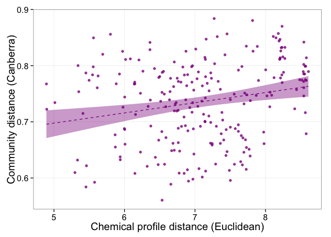

# Test for associations between community dissimilarity, resistome dissimilarity, and chemical profiles
Roxana Hickey  
Last updated December 9, 2015  

## Setup

```r
setwd('~/Documents/projects/dust_2015/')
load('~/Documents/projects/dust_2015/results/otu_setup/ger_rm_contaminants.RData')
load('~/Documents/projects/dust_2015/results/ger_abres_extra_plots.RData')

library(vegan)
```

```
## Loading required package: permute
## Loading required package: lattice
## This is vegan 2.3-1
```

```r
library(ggplot2)
```

## Test taxonomy vs. chem profiles

```r
## step 1: compute distance/dissimilarity on matrix 1
## step 2: plot histogram of dist object ofr matrix 1; transform if necessary and repeat
## step 3: compute distance/dissimilarity on matrix 2 
## step 4: plot histogram of dist object ofr matrix 2; transform if necessary and repeat
## step 5: plot dist 1 against dist 2 to get visual of relationship
## step 6: perform Mantel test on dist 1 vs. dist 2

## (prep) reduce ger.chem to non-NA data
ger.chem <- na.exclude(ger.map[,c('TCSavg', 'TCCavg', 'MePBavg', 'EtPBavg', 'PrPBavg', 'BuPBavg')])

## (prep) reduce rarefied otu table to match samples in ger.chem
ger.nc.rare.mc <- ger.nc.rare[rownames(ger.nc.rare) %in% rownames(ger.chem),] # n = 22
identical(rownames(ger.nc.rare.mc), rownames(ger.chem))
```

```
## [1] TRUE
```

```r
## steps 1-2: compute bray-curtis diss on otu table; view distribution
bc.nc.mc <- vegdist(ger.nc.rare.mc)
can.nc.mc <- vegdist(ger.nc.rare.mc, method = 'canberra')

par(mfrow = c(1,2))
hist(bc.nc.mc, breaks = 10, main = 'Bray-Curtis(taxonomy)', 
     xlab = 'Pairwise Bray-Curtis dissimilarity', col = mycol.9[9]) ## somewhat bimodal
hist(can.nc.mc, breaks = 10, main = 'Canberra(taxonomy)', 
     xlab = 'Pairwise Canberra dissimilarity', col = mycol.9[9]) ## roughly normal
```

 

```r
## steps 3-4: compute euclidean distance matrix on ger.chem; view distribution
euc.chem <- dist(ger.chem)
hist(euc.chem, breaks = 10, main = 'dist(chemical profile)', 
     xlab = 'Pairwise Euclidean distance', col = mycol.9[9]) ## weighted toward low dist

euc.chem.log <- log(dist(ger.chem)) ## transform dist(raw [chem])
hist(euc.chem.log, breaks = 10, main = 'log[dist(chemical profile)]', 
     xlab = 'log(pairwise Euclidean distance)', col = mycol.9[9]) ## roughly normal
```

 

```r
par(mfrow = c(2,3))
for(i in c('TCSavg', 'TCCavg', 'MePBavg', 'EtPBavg', 'PrPBavg', 'BuPBavg')){
  hist(log(dist(ger.chem[,i])), breaks = 10, col = mycol.9[9], 
       main = paste0('log[dist(', i, ')]'), 
       xlab = paste0('log Euclidean distance'))} ## mostly normal
```

 

```r
## step 5a: plot taxonomy against chem profile distance (all)
par(mfrow = c(1,1))
plot(can.nc.mc ~ euc.chem.log, col = mycol.9[9],
     ylab = 'Canberra dissimilarity of taxonomy profiles',
     xlab = 'log Euclidean distance of chemical profiles')
```

 

```r
## put data into 'long form' for analysis and ggplot
gg.dat <- na.omit(data.frame('dist.1' = c(can.nc.mc), 'dist.2' = c(euc.chem.log)))

## pick a pretty color
my.color <- mycol.9[9]

## quick ggplot
theme_set(theme_bw(base_size = 16))

ggplot(gg.dat, aes(x = dist.2, y = dist.1)) + 
  geom_point(colour = my.color, alpha = 0.8, size = 2) +
  stat_smooth(colour = my.color, linetype = 2, method = "lm", formula = y ~ poly(x, 1), fill = my.color, level = .95) + ## fit a 2nd order polynomial. you can change the '2' value in poly() to fit different functions (e.g., 1 for a line)
  guides(colour = FALSE, fill = FALSE) +
  xlab('Chemical profile distance (Euclidean)') +
  ylab('Community distance (Canberra)') +
#   geom_text(data = NULL, x = 8.25, y = 0.58, label = "r = 0.2039\np < 0.09", 
#             size = 8) +
  theme(panel.grid.minor = element_blank())
```

 

```r
ggsave('~/Documents/projects/dust_2015/figures/mantel_tax_chem.png', width = 8, height = 8, units = 'in')

## step 6a: mantel test (all chem)
mantel(can.nc.mc, euc.chem.log) ## r = 0.2039, p = 0.086
```

```
## 
## Mantel statistic based on Pearson's product-moment correlation 
## 
## Call:
## mantel(xdis = can.nc.mc, ydis = euc.chem.log) 
## 
## Mantel statistic r: 0.2214 
##       Significance: 0.078 
## 
## Upper quantiles of permutations (null model):
##   90%   95% 97.5%   99% 
## 0.191 0.250 0.304 0.347 
## Permutation: free
## Number of permutations: 999
```

```r
## step 5b: plot taxonomy against chem profile distance (individual)
par(mfrow = c(2,3))
for(i in c('TCSavg', 'TCCavg', 'MePBavg', 'EtPBavg', 'PrPBavg', 'BuPBavg')){
  ger.dist.tmp <- log(dist(ger.chem[,i]))
  plot(can.nc.mc ~ ger.dist.tmp, main = i, col = mycol.9[9],
       ylab = 'Canberra dissimilarity of taxonomy profiles',
       xlab = paste0('log Euclidean distance of [chemical]'))}
```

 

```r
## step 6b: mantel test (individual chem); need to add marginal amount to dist prior to log 
mantel(can.nc.mc, log(dist(ger.chem[,'TCSavg']) + 0.0001)) ## ns
```

```
## 
## Mantel statistic based on Pearson's product-moment correlation 
## 
## Call:
## mantel(xdis = can.nc.mc, ydis = log(dist(ger.chem[, "TCSavg"]) +      1e-04)) 
## 
## Mantel statistic r: -0.03079 
##       Significance: 0.576 
## 
## Upper quantiles of permutations (null model):
##   90%   95% 97.5%   99% 
## 0.147 0.188 0.214 0.255 
## Permutation: free
## Number of permutations: 999
```

```r
mantel(can.nc.mc, log(dist(ger.chem[,'TCCavg']) + 0.0001)) ## r = 0.2389, p usually > 0.05
```

```
## 
## Mantel statistic based on Pearson's product-moment correlation 
## 
## Call:
## mantel(xdis = can.nc.mc, ydis = log(dist(ger.chem[, "TCCavg"]) +      1e-04)) 
## 
## Mantel statistic r: 0.2465 
##       Significance: 0.054 
## 
## Upper quantiles of permutations (null model):
##   90%   95% 97.5%   99% 
## 0.182 0.254 0.305 0.336 
## Permutation: free
## Number of permutations: 999
```

```r
mantel(can.nc.mc, log(dist(ger.chem[,'MePBavg']) + 0.0001)) ## ns
```

```
## 
## Mantel statistic based on Pearson's product-moment correlation 
## 
## Call:
## mantel(xdis = can.nc.mc, ydis = log(dist(ger.chem[, "MePBavg"]) +      1e-04)) 
## 
## Mantel statistic r: -0.02703 
##       Significance: 0.581 
## 
## Upper quantiles of permutations (null model):
##   90%   95% 97.5%   99% 
## 0.114 0.147 0.186 0.220 
## Permutation: free
## Number of permutations: 999
```

```r
mantel(can.nc.mc, log(dist(ger.chem[,'EtPBavg']) + 0.0001)) ## ns
```

```
## 
## Mantel statistic based on Pearson's product-moment correlation 
## 
## Call:
## mantel(xdis = can.nc.mc, ydis = log(dist(ger.chem[, "EtPBavg"]) +      1e-04)) 
## 
## Mantel statistic r: -0.0529 
##       Significance: 0.651 
## 
## Upper quantiles of permutations (null model):
##   90%   95% 97.5%   99% 
## 0.131 0.185 0.219 0.249 
## Permutation: free
## Number of permutations: 999
```

```r
mantel(can.nc.mc, log(dist(ger.chem[,'PrPBavg']) + 0.0001)) ## ns
```

```
## 
## Mantel statistic based on Pearson's product-moment correlation 
## 
## Call:
## mantel(xdis = can.nc.mc, ydis = log(dist(ger.chem[, "PrPBavg"]) +      1e-04)) 
## 
## Mantel statistic r: 0.01076 
##       Significance: 0.416 
## 
## Upper quantiles of permutations (null model):
##   90%   95% 97.5%   99% 
## 0.148 0.192 0.227 0.263 
## Permutation: free
## Number of permutations: 999
```

```r
mantel(can.nc.mc, log(dist(ger.chem[,'BuPBavg']) + 0.0001)) ## ns
```

```
## 
## Mantel statistic based on Pearson's product-moment correlation 
## 
## Call:
## mantel(xdis = can.nc.mc, ydis = log(dist(ger.chem[, "BuPBavg"]) +      1e-04)) 
## 
## Mantel statistic r: 0.06859 
##       Significance: 0.149 
## 
## Upper quantiles of permutations (null model):
##    90%    95%  97.5%    99% 
## 0.0867 0.1204 0.1462 0.1682 
## Permutation: free
## Number of permutations: 999
```

```r
## extra: PERMANOVA tests
adonis(can.nc.mc ~ log(ger.chem$TCSavg)) ## R2 = 0.07157, p = 0.022 *
```

```
## 
## Call:
## adonis(formula = can.nc.mc ~ log(ger.chem$TCSavg)) 
## 
## Permutation: free
## Number of permutations: 999
## 
## Terms added sequentially (first to last)
## 
##                      Df SumsOfSqs MeanSqs F.Model      R2 Pr(>F)  
## log(ger.chem$TCSavg)  1    0.4053 0.40528  1.5202 0.07064  0.011 *
## Residuals            20    5.3319 0.26659         0.92936         
## Total                21    5.7371                 1.00000         
## ---
## Signif. codes:  0 '***' 0.001 '**' 0.01 '*' 0.05 '.' 0.1 ' ' 1
```

```r
adonis(can.nc.mc ~ log(ger.chem$TCCavg)) ## R2 = 0.0594, p = 0.118 (ns)
```

```
## 
## Call:
## adonis(formula = can.nc.mc ~ log(ger.chem$TCCavg)) 
## 
## Permutation: free
## Number of permutations: 999
## 
## Terms added sequentially (first to last)
## 
##                      Df SumsOfSqs MeanSqs F.Model      R2 Pr(>F)  
## log(ger.chem$TCCavg)  1    0.3499 0.34986  1.2988 0.06098   0.09 .
## Residuals            20    5.3873 0.26936         0.93902         
## Total                21    5.7371                 1.00000         
## ---
## Signif. codes:  0 '***' 0.001 '**' 0.01 '*' 0.05 '.' 0.1 ' ' 1
```

```r
adonis(can.nc.mc ~ log(ger.chem$EtPBavg)) ## R2 = 0.06908, p = 0.021 *
```

```
## 
## Call:
## adonis(formula = can.nc.mc ~ log(ger.chem$EtPBavg)) 
## 
## Permutation: free
## Number of permutations: 999
## 
## Terms added sequentially (first to last)
## 
##                       Df SumsOfSqs MeanSqs F.Model      R2 Pr(>F)  
## log(ger.chem$EtPBavg)  1    0.3939 0.39393  1.4745 0.06866  0.032 *
## Residuals             20    5.3432 0.26716         0.93134         
## Total                 21    5.7371                 1.00000         
## ---
## Signif. codes:  0 '***' 0.001 '**' 0.01 '*' 0.05 '.' 0.1 ' ' 1
```

```r
adonis(can.nc.mc ~ log(ger.chem$MePBavg)) ## R2 = 0.07697, p = 0.007 **
```

```
## 
## Call:
## adonis(formula = can.nc.mc ~ log(ger.chem$MePBavg)) 
## 
## Permutation: free
## Number of permutations: 999
## 
## Terms added sequentially (first to last)
## 
##                       Df SumsOfSqs MeanSqs F.Model      R2 Pr(>F)   
## log(ger.chem$MePBavg)  1    0.4443 0.44434   1.679 0.07745  0.006 **
## Residuals             20    5.2928 0.26464         0.92255          
## Total                 21    5.7371                 1.00000          
## ---
## Signif. codes:  0 '***' 0.001 '**' 0.01 '*' 0.05 '.' 0.1 ' ' 1
```

```r
adonis(can.nc.mc ~ log(ger.chem$PrPBavg)) ## R2 = 0.08092, p = 0.004 **
```

```
## 
## Call:
## adonis(formula = can.nc.mc ~ log(ger.chem$PrPBavg)) 
## 
## Permutation: free
## Number of permutations: 999
## 
## Terms added sequentially (first to last)
## 
##                       Df SumsOfSqs MeanSqs F.Model      R2 Pr(>F)   
## log(ger.chem$PrPBavg)  1    0.4631 0.46314  1.7563 0.08073  0.004 **
## Residuals             20    5.2740 0.26370         0.91927          
## Total                 21    5.7371                 1.00000          
## ---
## Signif. codes:  0 '***' 0.001 '**' 0.01 '*' 0.05 '.' 0.1 ' ' 1
```

```r
adonis(can.nc.mc ~ log(ger.chem$BuPBavg)) ## R2 = 0.07886, p = 0.008 **
```

```
## 
## Call:
## adonis(formula = can.nc.mc ~ log(ger.chem$BuPBavg)) 
## 
## Permutation: free
## Number of permutations: 999
## 
## Terms added sequentially (first to last)
## 
##                       Df SumsOfSqs MeanSqs F.Model      R2 Pr(>F)   
## log(ger.chem$BuPBavg)  1    0.4552 0.45523  1.7237 0.07935  0.009 **
## Residuals             20    5.2819 0.26410         0.92065          
## Total                 21    5.7371                 1.00000          
## ---
## Signif. codes:  0 '***' 0.001 '**' 0.01 '*' 0.05 '.' 0.1 ' ' 1
```

```r
adonis(bc.nc.mc ~ log(ger.chem$TCSavg)) ## R2 = 0.07307, p = 0.106 (ns)
```

```
## 
## Call:
## adonis(formula = bc.nc.mc ~ log(ger.chem$TCSavg)) 
## 
## Permutation: free
## Number of permutations: 999
## 
## Terms added sequentially (first to last)
## 
##                      Df SumsOfSqs MeanSqs F.Model      R2 Pr(>F)  
## log(ger.chem$TCSavg)  1    0.3090 0.30898  1.5881 0.07356  0.087 .
## Residuals            20    3.8913 0.19457         0.92644         
## Total                21    4.2003                 1.00000         
## ---
## Signif. codes:  0 '***' 0.001 '**' 0.01 '*' 0.05 '.' 0.1 ' ' 1
```

```r
adonis(bc.nc.mc ~ log(ger.chem$TCCavg)) ## R2 = 0.09499,  p = 0.052 . (marginally signif)
```

```
## 
## Call:
## adonis(formula = bc.nc.mc ~ log(ger.chem$TCCavg)) 
## 
## Permutation: free
## Number of permutations: 999
## 
## Terms added sequentially (first to last)
## 
##                      Df SumsOfSqs MeanSqs F.Model      R2 Pr(>F)  
## log(ger.chem$TCCavg)  1    0.4038 0.40383  2.1274 0.09614  0.052 .
## Residuals            20    3.7965 0.18982         0.90386         
## Total                21    4.2003                 1.00000         
## ---
## Signif. codes:  0 '***' 0.001 '**' 0.01 '*' 0.05 '.' 0.1 ' ' 1
```

```r
adonis(bc.nc.mc ~ log(ger.chem$EtPBavg)) ## R2 = 0.06254, p = 0.156 (ns)
```

```
## 
## Call:
## adonis(formula = bc.nc.mc ~ log(ger.chem$EtPBavg)) 
## 
## Permutation: free
## Number of permutations: 999
## 
## Terms added sequentially (first to last)
## 
##                       Df SumsOfSqs MeanSqs F.Model      R2 Pr(>F)
## log(ger.chem$EtPBavg)  1    0.2652 0.26523   1.348 0.06315  0.187
## Residuals             20    3.9351 0.19675         0.93685       
## Total                 21    4.2003                 1.00000
```

```r
adonis(bc.nc.mc ~ log(ger.chem$MePBavg)) ## R2 = 0.09015, p = 0.06 . (marginally signif)
```

```
## 
## Call:
## adonis(formula = bc.nc.mc ~ log(ger.chem$MePBavg)) 
## 
## Permutation: free
## Number of permutations: 999
## 
## Terms added sequentially (first to last)
## 
##                       Df SumsOfSqs MeanSqs F.Model      R2 Pr(>F)  
## log(ger.chem$MePBavg)  1    0.3834 0.38342  2.0091 0.09129   0.06 .
## Residuals             20    3.8169 0.19084         0.90871         
## Total                 21    4.2003                 1.00000         
## ---
## Signif. codes:  0 '***' 0.001 '**' 0.01 '*' 0.05 '.' 0.1 ' ' 1
```

```r
adonis(bc.nc.mc ~ log(ger.chem$PrPBavg)) ## R2 = 0.09308, p = 0.045 *
```

```
## 
## Call:
## adonis(formula = bc.nc.mc ~ log(ger.chem$PrPBavg)) 
## 
## Permutation: free
## Number of permutations: 999
## 
## Terms added sequentially (first to last)
## 
##                       Df SumsOfSqs MeanSqs F.Model      R2 Pr(>F)  
## log(ger.chem$PrPBavg)  1    0.3954 0.39541  2.0784 0.09414  0.038 *
## Residuals             20    3.8049 0.19024         0.90586         
## Total                 21    4.2003                 1.00000         
## ---
## Signif. codes:  0 '***' 0.001 '**' 0.01 '*' 0.05 '.' 0.1 ' ' 1
```

```r
adonis(bc.nc.mc ~ log(ger.chem$BuPBavg)) ## R2 = 0.08765, p = 0.055 . (marginally signif)
```

```
## 
## Call:
## adonis(formula = bc.nc.mc ~ log(ger.chem$BuPBavg)) 
## 
## Permutation: free
## Number of permutations: 999
## 
## Terms added sequentially (first to last)
## 
##                       Df SumsOfSqs MeanSqs F.Model      R2 Pr(>F)  
## log(ger.chem$BuPBavg)  1    0.3718 0.37175   1.942 0.08851  0.046 *
## Residuals             20    3.8285 0.19143         0.91149         
## Total                 21    4.2003                 1.00000         
## ---
## Signif. codes:  0 '***' 0.001 '**' 0.01 '*' 0.05 '.' 0.1 ' ' 1
```

## Test ARDB resistome vs. chem profiles

```r
## step 1: compute distance/dissimilarity on matrix 1
## step 2: plot histogram of dist object ofr matrix 1; transform if necessary and repeat
## step 3: compute distance/dissimilarity on matrix 2 
## step 4: plot histogram of dist object ofr matrix 2; transform if necessary and repeat
## step 5: plot dist 1 against dist 2 to get visual of relationship
## step 6: perform Mantel test on dist 1 vs. dist 2

## (prep step) reduce ardb to match ger.chem
ger.ardb.mc <- ger.ardb[,colnames(ger.ardb) %in% rownames(ger.chem)] ## n = 18

## (prep step) reduce chem to match ger.ardb.mc
ger.chem.2 <- ger.chem[rownames(ger.chem) %in% colnames(ger.ardb.mc),]
ger.chem.2 <- ger.chem.2[match(rownames(t(ger.ardb.mc)), rownames(ger.chem.2)),]

identical(rownames(t(ger.ardb.mc)), rownames(ger.chem.2))
```

```
## [1] TRUE
```

```r
## steps 1-2: compute diss on ARDB table; view distribution
bc.ardb.mc <- vegdist(t(ger.ardb.mc))
euc.ardb.mc <- dist(t(ger.ardb.mc))
can.ardb.mc <- vegdist(t(ger.ardb.mc), method = 'canberra')
jac.ardb.mc <- vegdist(t(ger.ardb.mc), method = 'jaccard')
gow.ardb.mc <- vegdist(t(ger.ardb.mc), method = 'gower')
horn.ardb.mc <- vegdist(t(ger.ardb.mc), method = 'horn')

par(mfrow = c(2,3))
hist(bc.ardb.mc, breaks = 10, main = 'Bray-Curtis(ARDB resistome)', 
     xlab = 'Pairwise Bray-Curtis dissimilarity', col = mycol.9[9]) ## skewed left tail
hist(euc.ardb.mc, breaks = 10, main = 'Euclidean(ARDB resistome)', 
     xlab = 'Pairwise Euclidean distance', col = mycol.9[9]) ## roughly normal, but gappy
hist(can.ardb.mc, breaks = 10, main = 'Canberra(ARDB resistome)', 
     xlab = 'Pairwise Canberra distance', col = mycol.9[9]) ## skewed left tail
hist(jac.ardb.mc, breaks = 10, main = 'Jaccard(ARDB resistome)', 
     xlab = 'Pairwise Jaccard distance', col = mycol.9[9]) ## skewed left tail
hist(gow.ardb.mc, breaks = 10, main = 'Gower(ARDB resistome)', 
     xlab = 'Pairwise Gower distance', col = mycol.9[9]) ## roughly normal
hist(horn.ardb.mc, breaks = 10, main = 'Horn-Morisita(ARDB resistome)', 
     xlab = 'Pairwise Horn-Morisita distance', col = mycol.9[9]) ## skewed/bimodal
```

 

```r
## steps 3-4: compute euclidean distance matrix on ger.chem; view distribution
par(mfrow = c(1,2))
euc.chem.2 <- dist(ger.chem.2)
hist(euc.chem.2, breaks = 10, main = 'dist(chemical profile)', 
     xlab = 'Pairwise Euclidean distance', col = mycol.9[9]) ## weighted toward low dist

euc.chem.2.log <- log(dist(ger.chem.2)) ## transform dist(raw [chem])
hist(euc.chem.2.log, breaks = 10, main = 'log[dist(chemical profile)]', 
     xlab = 'log(pairwise Euclidean distance)', col = mycol.9[9]) ## roughly normal
```

 

```r
par(mfrow = c(2,3))
for(i in c('TCSavg', 'TCCavg', 'MePBavg', 'EtPBavg', 'PrPBavg', 'BuPBavg')){
  hist(log(dist(ger.chem.2[,i])), breaks = 10, col = mycol.9[9], 
       main = paste0('log[dist(', i, ')]'), 
       xlab = paste0('log Euclidean distance'))} ## mostly normal
```

 

```r
## step 5a: plot ARDB resistome against chem profile distance (all)
par(mfrow = c(1,1))
plot(gow.ardb.mc ~ euc.chem.2.log, col = mycol.9[9],
     ylab = 'Gower dissimilarity of ARDB resistome profiles',
     xlab = 'log Euclidean distance of chemical profiles')
```

 

```r
## step 6a: mantel test (all chem)
mantel(gow.ardb.mc, euc.chem.2.log) ## * r = 0.4521, p = 0.015
```

```
## 
## Mantel statistic based on Pearson's product-moment correlation 
## 
## Call:
## mantel(xdis = gow.ardb.mc, ydis = euc.chem.2.log) 
## 
## Mantel statistic r: 0.4521 
##       Significance: 0.013 
## 
## Upper quantiles of permutations (null model):
##   90%   95% 97.5%   99% 
## 0.277 0.350 0.413 0.493 
## Permutation: free
## Number of permutations: 999
```

```r
## step 5b: plot ARDB resistome against chem profile distance (individual)
par(mfrow = c(2,3))
for(i in c('TCSavg', 'TCCavg', 'MePBavg', 'EtPBavg', 'PrPBavg', 'BuPBavg')){
  ger.dist.tmp <- log(dist(ger.chem.2[,i]))
  plot(gow.ardb.mc ~ ger.dist.tmp, main = i, col = mycol.9[9],
       ylab = 'Gower dissimilarity of ARDB resistome',
       xlab = paste0('log Euclidean distance of [chemical]'))}
```

 

```r
## step 6b: mantel test (individual chem); need to add marginal amount to dist prior to log 
mantel(gow.ardb.mc, log(dist(ger.chem.2[,'TCSavg']) + 0.0001)) ## ns
```

```
## 
## Mantel statistic based on Pearson's product-moment correlation 
## 
## Call:
## mantel(xdis = gow.ardb.mc, ydis = log(dist(ger.chem.2[, "TCSavg"]) +      1e-04)) 
## 
## Mantel statistic r: 0.2654 
##       Significance: 0.092 
## 
## Upper quantiles of permutations (null model):
##   90%   95% 97.5%   99% 
## 0.247 0.356 0.420 0.496 
## Permutation: free
## Number of permutations: 999
```

```r
mantel(gow.ardb.mc, log(dist(ger.chem.2[,'TCCavg']) + 0.0001)) ## * r = 0.492, p = 0.012
```

```
## 
## Mantel statistic based on Pearson's product-moment correlation 
## 
## Call:
## mantel(xdis = gow.ardb.mc, ydis = log(dist(ger.chem.2[, "TCCavg"]) +      1e-04)) 
## 
## Mantel statistic r: 0.492 
##       Significance: 0.009 
## 
## Upper quantiles of permutations (null model):
##   90%   95% 97.5%   99% 
## 0.265 0.360 0.438 0.489 
## Permutation: free
## Number of permutations: 999
```

```r
mantel(gow.ardb.mc, log(dist(ger.chem.2[,'MePBavg']) + 0.0001)) ## . r = 0.1531, p = 0.054
```

```
## 
## Mantel statistic based on Pearson's product-moment correlation 
## 
## Call:
## mantel(xdis = gow.ardb.mc, ydis = log(dist(ger.chem.2[, "MePBavg"]) +      1e-04)) 
## 
## Mantel statistic r: 0.1531 
##       Significance: 0.059 
## 
## Upper quantiles of permutations (null model):
##   90%   95% 97.5%   99% 
## 0.127 0.158 0.187 0.214 
## Permutation: free
## Number of permutations: 999
```

```r
mantel(gow.ardb.mc, log(dist(ger.chem.2[,'EtPBavg']) + 0.0001)) ## ns
```

```
## 
## Mantel statistic based on Pearson's product-moment correlation 
## 
## Call:
## mantel(xdis = gow.ardb.mc, ydis = log(dist(ger.chem.2[, "EtPBavg"]) +      1e-04)) 
## 
## Mantel statistic r: 0.08099 
##       Significance: 0.288 
## 
## Upper quantiles of permutations (null model):
##   90%   95% 97.5%   99% 
## 0.205 0.270 0.330 0.381 
## Permutation: free
## Number of permutations: 999
```

```r
mantel(gow.ardb.mc, log(dist(ger.chem.2[,'PrPBavg']) + 0.0001)) ## ns
```

```
## 
## Mantel statistic based on Pearson's product-moment correlation 
## 
## Call:
## mantel(xdis = gow.ardb.mc, ydis = log(dist(ger.chem.2[, "PrPBavg"]) +      1e-04)) 
## 
## Mantel statistic r: 0.03348 
##       Significance: 0.365 
## 
## Upper quantiles of permutations (null model):
##   90%   95% 97.5%   99% 
## 0.183 0.244 0.301 0.348 
## Permutation: free
## Number of permutations: 999
```

```r
mantel(gow.ardb.mc, log(dist(ger.chem.2[,'BuPBavg']) + 0.0001)) ## ns
```

```
## 
## Mantel statistic based on Pearson's product-moment correlation 
## 
## Call:
## mantel(xdis = gow.ardb.mc, ydis = log(dist(ger.chem.2[, "BuPBavg"]) +      1e-04)) 
## 
## Mantel statistic r: 0.03179 
##       Significance: 0.368 
## 
## Upper quantiles of permutations (null model):
##   90%   95% 97.5%   99% 
## 0.144 0.184 0.229 0.270 
## Permutation: free
## Number of permutations: 999
```

```r
## bonus round: PERMANOVA
adonis(vegdist(t(ger.ardb), method = 'gower') ~ ger.meta.map.nc$SpaceTypeBioBE) ## 0.34438  0.011 *
```

```
## 
## Call:
## adonis(formula = vegdist(t(ger.ardb), method = "gower") ~ ger.meta.map.nc$SpaceTypeBioBE) 
## 
## Permutation: free
## Number of permutations: 999
## 
## Terms added sequentially (first to last)
## 
##                                Df  SumsOfSqs    MeanSqs F.Model      R2
## ger.meta.map.nc$SpaceTypeBioBE  8 0.00055557 6.9446e-05  1.7728 0.34438
## Residuals                      27 0.00105768 3.9173e-05         0.65562
## Total                          35 0.00161324                    1.00000
##                                Pr(>F)   
## ger.meta.map.nc$SpaceTypeBioBE  0.005 **
## Residuals                               
## Total                                   
## ---
## Signif. codes:  0 '***' 0.001 '**' 0.01 '*' 0.05 '.' 0.1 ' ' 1
```

```r
adonis(gow.ardb.mc ~ ger.chem.2$TCCavg) ## 0.11164  0.119
```

```
## 
## Call:
## adonis(formula = gow.ardb.mc ~ ger.chem.2$TCCavg) 
## 
## Permutation: free
## Number of permutations: 999
## 
## Terms added sequentially (first to last)
## 
##                   Df  SumsOfSqs    MeanSqs F.Model      R2 Pr(>F)
## ger.chem.2$TCCavg  1 0.00013289 0.00013289  2.0108 0.11164  0.125
## Residuals         16 0.00105744 0.00006609         0.88836       
## Total             17 0.00119033                    1.00000
```

```r
adonis(gow.ardb.mc ~ ger.chem.2$TCSavg) ## 0.11718  0.127
```

```
## 
## Call:
## adonis(formula = gow.ardb.mc ~ ger.chem.2$TCSavg) 
## 
## Permutation: free
## Number of permutations: 999
## 
## Terms added sequentially (first to last)
## 
##                   Df  SumsOfSqs    MeanSqs F.Model      R2 Pr(>F)
## ger.chem.2$TCSavg  1 0.00013949 1.3949e-04  2.1238 0.11718  0.104
## Residuals         16 0.00105084 6.5678e-05         0.88282       
## Total             17 0.00119033                    1.00000
```

```r
adonis(gow.ardb.mc ~ ger.chem.2$EtPBavg) ## 0.08669  0.169
```

```
## 
## Call:
## adonis(formula = gow.ardb.mc ~ ger.chem.2$EtPBavg) 
## 
## Permutation: free
## Number of permutations: 999
## 
## Terms added sequentially (first to last)
## 
##                    Df  SumsOfSqs    MeanSqs F.Model      R2 Pr(>F)
## ger.chem.2$EtPBavg  1 0.00010319 1.0319e-04  1.5188 0.08669  0.155
## Residuals          16 0.00108713 6.7946e-05         0.91331       
## Total              17 0.00119033                    1.00000
```

```r
adonis(gow.ardb.mc ~ ger.chem.2$MePBavg) ## 0.11173  0.043 *
```

```
## 
## Call:
## adonis(formula = gow.ardb.mc ~ ger.chem.2$MePBavg) 
## 
## Permutation: free
## Number of permutations: 999
## 
## Terms added sequentially (first to last)
## 
##                    Df  SumsOfSqs    MeanSqs F.Model      R2 Pr(>F)  
## ger.chem.2$MePBavg  1 0.00013299 1.3299e-04  2.0125 0.11173  0.042 *
## Residuals          16 0.00105734 6.6084e-05         0.88827         
## Total              17 0.00119033                    1.00000         
## ---
## Signif. codes:  0 '***' 0.001 '**' 0.01 '*' 0.05 '.' 0.1 ' ' 1
```

```r
adonis(gow.ardb.mc ~ ger.chem.2$PrPBavg) ## 0.08387  0.177
```

```
## 
## Call:
## adonis(formula = gow.ardb.mc ~ ger.chem.2$PrPBavg) 
## 
## Permutation: free
## Number of permutations: 999
## 
## Terms added sequentially (first to last)
## 
##                    Df  SumsOfSqs    MeanSqs F.Model      R2 Pr(>F)
## ger.chem.2$PrPBavg  1 0.00009983 9.9831e-05  1.4647 0.08387   0.18
## Residuals          16 0.00109050 6.8156e-05         0.91613       
## Total              17 0.00119033                    1.00000
```

```r
adonis(gow.ardb.mc ~ ger.chem.2$BuPBavg) ## 0.08796  0.147
```

```
## 
## Call:
## adonis(formula = gow.ardb.mc ~ ger.chem.2$BuPBavg) 
## 
## Permutation: free
## Number of permutations: 999
## 
## Terms added sequentially (first to last)
## 
##                    Df SumsOfSqs    MeanSqs F.Model      R2 Pr(>F)
## ger.chem.2$BuPBavg  1 0.0001047 1.0470e-04  1.5431 0.08796  0.135
## Residuals          16 0.0010856 6.7852e-05         0.91204       
## Total              17 0.0011903                    1.00000
```

## Test CARD resistome vs. chem profiles

```r
## step 1: compute distance/dissimilarity on matrix 1
## step 2: plot histogram of dist object ofr matrix 1; transform if necessary and repeat
## step 3: compute distance/dissimilarity on matrix 2 
## step 4: plot histogram of dist object ofr matrix 2; transform if necessary and repeat
## step 5: plot dist 1 against dist 2 to get visual of relationship
## step 6: perform Mantel test on dist 1 vs. dist 2

## (prep step) reduce card to match ger.chem
ger.card.mc <- ger.card[,colnames(ger.card) %in% rownames(ger.chem)] ## n = 18
identical(rownames(t(ger.card.mc)), rownames(ger.chem.2))
```

```
## [1] TRUE
```

```r
## steps 1-2: compute dissimilarity on CARD table; view distribution
bc.card.mc <- vegdist(t(ger.card.mc))
euc.card.mc <- dist(t(ger.card.mc))
can.card.mc <- vegdist(t(ger.card.mc), method = 'canberra')
jac.card.mc <- vegdist(t(ger.card.mc), method = 'jaccard')
gow.card.mc <- vegdist(t(ger.card.mc), method = 'gower')
horn.card.mc <- vegdist(t(ger.card.mc), method = 'horn')

par(mfrow = c(2,3))
hist(bc.card.mc, breaks = 10, main = 'Bray-Curtis(CARD resistome)', 
     xlab = 'Pairwise Bray-Curtis dissimilarity', col = mycol.9[9]) ## skewed left tail
hist(euc.card.mc, breaks = 10, main = 'Euclidean(CARD resistome)', 
     xlab = 'Pairwise Euclidean distance', col = mycol.9[9]) ## normal left, skewed right tail
hist(can.card.mc, breaks = 10, main = 'Canberra(CARD resistome)', 
     xlab = 'Pairwise Canberra distance', col = mycol.9[9]) ## slighly skewed left tail
hist(jac.card.mc, breaks = 10, main = 'Jaccard(CARD resistome)', 
     xlab = 'Pairwise Jaccard distance', col = mycol.9[9]) ## skewed left tail
hist(gow.card.mc, breaks = 10, main = 'Gower(CARD resistome)', 
     xlab = 'Pairwise Gower distance', col = mycol.9[9]) ## roughly normal
hist(horn.card.mc, breaks = 10, main = 'Horn-Morisita(CARD resistome)', 
     xlab = 'Pairwise Horn-Morisita distance', col = mycol.9[9]) ## highly skewed; don't use
```

 

```r
## steps 3-4: done in previous step for ARDB

## step 5a: plot CARD resistome against chem profile distance (all)
par(mfrow = c(1,1))
plot(gow.card.mc ~ euc.chem.2.log, col = mycol.9[9],
     ylab = 'Gower dissimilarity of CARD resistomes',
     xlab = 'log Euclidean distance of chemical profiles')
```

 

```r
## step 6a: mantel test (all chem)
mantel(gow.card.mc, euc.chem.2.log) ## * r = 0.4593, p = 0.016
```

```
## 
## Mantel statistic based on Pearson's product-moment correlation 
## 
## Call:
## mantel(xdis = gow.card.mc, ydis = euc.chem.2.log) 
## 
## Mantel statistic r: 0.4593 
##       Significance: 0.014 
## 
## Upper quantiles of permutations (null model):
##   90%   95% 97.5%   99% 
## 0.254 0.357 0.420 0.469 
## Permutation: free
## Number of permutations: 999
```

```r
mantel(euc.card.mc, euc.chem.2.log) ## ns
```

```
## 
## Mantel statistic based on Pearson's product-moment correlation 
## 
## Call:
## mantel(xdis = euc.card.mc, ydis = euc.chem.2.log) 
## 
## Mantel statistic r: 0.1572 
##       Significance: 0.175 
## 
## Upper quantiles of permutations (null model):
##   90%   95% 97.5%   99% 
## 0.304 0.411 0.465 0.538 
## Permutation: free
## Number of permutations: 999
```

```r
mantel(can.card.mc, euc.chem.2.log) ## * r = 0.2418, p = 0.014
```

```
## 
## Mantel statistic based on Pearson's product-moment correlation 
## 
## Call:
## mantel(xdis = can.card.mc, ydis = euc.chem.2.log) 
## 
## Mantel statistic r: 0.2418 
##       Significance: 0.023 
## 
## Upper quantiles of permutations (null model):
##   90%   95% 97.5%   99% 
## 0.146 0.194 0.237 0.301 
## Permutation: free
## Number of permutations: 999
```

```r
## step 5b: plot CARD resistome against chem profile distance (individual)
par(mfrow = c(2,3))
for(i in c('TCSavg', 'TCCavg', 'MePBavg', 'EtPBavg', 'PrPBavg', 'BuPBavg')){
  ger.dist.tmp <- log(dist(ger.chem.2[,i]))
  plot(gow.card.mc ~ ger.dist.tmp, main = i, col = mycol.9[9],
       ylab = 'Gower dissimilarity of CARD resistomes',
       xlab = paste0('log Euclidean distance of [chemical]'))}
```

 

```r
## step 6b: mantel test (individual chem); need to add marginal amount to dist prior to log 
mantel(gow.card.mc, log(dist(ger.chem.2[,'TCSavg']) + 0.0001)) ## * r = 0.3976, p = 0.025
```

```
## 
## Mantel statistic based on Pearson's product-moment correlation 
## 
## Call:
## mantel(xdis = gow.card.mc, ydis = log(dist(ger.chem.2[, "TCSavg"]) +      1e-04)) 
## 
## Mantel statistic r: 0.3976 
##       Significance: 0.029 
## 
## Upper quantiles of permutations (null model):
##   90%   95% 97.5%   99% 
## 0.266 0.340 0.405 0.459 
## Permutation: free
## Number of permutations: 999
```

```r
mantel(gow.card.mc, log(dist(ger.chem.2[,'TCCavg']) + 0.0001)) ## * r = 0.4889, p = 0.011
```

```
## 
## Mantel statistic based on Pearson's product-moment correlation 
## 
## Call:
## mantel(xdis = gow.card.mc, ydis = log(dist(ger.chem.2[, "TCCavg"]) +      1e-04)) 
## 
## Mantel statistic r: 0.4889 
##       Significance: 0.012 
## 
## Upper quantiles of permutations (null model):
##   90%   95% 97.5%   99% 
## 0.281 0.349 0.406 0.495 
## Permutation: free
## Number of permutations: 999
```

```r
mantel(gow.card.mc, log(dist(ger.chem.2[,'MePBavg']) + 0.0001)) ## ** r = 0.2518, p = 0.002
```

```
## 
## Mantel statistic based on Pearson's product-moment correlation 
## 
## Call:
## mantel(xdis = gow.card.mc, ydis = log(dist(ger.chem.2[, "MePBavg"]) +      1e-04)) 
## 
## Mantel statistic r: 0.2518 
##       Significance: 0.005 
## 
## Upper quantiles of permutations (null model):
##   90%   95% 97.5%   99% 
## 0.123 0.164 0.192 0.222 
## Permutation: free
## Number of permutations: 999
```

```r
mantel(gow.card.mc, log(dist(ger.chem.2[,'EtPBavg']) + 0.0001)) ## ns
```

```
## 
## Mantel statistic based on Pearson's product-moment correlation 
## 
## Call:
## mantel(xdis = gow.card.mc, ydis = log(dist(ger.chem.2[, "EtPBavg"]) +      1e-04)) 
## 
## Mantel statistic r: 0.09474 
##       Significance: 0.25 
## 
## Upper quantiles of permutations (null model):
##   90%   95% 97.5%   99% 
## 0.205 0.278 0.340 0.367 
## Permutation: free
## Number of permutations: 999
```

```r
mantel(gow.card.mc, log(dist(ger.chem.2[,'PrPBavg']) + 0.0001)) ## ns
```

```
## 
## Mantel statistic based on Pearson's product-moment correlation 
## 
## Call:
## mantel(xdis = gow.card.mc, ydis = log(dist(ger.chem.2[, "PrPBavg"]) +      1e-04)) 
## 
## Mantel statistic r: 0.03357 
##       Significance: 0.363 
## 
## Upper quantiles of permutations (null model):
##   90%   95% 97.5%   99% 
## 0.194 0.271 0.312 0.362 
## Permutation: free
## Number of permutations: 999
```

```r
mantel(gow.card.mc, log(dist(ger.chem.2[,'BuPBavg']) + 0.0001)) ## ns
```

```
## 
## Mantel statistic based on Pearson's product-moment correlation 
## 
## Call:
## mantel(xdis = gow.card.mc, ydis = log(dist(ger.chem.2[, "BuPBavg"]) +      1e-04)) 
## 
## Mantel statistic r: 0.1018 
##       Significance: 0.179 
## 
## Upper quantiles of permutations (null model):
##   90%   95% 97.5%   99% 
## 0.155 0.197 0.228 0.266 
## Permutation: free
## Number of permutations: 999
```

## Test ARDB resistome vs. taxonomy profiles

```r
ger.nc.rare.matchardb <- ger.nc.rare[rownames(ger.nc.rare) %in% colnames(ger.ardb),]
ger.nc.rare.matchardb <- ger.nc.rare.matchardb[match(rownames(t(ger.ardb)), rownames(ger.nc.rare.matchardb)),]

identical(rownames(ger.nc.rare.matchardb), rownames(t(ger.ardb)))
```

```
## [1] TRUE
```

```r
par(mfrow = c(1,2))
hist(vegdist(ger.nc.rare.matchardb, method = 'canberra'), breaks = 10, main = 'Canberra(taxonomy)', 
     xlab = 'Pairwise Canberra distance', col = mycol.9[9]) ## roughly normal
hist(vegdist(t(ger.ardb), method = 'gower'), breaks = 10, main = 'Gower(ARDB resistome)', 
     xlab = 'Pairwise Gower dissimilarity', col = mycol.9[9]) ## roughly normal
```

 

```r
par(mfrow = c(1,1))
plot(vegdist(ger.nc.rare.matchardb, method = 'canberra'),
     vegdist(t(ger.ardb), method = 'gower'), col = mycol.9[9],
     xlab = '16S rRNA taxonomy pairwise Canberra distance',
     ylab = 'ARDB resistome pairwise Gower dissimilarity')
```

 

```r
mantel(vegdist(ger.nc.rare.matchardb, method = 'canberra'), 
       vegdist(t(ger.ardb), method = 'gower')) ## * r = 0.2844, p = 0.025
```

```
## 
## Mantel statistic based on Pearson's product-moment correlation 
## 
## Call:
## mantel(xdis = vegdist(ger.nc.rare.matchardb, method = "canberra"),      ydis = vegdist(t(ger.ardb), method = "gower")) 
## 
## Mantel statistic r: 0.2892 
##       Significance: 0.023 
## 
## Upper quantiles of permutations (null model):
##   90%   95% 97.5%   99% 
## 0.177 0.223 0.283 0.336 
## Permutation: free
## Number of permutations: 999
```

## Test CARD resistome vs. taxonomy profiles

```r
ger.nc.rare.matchcard <- ger.nc.rare[rownames(ger.nc.rare) %in% colnames(ger.card),]
ger.nc.rare.matchcard <- ger.nc.rare.matchcard[match(rownames(t(ger.card)), rownames(ger.nc.rare.matchcard)),]

identical(rownames(ger.nc.rare.matchcard), rownames(t(ger.card)))
```

```
## [1] TRUE
```

```r
par(mfrow = c(1,1))
par(mfrow = c(1,2))
hist(vegdist(ger.nc.rare.matchcard, method = 'canberra'), breaks = 10, main = 'Canberra(taxonomy)', 
     xlab = 'Pairwise Canberra distance', col = mycol.9[9]) ## roughly normal
hist(vegdist(t(ger.card), method = 'gower'), breaks = 10, main = 'Gower(CARD resistome)', 
     xlab = 'Pairwise Gower dissimilarity', col = mycol.9[9]) ## roughly normal
```

 

```r
par(mfrow = c(1,1))
plot(vegdist(ger.nc.rare.matchcard, method = 'canberra'),
     vegdist(t(ger.card), method = 'gower'), col = mycol.9[9],
     xlab = '16S rRNA taxonomy pairwise Canberra distance',
     ylab = 'CARD resistome pairwise Gower dissimilarity')
```

 

```r
mantel(vegdist(ger.nc.rare.matchcard, method = 'canberra'), 
       vegdist(t(ger.card), method = 'gower')) ## r = 0.2677, p = 0.026 *
```

```
## 
## Mantel statistic based on Pearson's product-moment correlation 
## 
## Call:
## mantel(xdis = vegdist(ger.nc.rare.matchcard, method = "canberra"),      ydis = vegdist(t(ger.card), method = "gower")) 
## 
## Mantel statistic r: 0.2762 
##       Significance: 0.029 
## 
## Upper quantiles of permutations (null model):
##   90%   95% 97.5%   99% 
## 0.183 0.232 0.291 0.327 
## Permutation: free
## Number of permutations: 999
```


```r
save.image('~/Documents/projects/dust_2015/results/ger_tax_resistome_chem_mantel_permanova.RData')
```
