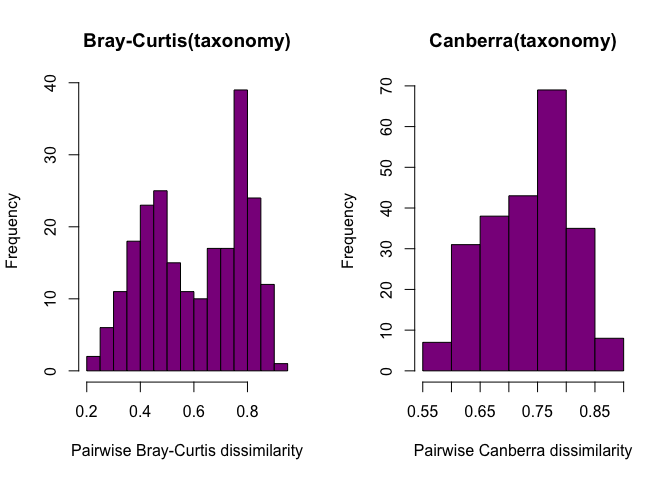
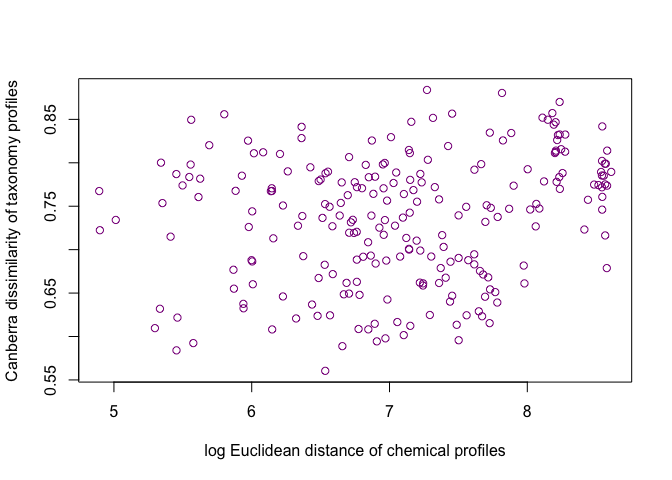
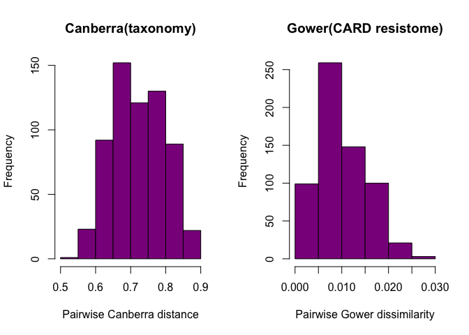

# Test for associations between community dissimilarity, resistome dissimilarity, and chemical profiles
Roxana Hickey  
Last updated December 9, 2015  

## Setup

```r
library(vegan)
```

```
## Loading required package: permute
## Loading required package: lattice
## This is vegan 2.3-1
```

```r
setwd('~/Documents/projects/gerlinger/')
load('results/otu_setup/ger_rm_contaminants.RData')
load('results/ger_abres_extra_plots.RData')
```

## Test taxonomy vs. chem profiles

```r
## step 1: compute distance/dissimilarity on matrix 1
## step 2: plot histogram of dist object ofr matrix 1; transform if necessary and repeat
## step 3: compute distance/dissimilarity on matrix 2 
## step 4: plot histogram of dist object ofr matrix 2; transform if necessary and repeat
## step 5: plot dist 1 against dist 2 to get visual of relationship
## step 6: perform Mantel test on dist 1 vs. dist 2

## (prep) reduce ger.chem to non-NA data
ger.chem <- na.exclude(ger.map[,c('TCSavg', 'TCCavg', 'MePBavg', 'EtPBavg', 'PrPBavg', 'BuPBavg')])

## (prep) reduce rarefied otu table to match samples in ger.chem
ger.nc.rare.mc <- ger.nc.rare[rownames(ger.nc.rare) %in% rownames(ger.chem),] # n = 22
identical(rownames(ger.nc.rare.mc), rownames(ger.chem))
```

```
## [1] TRUE
```

```r
## steps 1-2: compute bray-curtis diss on otu table; view distribution
bc.nc.mc <- vegdist(ger.nc.rare.mc)
can.nc.mc <- vegdist(ger.nc.rare.mc, method = 'canberra')

# png('figures/ger_tax_bc_vs_can_diss.png', width = 8, height = 6, units = 'in')
par(mfrow = c(1,2))
hist(bc.nc.mc, breaks = 10, main = 'Bray-Curtis(taxonomy)', 
     xlab = 'Pairwise Bray-Curtis dissimilarity', col = mycol.9[9]) ## somewhat bimodal
hist(can.nc.mc, breaks = 10, main = 'Canberra(taxonomy)', 
     xlab = 'Pairwise Canberra dissimilarity', col = mycol.9[9]) ## roughly normal
```

 

```r
# dev.off()

## steps 3-4: compute euclidean distance matrix on ger.chem; view distribution
euc.chem <- dist(ger.chem)
hist(euc.chem, breaks = 10, main = 'dist(chemical profile)', 
     xlab = 'Pairwise Euclidean distance', col = mycol.9[9]) ## weighted toward low dist

euc.chem.log <- log(dist(ger.chem)) ## transform dist(raw [chem])
hist(euc.chem.log, breaks = 10, main = 'log[dist(chemical profile)]', 
     xlab = 'log(pairwise Euclidean distance)', col = mycol.9[9]) ## roughly normal
```

 

```r
par(mfrow = c(2,3))
for(i in c('TCSavg', 'TCCavg', 'MePBavg', 'EtPBavg', 'PrPBavg', 'BuPBavg')){
  hist(log(dist(ger.chem[,i])), breaks = 10, col = mycol.9[9], 
       main = paste0('log[dist(', i, ')]'), 
       xlab = paste0('log Euclidean distance'))} ## mostly normal
```

 

```r
# dev.off()

## step 5a: plot taxonomy against chem profile distance (all)
par(mfrow = c(1,1))
plot(can.nc.mc ~ euc.chem.log, col = mycol.9[9],
     ylab = 'Canberra dissimilarity of taxonomy profiles',
     xlab = 'log Euclidean distance of chemical profiles')
```

 

```r
## step 6a: mantel test (all chem)
mantel(can.nc.mc, euc.chem.log) ## r = 0.2075, p = 0.074
```

```
## 
## Mantel statistic based on Pearson's product-moment correlation 
## 
## Call:
## mantel(xdis = can.nc.mc, ydis = euc.chem.log) 
## 
## Mantel statistic r: 0.2075 
##       Significance: 0.071 
## 
## Upper quantiles of permutations (null model):
##   90%   95% 97.5%   99% 
## 0.177 0.244 0.316 0.354 
## Permutation: free
## Number of permutations: 999
```

```r
## step 5b: plot taxonomy against chem profile distance (individual)
par(mfrow = c(2,3))
for(i in c('TCSavg', 'TCCavg', 'MePBavg', 'EtPBavg', 'PrPBavg', 'BuPBavg')){
  ger.dist.tmp <- log(dist(ger.chem[,i]))
  plot(can.nc.mc ~ ger.dist.tmp, main = i, col = mycol.9[9],
       ylab = 'Canberra dissimilarity of taxonomy profiles',
       xlab = paste0('log Euclidean distance of [chemical]'))}
```

 

```r
# dev.off()

## step 6b: mantel test (individual chem); need to add marginal amount to dist prior to log 
mantel(can.nc.mc, log(dist(ger.chem[,'TCSavg']) + 0.0001)) ## ns
```

```
## 
## Mantel statistic based on Pearson's product-moment correlation 
## 
## Call:
## mantel(xdis = can.nc.mc, ydis = log(dist(ger.chem[, "TCSavg"]) +      1e-04)) 
## 
## Mantel statistic r: -0.02708 
##       Significance: 0.543 
## 
## Upper quantiles of permutations (null model):
##   90%   95% 97.5%   99% 
## 0.138 0.184 0.221 0.251 
## Permutation: free
## Number of permutations: 999
```

```r
mantel(can.nc.mc, log(dist(ger.chem[,'TCCavg']) + 0.0001)) ## r = 0.2389, p usually > 0.05
```

```
## 
## Mantel statistic based on Pearson's product-moment correlation 
## 
## Call:
## mantel(xdis = can.nc.mc, ydis = log(dist(ger.chem[, "TCCavg"]) +      1e-04)) 
## 
## Mantel statistic r: 0.2389 
##       Significance: 0.073 
## 
## Upper quantiles of permutations (null model):
##   90%   95% 97.5%   99% 
## 0.208 0.269 0.329 0.376 
## Permutation: free
## Number of permutations: 999
```

```r
mantel(can.nc.mc, log(dist(ger.chem[,'MePBavg']) + 0.0001)) ## ns
```

```
## 
## Mantel statistic based on Pearson's product-moment correlation 
## 
## Call:
## mantel(xdis = can.nc.mc, ydis = log(dist(ger.chem[, "MePBavg"]) +      1e-04)) 
## 
## Mantel statistic r: -0.03142 
##       Significance: 0.625 
## 
## Upper quantiles of permutations (null model):
##   90%   95% 97.5%   99% 
## 0.104 0.136 0.171 0.225 
## Permutation: free
## Number of permutations: 999
```

```r
mantel(can.nc.mc, log(dist(ger.chem[,'EtPBavg']) + 0.0001)) ## ns
```

```
## 
## Mantel statistic based on Pearson's product-moment correlation 
## 
## Call:
## mantel(xdis = can.nc.mc, ydis = log(dist(ger.chem[, "EtPBavg"]) +      1e-04)) 
## 
## Mantel statistic r: -0.04852 
##       Significance: 0.664 
## 
## Upper quantiles of permutations (null model):
##   90%   95% 97.5%   99% 
## 0.125 0.172 0.200 0.244 
## Permutation: free
## Number of permutations: 999
```

```r
mantel(can.nc.mc, log(dist(ger.chem[,'PrPBavg']) + 0.0001)) ## ns
```

```
## 
## Mantel statistic based on Pearson's product-moment correlation 
## 
## Call:
## mantel(xdis = can.nc.mc, ydis = log(dist(ger.chem[, "PrPBavg"]) +      1e-04)) 
## 
## Mantel statistic r: 0.006674 
##       Significance: 0.434 
## 
## Upper quantiles of permutations (null model):
##   90%   95% 97.5%   99% 
## 0.145 0.185 0.222 0.239 
## Permutation: free
## Number of permutations: 999
```

```r
mantel(can.nc.mc, log(dist(ger.chem[,'BuPBavg']) + 0.0001)) ## ns
```

```
## 
## Mantel statistic based on Pearson's product-moment correlation 
## 
## Call:
## mantel(xdis = can.nc.mc, ydis = log(dist(ger.chem[, "BuPBavg"]) +      1e-04)) 
## 
## Mantel statistic r: 0.06295 
##       Significance: 0.2 
## 
## Upper quantiles of permutations (null model):
##   90%   95% 97.5%   99% 
## 0.100 0.132 0.156 0.191 
## Permutation: free
## Number of permutations: 999
```

```r
## extra: PERMANOVA tests
adonis(can.nc.mc ~ log(ger.chem$TCSavg)) ## R2 = 0.07157, p = 0.022 *
```

```
## 
## Call:
## adonis(formula = can.nc.mc ~ log(ger.chem$TCSavg)) 
## 
## Permutation: free
## Number of permutations: 999
## 
## Terms added sequentially (first to last)
## 
##                      Df SumsOfSqs MeanSqs F.Model      R2 Pr(>F)  
## log(ger.chem$TCSavg)  1    0.4092 0.40921  1.5418 0.07157  0.022 *
## Residuals            20    5.3083 0.26542         0.92843         
## Total                21    5.7175                 1.00000         
## ---
## Signif. codes:  0 '***' 0.001 '**' 0.01 '*' 0.05 '.' 0.1 ' ' 1
```

```r
adonis(can.nc.mc ~ log(ger.chem$TCCavg)) ## R2 = 0.0594, p = 0.118 (ns)
```

```
## 
## Call:
## adonis(formula = can.nc.mc ~ log(ger.chem$TCCavg)) 
## 
## Permutation: free
## Number of permutations: 999
## 
## Terms added sequentially (first to last)
## 
##                      Df SumsOfSqs MeanSqs F.Model     R2 Pr(>F)
## log(ger.chem$TCCavg)  1    0.3396  0.3396  1.2629 0.0594   0.11
## Residuals            20    5.3779  0.2689         0.9406       
## Total                21    5.7175                 1.0000
```

```r
adonis(can.nc.mc ~ log(ger.chem$EtPBavg)) ## R2 = 0.06908, p = 0.021 *
```

```
## 
## Call:
## adonis(formula = can.nc.mc ~ log(ger.chem$EtPBavg)) 
## 
## Permutation: free
## Number of permutations: 999
## 
## Terms added sequentially (first to last)
## 
##                       Df SumsOfSqs MeanSqs F.Model      R2 Pr(>F)  
## log(ger.chem$EtPBavg)  1    0.3950 0.39497  1.4841 0.06908   0.02 *
## Residuals             20    5.3226 0.26613         0.93092         
## Total                 21    5.7175                 1.00000         
## ---
## Signif. codes:  0 '***' 0.001 '**' 0.01 '*' 0.05 '.' 0.1 ' ' 1
```

```r
adonis(can.nc.mc ~ log(ger.chem$MePBavg)) ## R2 = 0.07697, p = 0.007 **
```

```
## 
## Call:
## adonis(formula = can.nc.mc ~ log(ger.chem$MePBavg)) 
## 
## Permutation: free
## Number of permutations: 999
## 
## Terms added sequentially (first to last)
## 
##                       Df SumsOfSqs MeanSqs F.Model      R2 Pr(>F)   
## log(ger.chem$MePBavg)  1    0.4401 0.44006  1.6677 0.07697  0.006 **
## Residuals             20    5.2775 0.26387         0.92303          
## Total                 21    5.7175                 1.00000          
## ---
## Signif. codes:  0 '***' 0.001 '**' 0.01 '*' 0.05 '.' 0.1 ' ' 1
```

```r
adonis(can.nc.mc ~ log(ger.chem$PrPBavg)) ## R2 = 0.08092, p = 0.004 **
```

```
## 
## Call:
## adonis(formula = can.nc.mc ~ log(ger.chem$PrPBavg)) 
## 
## Permutation: free
## Number of permutations: 999
## 
## Terms added sequentially (first to last)
## 
##                       Df SumsOfSqs MeanSqs F.Model      R2 Pr(>F)    
## log(ger.chem$PrPBavg)  1    0.4626 0.46264  1.7608 0.08092  0.001 ***
## Residuals             20    5.2549 0.26274         0.91908           
## Total                 21    5.7175                 1.00000           
## ---
## Signif. codes:  0 '***' 0.001 '**' 0.01 '*' 0.05 '.' 0.1 ' ' 1
```

```r
adonis(can.nc.mc ~ log(ger.chem$BuPBavg)) ## R2 = 0.07886, p = 0.008 **
```

```
## 
## Call:
## adonis(formula = can.nc.mc ~ log(ger.chem$BuPBavg)) 
## 
## Permutation: free
## Number of permutations: 999
## 
## Terms added sequentially (first to last)
## 
##                       Df SumsOfSqs MeanSqs F.Model      R2 Pr(>F)   
## log(ger.chem$BuPBavg)  1    0.4509 0.45089  1.7123 0.07886  0.005 **
## Residuals             20    5.2666 0.26333         0.92114          
## Total                 21    5.7175                 1.00000          
## ---
## Signif. codes:  0 '***' 0.001 '**' 0.01 '*' 0.05 '.' 0.1 ' ' 1
```

```r
adonis(bc.nc.mc ~ log(ger.chem$TCSavg)) ## R2 = 0.07307, p = 0.106 (ns)
```

```
## 
## Call:
## adonis(formula = bc.nc.mc ~ log(ger.chem$TCSavg)) 
## 
## Permutation: free
## Number of permutations: 999
## 
## Terms added sequentially (first to last)
## 
##                      Df SumsOfSqs MeanSqs F.Model      R2 Pr(>F)  
## log(ger.chem$TCSavg)  1    0.3067 0.30667  1.5766 0.07307  0.099 .
## Residuals            20    3.8902 0.19451         0.92693         
## Total                21    4.1969                 1.00000         
## ---
## Signif. codes:  0 '***' 0.001 '**' 0.01 '*' 0.05 '.' 0.1 ' ' 1
```

```r
adonis(bc.nc.mc ~ log(ger.chem$TCCavg)) ## R2 = 0.09499,  p = 0.052 . (marginally signif)
```

```
## 
## Call:
## adonis(formula = bc.nc.mc ~ log(ger.chem$TCCavg)) 
## 
## Permutation: free
## Number of permutations: 999
## 
## Terms added sequentially (first to last)
## 
##                      Df SumsOfSqs MeanSqs F.Model      R2 Pr(>F)  
## log(ger.chem$TCCavg)  1    0.3986 0.39865  2.0991 0.09499  0.054 .
## Residuals            20    3.7982 0.18991         0.90501         
## Total                21    4.1969                 1.00000         
## ---
## Signif. codes:  0 '***' 0.001 '**' 0.01 '*' 0.05 '.' 0.1 ' ' 1
```

```r
adonis(bc.nc.mc ~ log(ger.chem$EtPBavg)) ## R2 = 0.06254, p = 0.156 (ns)
```

```
## 
## Call:
## adonis(formula = bc.nc.mc ~ log(ger.chem$EtPBavg)) 
## 
## Permutation: free
## Number of permutations: 999
## 
## Terms added sequentially (first to last)
## 
##                       Df SumsOfSqs MeanSqs F.Model      R2 Pr(>F)
## log(ger.chem$EtPBavg)  1    0.2625 0.26248  1.3343 0.06254  0.173
## Residuals             20    3.9344 0.19672         0.93746       
## Total                 21    4.1969                 1.00000
```

```r
adonis(bc.nc.mc ~ log(ger.chem$MePBavg)) ## R2 = 0.09015, p = 0.06 . (marginally signif)
```

```
## 
## Call:
## adonis(formula = bc.nc.mc ~ log(ger.chem$MePBavg)) 
## 
## Permutation: free
## Number of permutations: 999
## 
## Terms added sequentially (first to last)
## 
##                       Df SumsOfSqs MeanSqs F.Model      R2 Pr(>F)  
## log(ger.chem$MePBavg)  1    0.3784 0.37837  1.9818 0.09015  0.072 .
## Residuals             20    3.8185 0.19093         0.90985         
## Total                 21    4.1969                 1.00000         
## ---
## Signif. codes:  0 '***' 0.001 '**' 0.01 '*' 0.05 '.' 0.1 ' ' 1
```

```r
adonis(bc.nc.mc ~ log(ger.chem$PrPBavg)) ## R2 = 0.09308, p = 0.045 *
```

```
## 
## Call:
## adonis(formula = bc.nc.mc ~ log(ger.chem$PrPBavg)) 
## 
## Permutation: free
## Number of permutations: 999
## 
## Terms added sequentially (first to last)
## 
##                       Df SumsOfSqs MeanSqs F.Model      R2 Pr(>F)  
## log(ger.chem$PrPBavg)  1    0.3907 0.39065  2.0527 0.09308   0.05 *
## Residuals             20    3.8062 0.19031         0.90692         
## Total                 21    4.1969                 1.00000         
## ---
## Signif. codes:  0 '***' 0.001 '**' 0.01 '*' 0.05 '.' 0.1 ' ' 1
```

```r
adonis(bc.nc.mc ~ log(ger.chem$BuPBavg)) ## R2 = 0.08765, p = 0.055 . (marginally signif)
```

```
## 
## Call:
## adonis(formula = bc.nc.mc ~ log(ger.chem$BuPBavg)) 
## 
## Permutation: free
## Number of permutations: 999
## 
## Terms added sequentially (first to last)
## 
##                       Df SumsOfSqs MeanSqs F.Model      R2 Pr(>F)  
## log(ger.chem$BuPBavg)  1    0.3679 0.36787  1.9215 0.08765  0.037 *
## Residuals             20    3.8290 0.19145         0.91235         
## Total                 21    4.1969                 1.00000         
## ---
## Signif. codes:  0 '***' 0.001 '**' 0.01 '*' 0.05 '.' 0.1 ' ' 1
```

## Test ARDB resistome vs. chem profiles

```r
## step 1: compute distance/dissimilarity on matrix 1
## step 2: plot histogram of dist object ofr matrix 1; transform if necessary and repeat
## step 3: compute distance/dissimilarity on matrix 2 
## step 4: plot histogram of dist object ofr matrix 2; transform if necessary and repeat
## step 5: plot dist 1 against dist 2 to get visual of relationship
## step 6: perform Mantel test on dist 1 vs. dist 2

## (prep step) reduce ardb to match ger.chem
ger.ardb.mc <- ger.ardb[,colnames(ger.ardb) %in% rownames(ger.chem)] ## n = 18

## (prep step) reduce chem to match ger.ardb.mc
ger.chem.2 <- ger.chem[rownames(ger.chem) %in% colnames(ger.ardb.mc),]
ger.chem.2 <- ger.chem.2[match(rownames(t(ger.ardb.mc)), rownames(ger.chem.2)),]

identical(rownames(t(ger.ardb.mc)), rownames(ger.chem.2))
```

```
## [1] TRUE
```

```r
## steps 1-2: compute diss on ARDB table; view distribution
bc.ardb.mc <- vegdist(t(ger.ardb.mc))
euc.ardb.mc <- dist(t(ger.ardb.mc))
can.ardb.mc <- vegdist(t(ger.ardb.mc), method = 'canberra')
jac.ardb.mc <- vegdist(t(ger.ardb.mc), method = 'jaccard')
gow.ardb.mc <- vegdist(t(ger.ardb.mc), method = 'gower')
horn.ardb.mc <- vegdist(t(ger.ardb.mc), method = 'horn')

# png('figures/ger_ardb_dist_comparison.png', width = 8, height = 6, units = 'in', res = 300)
par(mfrow = c(2,3))
hist(bc.ardb.mc, breaks = 10, main = 'Bray-Curtis(ARDB resistome)', 
     xlab = 'Pairwise Bray-Curtis dissimilarity', col = mycol.9[9]) ## skewed left tail
hist(euc.ardb.mc, breaks = 10, main = 'Euclidean(ARDB resistome)', 
     xlab = 'Pairwise Euclidean distance', col = mycol.9[9]) ## roughly normal, but gappy
hist(can.ardb.mc, breaks = 10, main = 'Canberra(ARDB resistome)', 
     xlab = 'Pairwise Canberra distance', col = mycol.9[9]) ## skewed left tail
hist(jac.ardb.mc, breaks = 10, main = 'Jaccard(ARDB resistome)', 
     xlab = 'Pairwise Jaccard distance', col = mycol.9[9]) ## skewed left tail
hist(gow.ardb.mc, breaks = 10, main = 'Gower(ARDB resistome)', 
     xlab = 'Pairwise Gower distance', col = mycol.9[9]) ## roughly normal
hist(horn.ardb.mc, breaks = 10, main = 'Horn-Morisita(ARDB resistome)', 
     xlab = 'Pairwise Horn-Morisita distance', col = mycol.9[9]) ## skewed/bimodal
```

 

```r
# dev.off()

## steps 3-4: compute euclidean distance matrix on ger.chem; view distribution
par(mfrow = c(1,2))
euc.chem.2 <- dist(ger.chem.2)
hist(euc.chem.2, breaks = 10, main = 'dist(chemical profile)', 
     xlab = 'Pairwise Euclidean distance', col = mycol.9[9]) ## weighted toward low dist

euc.chem.2.log <- log(dist(ger.chem.2)) ## transform dist(raw [chem])
hist(euc.chem.2.log, breaks = 10, main = 'log[dist(chemical profile)]', 
     xlab = 'log(pairwise Euclidean distance)', col = mycol.9[9]) ## roughly normal
```

 

```r
par(mfrow = c(2,3))
for(i in c('TCSavg', 'TCCavg', 'MePBavg', 'EtPBavg', 'PrPBavg', 'BuPBavg')){
  hist(log(dist(ger.chem.2[,i])), breaks = 10, col = mycol.9[9], 
       main = paste0('log[dist(', i, ')]'), 
       xlab = paste0('log Euclidean distance'))} ## mostly normal
```

 

```r
# dev.off()

## step 5a: plot ARDB resistome against chem profile distance (all)
par(mfrow = c(1,1))
plot(gow.ardb.mc ~ euc.chem.2.log, col = mycol.9[9],
     ylab = 'Gower dissimilarity of ARDB resistome profiles',
     xlab = 'log Euclidean distance of chemical profiles')
```

 

```r
## step 6a: mantel test (all chem)
mantel(gow.ardb.mc, euc.chem.2.log) ## * r = 0.4521, p = 0.015
```

```
## 
## Mantel statistic based on Pearson's product-moment correlation 
## 
## Call:
## mantel(xdis = gow.ardb.mc, ydis = euc.chem.2.log) 
## 
## Mantel statistic r: 0.4521 
##       Significance: 0.009 
## 
## Upper quantiles of permutations (null model):
##   90%   95% 97.5%   99% 
## 0.256 0.321 0.366 0.439 
## Permutation: free
## Number of permutations: 999
```

```r
## step 5b: plot ARDB resistome against chem profile distance (individual)
par(mfrow = c(2,3))
for(i in c('TCSavg', 'TCCavg', 'MePBavg', 'EtPBavg', 'PrPBavg', 'BuPBavg')){
  ger.dist.tmp <- log(dist(ger.chem.2[,i]))
  plot(gow.ardb.mc ~ ger.dist.tmp, main = i, col = mycol.9[9],
       ylab = 'Gower dissimilarity of ARDB resistome',
       xlab = paste0('log Euclidean distance of [chemical]'))}
```

 

```r
# dev.off()

## step 6b: mantel test (individual chem); need to add marginal amount to dist prior to log 
mantel(gow.ardb.mc, log(dist(ger.chem.2[,'TCSavg']) + 0.0001)) ## ns
```

```
## 
## Mantel statistic based on Pearson's product-moment correlation 
## 
## Call:
## mantel(xdis = gow.ardb.mc, ydis = log(dist(ger.chem.2[, "TCSavg"]) +      1e-04)) 
## 
## Mantel statistic r: 0.2654 
##       Significance: 0.1 
## 
## Upper quantiles of permutations (null model):
##   90%   95% 97.5%   99% 
## 0.261 0.354 0.423 0.497 
## Permutation: free
## Number of permutations: 999
```

```r
mantel(gow.ardb.mc, log(dist(ger.chem.2[,'TCCavg']) + 0.0001)) ## * r = 0.492, p = 0.012
```

```
## 
## Mantel statistic based on Pearson's product-moment correlation 
## 
## Call:
## mantel(xdis = gow.ardb.mc, ydis = log(dist(ger.chem.2[, "TCCavg"]) +      1e-04)) 
## 
## Mantel statistic r: 0.492 
##       Significance: 0.018 
## 
## Upper quantiles of permutations (null model):
##   90%   95% 97.5%   99% 
## 0.271 0.366 0.440 0.545 
## Permutation: free
## Number of permutations: 999
```

```r
mantel(gow.ardb.mc, log(dist(ger.chem.2[,'MePBavg']) + 0.0001)) ## . r = 0.1531, p = 0.054
```

```
## 
## Mantel statistic based on Pearson's product-moment correlation 
## 
## Call:
## mantel(xdis = gow.ardb.mc, ydis = log(dist(ger.chem.2[, "MePBavg"]) +      1e-04)) 
## 
## Mantel statistic r: 0.1531 
##       Significance: 0.073 
## 
## Upper quantiles of permutations (null model):
##   90%   95% 97.5%   99% 
## 0.134 0.175 0.199 0.221 
## Permutation: free
## Number of permutations: 999
```

```r
mantel(gow.ardb.mc, log(dist(ger.chem.2[,'EtPBavg']) + 0.0001)) ## ns
```

```
## 
## Mantel statistic based on Pearson's product-moment correlation 
## 
## Call:
## mantel(xdis = gow.ardb.mc, ydis = log(dist(ger.chem.2[, "EtPBavg"]) +      1e-04)) 
## 
## Mantel statistic r: 0.08099 
##       Significance: 0.296 
## 
## Upper quantiles of permutations (null model):
##   90%   95% 97.5%   99% 
## 0.223 0.282 0.346 0.394 
## Permutation: free
## Number of permutations: 999
```

```r
mantel(gow.ardb.mc, log(dist(ger.chem.2[,'PrPBavg']) + 0.0001)) ## ns
```

```
## 
## Mantel statistic based on Pearson's product-moment correlation 
## 
## Call:
## mantel(xdis = gow.ardb.mc, ydis = log(dist(ger.chem.2[, "PrPBavg"]) +      1e-04)) 
## 
## Mantel statistic r: 0.03348 
##       Significance: 0.363 
## 
## Upper quantiles of permutations (null model):
##   90%   95% 97.5%   99% 
## 0.187 0.282 0.354 0.400 
## Permutation: free
## Number of permutations: 999
```

```r
mantel(gow.ardb.mc, log(dist(ger.chem.2[,'BuPBavg']) + 0.0001)) ## ns
```

```
## 
## Mantel statistic based on Pearson's product-moment correlation 
## 
## Call:
## mantel(xdis = gow.ardb.mc, ydis = log(dist(ger.chem.2[, "BuPBavg"]) +      1e-04)) 
## 
## Mantel statistic r: 0.03179 
##       Significance: 0.358 
## 
## Upper quantiles of permutations (null model):
##   90%   95% 97.5%   99% 
## 0.153 0.188 0.224 0.263 
## Permutation: free
## Number of permutations: 999
```

```r
## bonus round: PERMANOVA
adonis(vegdist(t(ger.ardb), method = 'gower') ~ ger.meta.map.nc$SpaceTypeBioBE) ## 0.34438  0.011 *
```

```
## 
## Call:
## adonis(formula = vegdist(t(ger.ardb), method = "gower") ~ ger.meta.map.nc$SpaceTypeBioBE) 
## 
## Permutation: free
## Number of permutations: 999
## 
## Terms added sequentially (first to last)
## 
##                                Df  SumsOfSqs    MeanSqs F.Model      R2
## ger.meta.map.nc$SpaceTypeBioBE  8 0.00055557 6.9446e-05  1.7728 0.34438
## Residuals                      27 0.00105768 3.9173e-05         0.65562
## Total                          35 0.00161324                    1.00000
##                                Pr(>F)   
## ger.meta.map.nc$SpaceTypeBioBE  0.004 **
## Residuals                               
## Total                                   
## ---
## Signif. codes:  0 '***' 0.001 '**' 0.01 '*' 0.05 '.' 0.1 ' ' 1
```

```r
adonis(gow.ardb.mc ~ ger.chem.2$TCCavg) ## 0.11164  0.119
```

```
## 
## Call:
## adonis(formula = gow.ardb.mc ~ ger.chem.2$TCCavg) 
## 
## Permutation: free
## Number of permutations: 999
## 
## Terms added sequentially (first to last)
## 
##                   Df  SumsOfSqs    MeanSqs F.Model      R2 Pr(>F)
## ger.chem.2$TCCavg  1 0.00013289 0.00013289  2.0108 0.11164  0.121
## Residuals         16 0.00105744 0.00006609         0.88836       
## Total             17 0.00119033                    1.00000
```

```r
adonis(gow.ardb.mc ~ ger.chem.2$TCSavg) ## 0.11718  0.127
```

```
## 
## Call:
## adonis(formula = gow.ardb.mc ~ ger.chem.2$TCSavg) 
## 
## Permutation: free
## Number of permutations: 999
## 
## Terms added sequentially (first to last)
## 
##                   Df  SumsOfSqs    MeanSqs F.Model      R2 Pr(>F)
## ger.chem.2$TCSavg  1 0.00013949 1.3949e-04  2.1238 0.11718  0.113
## Residuals         16 0.00105084 6.5678e-05         0.88282       
## Total             17 0.00119033                    1.00000
```

```r
adonis(gow.ardb.mc ~ ger.chem.2$EtPBavg) ## 0.08669  0.169
```

```
## 
## Call:
## adonis(formula = gow.ardb.mc ~ ger.chem.2$EtPBavg) 
## 
## Permutation: free
## Number of permutations: 999
## 
## Terms added sequentially (first to last)
## 
##                    Df  SumsOfSqs    MeanSqs F.Model      R2 Pr(>F)
## ger.chem.2$EtPBavg  1 0.00010319 1.0319e-04  1.5188 0.08669  0.142
## Residuals          16 0.00108713 6.7946e-05         0.91331       
## Total              17 0.00119033                    1.00000
```

```r
adonis(gow.ardb.mc ~ ger.chem.2$MePBavg) ## 0.11173  0.043 *
```

```
## 
## Call:
## adonis(formula = gow.ardb.mc ~ ger.chem.2$MePBavg) 
## 
## Permutation: free
## Number of permutations: 999
## 
## Terms added sequentially (first to last)
## 
##                    Df  SumsOfSqs    MeanSqs F.Model      R2 Pr(>F)  
## ger.chem.2$MePBavg  1 0.00013299 1.3299e-04  2.0125 0.11173  0.044 *
## Residuals          16 0.00105734 6.6084e-05         0.88827         
## Total              17 0.00119033                    1.00000         
## ---
## Signif. codes:  0 '***' 0.001 '**' 0.01 '*' 0.05 '.' 0.1 ' ' 1
```

```r
adonis(gow.ardb.mc ~ ger.chem.2$PrPBavg) ## 0.08387  0.177
```

```
## 
## Call:
## adonis(formula = gow.ardb.mc ~ ger.chem.2$PrPBavg) 
## 
## Permutation: free
## Number of permutations: 999
## 
## Terms added sequentially (first to last)
## 
##                    Df  SumsOfSqs    MeanSqs F.Model      R2 Pr(>F)
## ger.chem.2$PrPBavg  1 0.00009983 9.9831e-05  1.4647 0.08387  0.198
## Residuals          16 0.00109050 6.8156e-05         0.91613       
## Total              17 0.00119033                    1.00000
```

```r
adonis(gow.ardb.mc ~ ger.chem.2$BuPBavg) ## 0.08796  0.147
```

```
## 
## Call:
## adonis(formula = gow.ardb.mc ~ ger.chem.2$BuPBavg) 
## 
## Permutation: free
## Number of permutations: 999
## 
## Terms added sequentially (first to last)
## 
##                    Df SumsOfSqs    MeanSqs F.Model      R2 Pr(>F)
## ger.chem.2$BuPBavg  1 0.0001047 1.0470e-04  1.5431 0.08796  0.129
## Residuals          16 0.0010856 6.7852e-05         0.91204       
## Total              17 0.0011903                    1.00000
```

## Test CARD resistome vs. chem profiles

```r
## step 1: compute distance/dissimilarity on matrix 1
## step 2: plot histogram of dist object ofr matrix 1; transform if necessary and repeat
## step 3: compute distance/dissimilarity on matrix 2 
## step 4: plot histogram of dist object ofr matrix 2; transform if necessary and repeat
## step 5: plot dist 1 against dist 2 to get visual of relationship
## step 6: perform Mantel test on dist 1 vs. dist 2

## (prep step) reduce card to match ger.chem
ger.card.mc <- ger.card[,colnames(ger.card) %in% rownames(ger.chem)] ## n = 18
identical(rownames(t(ger.card.mc)), rownames(ger.chem.2))
```

```
## [1] TRUE
```

```r
## steps 1-2: compute dissimilarity on CARD table; view distribution
bc.card.mc <- vegdist(t(ger.card.mc))
euc.card.mc <- dist(t(ger.card.mc))
can.card.mc <- vegdist(t(ger.card.mc), method = 'canberra')
jac.card.mc <- vegdist(t(ger.card.mc), method = 'jaccard')
gow.card.mc <- vegdist(t(ger.card.mc), method = 'gower')
horn.card.mc <- vegdist(t(ger.card.mc), method = 'horn')

# png('figures/ger_card_dist_comparison.png', width = 8, height = 6, units = 'in', res = 300)
par(mfrow = c(2,3))
hist(bc.card.mc, breaks = 10, main = 'Bray-Curtis(CARD resistome)', 
     xlab = 'Pairwise Bray-Curtis dissimilarity', col = mycol.9[9]) ## skewed left tail
hist(euc.card.mc, breaks = 10, main = 'Euclidean(CARD resistome)', 
     xlab = 'Pairwise Euclidean distance', col = mycol.9[9]) ## normal left, skewed right tail
hist(can.card.mc, breaks = 10, main = 'Canberra(CARD resistome)', 
     xlab = 'Pairwise Canberra distance', col = mycol.9[9]) ## slighly skewed left tail
hist(jac.card.mc, breaks = 10, main = 'Jaccard(CARD resistome)', 
     xlab = 'Pairwise Jaccard distance', col = mycol.9[9]) ## skewed left tail
hist(gow.card.mc, breaks = 10, main = 'Gower(CARD resistome)', 
     xlab = 'Pairwise Gower distance', col = mycol.9[9]) ## roughly normal
hist(horn.card.mc, breaks = 10, main = 'Horn-Morisita(CARD resistome)', 
     xlab = 'Pairwise Horn-Morisita distance', col = mycol.9[9]) ## highly skewed; don't use
```

 

```r
# dev.off()

## steps 3-4: done in previous step for ARDB

## step 5a: plot CARD resistome against chem profile distance (all)
par(mfrow = c(1,1))
plot(gow.card.mc ~ euc.chem.2.log, col = mycol.9[9],
     ylab = 'Gower dissimilarity of CARD resistomes',
     xlab = 'log Euclidean distance of chemical profiles')
```

 

```r
## step 6a: mantel test (all chem)
mantel(gow.card.mc, euc.chem.2.log) ## * r = 0.4593, p = 0.016
```

```
## 
## Mantel statistic based on Pearson's product-moment correlation 
## 
## Call:
## mantel(xdis = gow.card.mc, ydis = euc.chem.2.log) 
## 
## Mantel statistic r: 0.4593 
##       Significance: 0.01 
## 
## Upper quantiles of permutations (null model):
##   90%   95% 97.5%   99% 
## 0.237 0.301 0.381 0.444 
## Permutation: free
## Number of permutations: 999
```

```r
mantel(euc.card.mc, euc.chem.2.log) ## ns
```

```
## 
## Mantel statistic based on Pearson's product-moment correlation 
## 
## Call:
## mantel(xdis = euc.card.mc, ydis = euc.chem.2.log) 
## 
## Mantel statistic r: 0.1572 
##       Significance: 0.19 
## 
## Upper quantiles of permutations (null model):
##   90%   95% 97.5%   99% 
## 0.318 0.418 0.472 0.521 
## Permutation: free
## Number of permutations: 999
```

```r
mantel(can.card.mc, euc.chem.2.log) ## * r = 0.2418, p = 0.014
```

```
## 
## Mantel statistic based on Pearson's product-moment correlation 
## 
## Call:
## mantel(xdis = can.card.mc, ydis = euc.chem.2.log) 
## 
## Mantel statistic r: 0.2418 
##       Significance: 0.015 
## 
## Upper quantiles of permutations (null model):
##   90%   95% 97.5%   99% 
## 0.140 0.183 0.219 0.252 
## Permutation: free
## Number of permutations: 999
```

```r
## step 5b: plot CARD resistome against chem profile distance (individual)
par(mfrow = c(2,3))
for(i in c('TCSavg', 'TCCavg', 'MePBavg', 'EtPBavg', 'PrPBavg', 'BuPBavg')){
  ger.dist.tmp <- log(dist(ger.chem.2[,i]))
  plot(gow.card.mc ~ ger.dist.tmp, main = i, col = mycol.9[9],
       ylab = 'Gower dissimilarity of CARD resistomes',
       xlab = paste0('log Euclidean distance of [chemical]'))}
```

 

```r
# dev.off()

## step 6b: mantel test (individual chem); need to add marginal amount to dist prior to log 
mantel(gow.card.mc, log(dist(ger.chem.2[,'TCSavg']) + 0.0001)) ## * r = 0.3976, p = 0.025
```

```
## 
## Mantel statistic based on Pearson's product-moment correlation 
## 
## Call:
## mantel(xdis = gow.card.mc, ydis = log(dist(ger.chem.2[, "TCSavg"]) +      1e-04)) 
## 
## Mantel statistic r: 0.3976 
##       Significance: 0.034 
## 
## Upper quantiles of permutations (null model):
##   90%   95% 97.5%   99% 
## 0.284 0.368 0.419 0.484 
## Permutation: free
## Number of permutations: 999
```

```r
mantel(gow.card.mc, log(dist(ger.chem.2[,'TCCavg']) + 0.0001)) ## * r = 0.4889, p = 0.011
```

```
## 
## Mantel statistic based on Pearson's product-moment correlation 
## 
## Call:
## mantel(xdis = gow.card.mc, ydis = log(dist(ger.chem.2[, "TCCavg"]) +      1e-04)) 
## 
## Mantel statistic r: 0.4889 
##       Significance: 0.015 
## 
## Upper quantiles of permutations (null model):
##   90%   95% 97.5%   99% 
## 0.261 0.370 0.439 0.520 
## Permutation: free
## Number of permutations: 999
```

```r
mantel(gow.card.mc, log(dist(ger.chem.2[,'MePBavg']) + 0.0001)) ## ** r = 0.2518, p = 0.002
```

```
## 
## Mantel statistic based on Pearson's product-moment correlation 
## 
## Call:
## mantel(xdis = gow.card.mc, ydis = log(dist(ger.chem.2[, "MePBavg"]) +      1e-04)) 
## 
## Mantel statistic r: 0.2518 
##       Significance: 0.004 
## 
## Upper quantiles of permutations (null model):
##   90%   95% 97.5%   99% 
## 0.133 0.168 0.197 0.231 
## Permutation: free
## Number of permutations: 999
```

```r
mantel(gow.card.mc, log(dist(ger.chem.2[,'EtPBavg']) + 0.0001)) ## ns
```

```
## 
## Mantel statistic based on Pearson's product-moment correlation 
## 
## Call:
## mantel(xdis = gow.card.mc, ydis = log(dist(ger.chem.2[, "EtPBavg"]) +      1e-04)) 
## 
## Mantel statistic r: 0.09474 
##       Significance: 0.289 
## 
## Upper quantiles of permutations (null model):
##   90%   95% 97.5%   99% 
## 0.240 0.300 0.340 0.429 
## Permutation: free
## Number of permutations: 999
```

```r
mantel(gow.card.mc, log(dist(ger.chem.2[,'PrPBavg']) + 0.0001)) ## ns
```

```
## 
## Mantel statistic based on Pearson's product-moment correlation 
## 
## Call:
## mantel(xdis = gow.card.mc, ydis = log(dist(ger.chem.2[, "PrPBavg"]) +      1e-04)) 
## 
## Mantel statistic r: 0.03357 
##       Significance: 0.379 
## 
## Upper quantiles of permutations (null model):
##   90%   95% 97.5%   99% 
## 0.184 0.245 0.298 0.357 
## Permutation: free
## Number of permutations: 999
```

```r
mantel(gow.card.mc, log(dist(ger.chem.2[,'BuPBavg']) + 0.0001)) ## ns
```

```
## 
## Mantel statistic based on Pearson's product-moment correlation 
## 
## Call:
## mantel(xdis = gow.card.mc, ydis = log(dist(ger.chem.2[, "BuPBavg"]) +      1e-04)) 
## 
## Mantel statistic r: 0.1018 
##       Significance: 0.177 
## 
## Upper quantiles of permutations (null model):
##   90%   95% 97.5%   99% 
## 0.150 0.197 0.234 0.258 
## Permutation: free
## Number of permutations: 999
```

## Test ARDB resistome vs. taxonomy profiles

```r
ger.nc.rare.matchardb <- ger.nc.rare[rownames(ger.nc.rare) %in% colnames(ger.ardb),]
ger.nc.rare.matchardb <- ger.nc.rare.matchardb[match(rownames(t(ger.ardb)), rownames(ger.nc.rare.matchardb)),]

identical(rownames(ger.nc.rare.matchardb), rownames(t(ger.ardb)))
```

```
## [1] TRUE
```

```r
# png('figures/tax_vs_ardb_hist.png', width = 6, height = 6, units = 'in', res = 300)
par(mfrow = c(1,2))
hist(vegdist(ger.nc.rare.matchardb, method = 'canberra'), breaks = 10, main = 'Canberra(taxonomy)', 
     xlab = 'Pairwise Canberra distance', col = mycol.9[9]) ## roughly normal
hist(vegdist(t(ger.ardb), method = 'gower'), breaks = 10, main = 'Gower(ARDB resistome)', 
     xlab = 'Pairwise Gower dissimilarity', col = mycol.9[9]) ## roughly normal
```

 

```r
# dev.off()

# png('figures/tax_vs_ardb_dist.png', width = 6, height = 6, units = 'in', res = 300)
par(mfrow = c(1,1))
plot(vegdist(ger.nc.rare.matchardb, method = 'canberra'),
     vegdist(t(ger.ardb), method = 'gower'), col = mycol.9[9],
     xlab = '16S rRNA taxonomy pairwise Canberra distance',
     ylab = 'ARDB resistome pairwise Gower dissimilarity')
```

 

```r
# dev.off()

mantel(vegdist(ger.nc.rare.matchardb, method = 'canberra'), 
       vegdist(t(ger.ardb), method = 'gower')) ## * r = 0.2844, p = 0.025
```

```
## 
## Mantel statistic based on Pearson's product-moment correlation 
## 
## Call:
## mantel(xdis = vegdist(ger.nc.rare.matchardb, method = "canberra"),      ydis = vegdist(t(ger.ardb), method = "gower")) 
## 
## Mantel statistic r: 0.2844 
##       Significance: 0.024 
## 
## Upper quantiles of permutations (null model):
##   90%   95% 97.5%   99% 
## 0.185 0.235 0.282 0.334 
## Permutation: free
## Number of permutations: 999
```

## Test CARD resistome vs. taxonomy profiles

```r
ger.nc.rare.matchcard <- ger.nc.rare[rownames(ger.nc.rare) %in% colnames(ger.card),]
ger.nc.rare.matchcard <- ger.nc.rare.matchcard[match(rownames(t(ger.card)), rownames(ger.nc.rare.matchcard)),]

identical(rownames(ger.nc.rare.matchcard), rownames(t(ger.card)))
```

```
## [1] TRUE
```

```r
# png('figures/tax_vs_card_hist.png', width = 6, height = 6, units = 'in', res = 300)
par(mfrow = c(1,1))
par(mfrow = c(1,2))
hist(vegdist(ger.nc.rare.matchcard, method = 'canberra'), breaks = 10, main = 'Canberra(taxonomy)', 
     xlab = 'Pairwise Canberra distance', col = mycol.9[9]) ## roughly normal
hist(vegdist(t(ger.card), method = 'gower'), breaks = 10, main = 'Gower(CARD resistome)', 
     xlab = 'Pairwise Gower dissimilarity', col = mycol.9[9]) ## roughly normal
```

 

```r
# dev.off()

# png('figures/tax_vs_card_dist.png', width = 6, height = 6, units = 'in', res = 300)
par(mfrow = c(1,1))
plot(vegdist(ger.nc.rare.matchcard, method = 'canberra'),
     vegdist(t(ger.card), method = 'gower'), col = mycol.9[9],
     xlab = '16S rRNA taxonomy pairwise Canberra distance',
     ylab = 'CARD resistome pairwise Gower dissimilarity')
```

 

```r
# dev.off()

mantel(vegdist(ger.nc.rare.matchcard, method = 'canberra'), 
       vegdist(t(ger.card), method = 'gower')) ## r = 0.2677, p = 0.026 *
```

```
## 
## Mantel statistic based on Pearson's product-moment correlation 
## 
## Call:
## mantel(xdis = vegdist(ger.nc.rare.matchcard, method = "canberra"),      ydis = vegdist(t(ger.card), method = "gower")) 
## 
## Mantel statistic r: 0.2677 
##       Significance: 0.027 
## 
## Upper quantiles of permutations (null model):
##   90%   95% 97.5%   99% 
## 0.178 0.229 0.269 0.308 
## Permutation: free
## Number of permutations: 999
```
